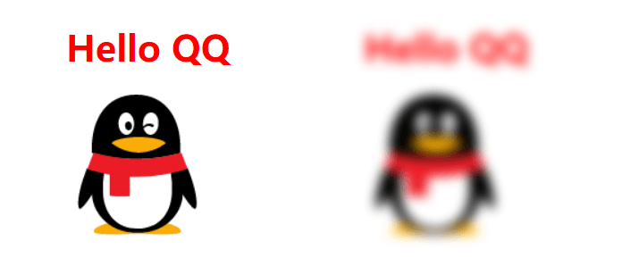

# 有趣的 filter 属性

</br>
</br>

### 前言

2020 注定不平凡，本是祭奠先祖的清明，又遇上了新冠疫情的爆发，全国都在沉痛哀悼。无论是打开网页，还是打开 App，都是一片灰白色。浏览器如何让网页一页直接全部灰暗？引起了我强烈的好奇心，一番摸索，才发现 CSS 中的 filter 属性如此有趣

</br>
</br>

### 定义

filter 翻译过来，即 **“过滤”** 的意思，其作用也跟命名类似，将我们所看到的网页内容进行过滤，进而展现出不一样的效果

</br>
</br>

### 模糊滤镜

**blur()：** 函数可改变网页内容的模糊程度，接受 css 长度单位，不接受百分比，值越大越模糊

```html
<style>
	body {
		color: red;
	}
	.blur {
		filter: blur(5px);
	}
</style>
<body>
	<div>
		<h1>Hello QQ</h1>
		
	</div>

	<div class="blur">
		<h1>Hello QQ</h1>
		
	</div>
</body>
```



</br>
</br>

### 光亮色泽滤镜

**brightness()：** 函数可改变网页内容的光亮色泽，如果值是 0%，图像会全黑。值是 100%，则图像无变化。其他的值对应线性乘数效果。值超过 100%也是可以的，图像会比原来更亮。如果没有设定值，默认是 1。

```html
<style>
	body {
		color: red;
	}
	.brightness_0 {
		filter: brightness(0%);
	}
	.brightness_50 {
		filter: brightness(50%);
	}
	.brightness_100 {
		filter: brightness(100%);
	}
	.brightness_200 {
		filter: brightness(200%);
	}
</style>
<body>
	<div class="brightness_0">
		<h1>Hello QQ</h1>
		
	</div>

	<div class="brightness_50">
		<h1>Hello QQ</h1>
		
	</div>

	<div class="brightness_100">
		<h1>Hello QQ</h1>
		
	</div>

	<div class="brightness_200">
		<h1>Hello QQ</h1>
		
	</div>
</body>
```


</br>
</br>

### 对比度滤镜

**contrast()：** 调整图像的对比度。值是 0%的话，图像会全黑。值是 100%，图像不变。值可以超过 100%，意味着会运用更低的对比。若没有设置值，默认是 1。

```html
<style>
	body {
		color: red;
	}
	.contrast_0 {
		filter: contrast(0%);
	}
	.contrast_50 {
		filter: contrast(50%);
	}
	.contrast_100 {
		filter: contrast(100%);
	}
	.contrast_200 {
		filter: contrast(200%);
	}
</style>
<body>
	<div class="contrast_0">
		<h1>Hello QQ</h1>
		
	</div>

	<div class="contrast_50">
		<h1>Hello QQ</h1>
		
	</div>

	<div class="contrast_100">
		<h1>Hello QQ</h1>
		
	</div>

	<div class="contrast_200">
		<h1>Hello QQ</h1>
		
	</div>
</body>
```


</br>
</br>

### 阴影偏移滤镜

**drop-shadow()：** 给图像设置一个阴影效果

-   **offset-x：** x 轴方向阴影偏移量

-   **offset-y：** y 轴方向阴影偏移量

-   **blur-radius：** 阴影偏移量

-   **color：** 阴影颜色，若未设定，颜色值基于浏览器

```html
<style>
	body {
		color: red;
	}

	.shadow_1 {
		filter: drop-shadow(10px 10px 10px black);
	}
	.shadow_2 {
		filter: drop-shadow(20px 20px 10px black);
	}
	.shadow_3 {
		filter: drop-shadow(20px 20px 20px black);
	}
	.shadow_4 {
		filter: drop-shadow(20px 20px 20px green);
	}
</style>
<body>
	<div>
		<h1>Hello QQ</h1>
		
	</div>

	<div class="shadow_1">
		<h1>Hello QQ</h1>
		
	</div>

	<div class="shadow_2">
		<h1>Hello QQ</h1>
		
	</div>

	<div class="shadow_3">
		<h1>Hello QQ</h1>
		
	</div>

	<div class="shadow_4">
		<h1>Hello QQ</h1>
		
	</div>
</body>
```


</br>
</br>

### 灰暗滤镜

**grayscale()：** 将图像转换为灰度图像，值为 100%则完全转为灰度图像，值为 0%图像无变化。若未设置，值默认是 0。

**PS：所有的百度网页能一瞬间全部灰暗，也是利用了这个特效**

```html
<style>
	body {
		color: red;
	}

	.grayscale_0 {
		filter: grayscale(0%);
	}
	.grayscale_50 {
		filter: grayscale(50%);
	}
	.grayscale_100 {
		filter: grayscale(100%);
	}
</style>
<body>
	<div class="grayscale_0">
		<h1>Hello QQ</h1>
		
	</div>

	<div class="grayscale_50">
		<h1>Hello QQ</h1>
		
	</div>

	<div class="grayscale_100">
		<h1>Hello QQ</h1>
		
	</div>
</body>
```


</br>
</br>

### 色环滤镜

**hue-rotate()：** 调整图像的[色环角度](https://baike.baidu.com/item/%E8%89%B2%E7%8E%AF/5874286?fr=aladdin)，值为 0deg，则图像无变化。若值未设置，默认值是 0deg。该值虽然没有最大值，超过 360deg 的值相当于又绕一圈。

```html
<style>
	body {
		color: red;
	}

	.rotate_0 {
		filter: hue-rotate(0deg);
	}
	.rotate_45 {
		filter: hue-rotate(45deg);
	}
	.rotate_90 {
		filter: hue-rotate(90deg);
	}
	.rotate_180 {
		filter: hue-rotate(180deg);
	}
	.rotate_270 {
		filter: hue-rotate(270deg);
	}
</style>
<body>
	<div class="rotate_0">
		<h1>Hello QQ</h1>
		
	</div>

	<div class="rotate_45">
		<h1>Hello QQ</h1>
		
	</div>

	<div class="rotate_90">
		<h1>Hello QQ</h1>
		
	</div>

	<div class="rotate_180">
		<h1>Hello QQ</h1>
		
	</div>

	<div class="rotate_270">
		<h1>Hello QQ</h1>
		
	</div>
</body>
```


</br>
</br>

### 透明度滤镜

**opacity()：** 该函数与已有的 opacity 属性很相似，值为 0%则是完全透明，值为 100%则图像无变化；不同之处在于通过 filter，一些浏览器为了提升性能会提供硬件加速。

</br>
</br>

### 饱和度滤镜

**saturate()：** 转换图像饱和度，值为 0%则是完全不饱和，值为 100%则图像无变化。

```html
<style>
	body {
		color: red;
	}

	.saturate_0 {
		filter: saturate(0%);
	}
	.saturate_30 {
		filter: saturate(30%);
	}
	.saturate_60 {
		filter: saturate(60%);
	}
	.saturate_100 {
		filter: saturate(100%);
	}
</style>
<body>
	<div class="saturate_0">
		<h1>Hello QQ</h1>
		
	</div>

	<div class="saturate_30">
		<h1>Hello QQ</h1>
		
	</div>

	<div class="saturate_60">
		<h1>Hello QQ</h1>
		
	</div>

	<div class="saturate_100">
		<h1>Hello QQ</h1>
		
	</div>
</body>
```


</br>
</br>

### 深褐色滤镜

**sepia()：** 将图像转换为深褐色，值为 100%则完全是深褐色的，值为 0%图像无变化。(有点像 PS 照片时，“旧时光”滤镜效果)

```html
<style>
	body {
		color: red;
	}

	.sepia_0 {
		filter: sepia(0%);
	}
	.sepia_30 {
		filter: sepia(30%);
	}
	.sepia_60 {
		filter: sepia(60%);
	}
	.sepia_100 {
		filter: sepia(100%);
	}
</style>
<body>
	<div class="sepia_0">
		<h1>Hello QQ</h1>
		
	</div>

	<div class="sepia_30">
		<h1>Hello QQ</h1>
		
	</div>

	<div class="sepia_60">
		<h1>Hello QQ</h1>
		
	</div>

	<div class="sepia_100">
		<h1>Hello QQ</h1>
		
	</div>
</body>
```


</br>
</br>

### 反转输入图像滤镜

**invert()：** 将图像颜色反转，100%的是完全反转。值为 0%则图像无变化

```html
<style>
	body {
		color: red;
	}

	.invert_0 {
		filter: invert(0%);
	}
	.invert_30 {
		filter: invert(30%);
	}
	.invert_60 {
		filter: invert(60%);
	}
	.invert_100 {
		filter: invert(100%);
	}
</style>
<body>
	<div class="invert_0">
		<h1>Hello QQ</h1>
		
	</div>

	<div class="invert_30">
		<h1>Hello QQ</h1>
		
	</div>

	<div class="invert_60">
		<h1>Hello QQ</h1>
		
	</div>

	<div class="invert_100">
		<h1>Hello QQ</h1>
		
	</div>
</body>
```


</br>
</br>

### 滤镜组合

你可以组合以上任意数量的函数来控制滤镜渲染

```css
filter: blur(5px) brightness(30%) contrast(40%) ....;
```

</br>
</br>

### 兼容性

通过 [can i use](https://caniuse.com/#search=filter) 的查询，各大浏览器的最新版，几乎完全覆盖，可放心使用


</br>
</br>

代码已经放在 github 上：[有趣的 filter 属性 demo](https://github.com/HeJueting/Blog/tree/master/CSS/%E6%9C%89%E8%B6%A3%E7%9A%84filter%E5%B1%9E%E6%80%A7)

</br>
</br>
