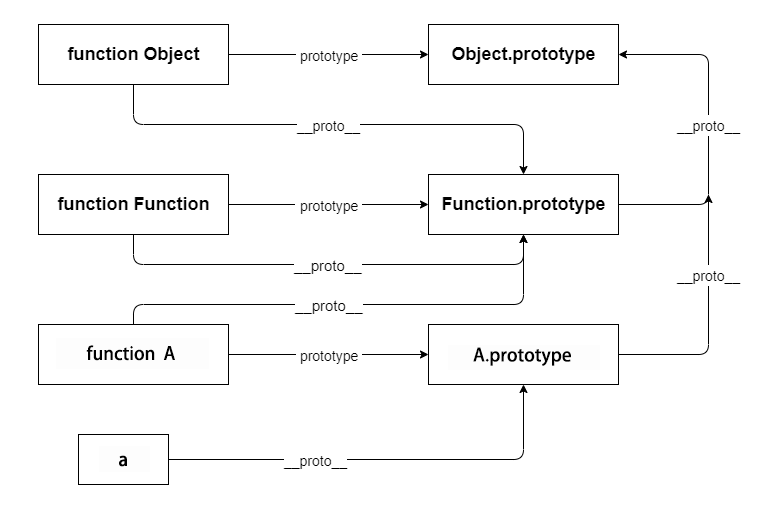
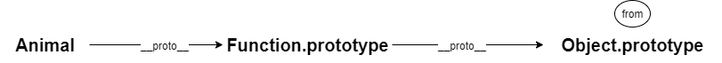
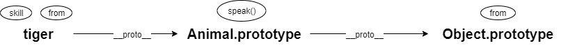

# 原型链
</br>
</br>


### 前言

原型链是JavaScript中很重要的一个基础知识，好记性不如烂笔头，几番挣扎，还是决定再梳理一下，将他写成一篇文章。

</br>


### 构造函数 & 实例

- **构造函数：** 通过new function这种形式去实例对象时，这个function就变成了构造函数

- **实例：** 通过new关键字去创建一个“对象”时，这个“对象”便叫作实例

```javascript
function A(){}
var a = new A();
```

例如，在如上代码中，函数A是一个构造函数，对象a是一个实例


</br>


### prototype & __proto__

- 任何对象都拥有__proto__属性

- 函数拥有__proto__属性和prototype属性，prototype属性也被称为**原型**

- 任何对象的__proto__属性都会指向它构造函数的prototype属性

```javascript
a.__proto__ === A.prototype;         //true
A.__proto__ === Function.prototype;  //true
```

例如，实例a是由构造函数A创建而来，实例a的__proto__属性便指向了构造函数A的prototype属性；在JavaScript中，一切函数都是由构造函数Function创建，因此函数A的__proto__属性又指向了构造函数Function的prototype属性


</br>


### 一切皆对象

无论是实例a，还是构造函数A，他们的__proto__属性最终会指向Object.prototype

```javascript
a.__proto__ === A.prototype;                 //true
a.__proto__.__proto__ === Object.prototype;  //true

A.__proto__ === Function.prototype;         //true
A.__proto__.__proto__ === Object.prototype; //true
```

在JavaScript中，目前共有7种数据类型：Number、String、Boolean、object、Symbol、undefined和null。undefined和null比较特殊，这两种类型都只有一个值，undefined表示**没有被赋值的变量**，而null用于表示**尚未创建的对象**

```javascript
var num = 1;
typeof num;   //number
num.__proto__.__proto__ === Object.prototype;  //true

var boo = true;
typeof boo;   //boolean
boo.__proto__.__proto__ === Object.prototype;  //true

var str = "hello world";
typeof str;   //string
str.__proto__.__proto__ === Object.prototype;  //true

var obj = {};
typeof obj;   //object
obj.__proto__.__proto__ === Object.prototype;  //true

var sym = Symbol("symbol");
typeof sym;   //symbol
sym.__proto__.__proto__ === Object.prototype;  //true
```
由此可见，在JavaScript中除开undefined和null类型以外，其余数据类型都继承于Object的prototype属性。因此，便有了“一切皆对象”的描述。


</br>


### 原型链的顶端

既然一切皆对象，那么Object.prototype是原型链的顶端吗？

```javascript
Object.prototype.__proto__ === null;   //true
```


虽然Object.prototype的__proto__属性确实指向了null，但是MDN上也给出了明确的提示，Object.prototype将不再拥有这个属性。因此，Object.prototype是原型链的顶端。


</br>


### 原型链的结构



乍一看，有点复杂，其实仔细梳理一下，也就四条原型链


Object作为一个函数，它的__proto__属性会指向Function的prototype属性；而Function作为函数的鼻祖，它的__proto__也只能指向自己的prototype属性


</br>


### 继承

当访问一个对象的属性或者方法时，它会顺着原型链往上查询，直至原型链顶端。通过这个原理，原型链能轻松实现继承。

```javascript
Object.prototype.from = "地球";

function Animal(){};
Animal.prototype.speak = function(){
    console.log("我是一种动物");
};

var tiger = new Animal();
tiger.skill = "捕猎";
tiger.from = "森林";

Animal.speak();            //报错：Animal.speak is not a function
console.log(Animal.skill); //undefined
console.log(Animal.from);  //地球

tiger.speak();             //我是一种动物
console.log(tiger.skill);  //捕猎
console.log(tiger.from);   //森林
```



**Animal：** 顺着Animal原型链往上查询的过程中，并没有找到say()方法和skill属性，因此访问say()方法时会报错，访问skill属性时结果是undefined；而整条原型链上，在Object.prototype处找到了from属性，因此访问from属性时会打印“地球”




**tiger：** 同理可得tiger.speak()和tiger.skill的结果。顺着tiger原型链往上查询from属性的过程中，在tiger处就已经找到了from属性，不会再继续查询下去，因此tiger.from得到的结果是"森林"


</br>


### 总结

原型链是由__proto__属性和prototype属性构造而成，因为原型链的存在，JavaScript能轻松实现面象对象编程


</br>
</br>

### 博客原文：[hejueting.cn](www.hejueting.cn)


</br>
