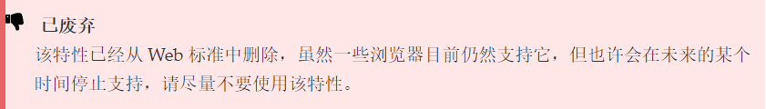
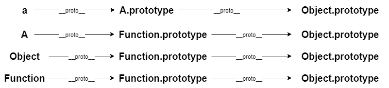
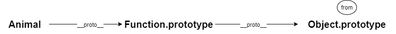
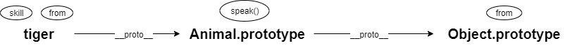

# 原型链

</br>
</br>

### 前言

原型链是 JavaScript 中很重要的一个基础知识，好记性不如烂笔头，几番挣扎，还是决定再梳理一下，将他写成一篇文章。

</br>

### 构造函数 & 实例

- **构造函数：** 通过 new function 这种形式去实例对象时，这个 function 就变成了构造函数

- **实例：** 通过 new 关键字去创建一个“对象”时，这个“对象”便叫作实例

```javascript
function A() {}
var a = new A();
```

例如，在如上代码中，函数 A 是一个构造函数，对象 a 是一个实例

</br>

### prototype & **proto**

- 任何对象都拥有**proto**属性

- 函数拥有**proto**属性和 prototype 属性，prototype 属性也被称为**原型**

- 任何对象的**proto**属性都会指向它构造函数的 prototype 属性

```javascript
a.__proto__ === A.prototype; //true
A.__proto__ === Function.prototype; //true
```

例如，实例 a 是由构造函数 A 创建而来，实例 a 的**proto**属性便指向了构造函数 A 的 prototype 属性；在 JavaScript 中，一切函数都是由构造函数 Function 创建，因此函数 A 的**proto**属性又指向了构造函数 Function 的 prototype 属性

</br>

### 一切皆对象

无论是实例 a，还是构造函数 A，他们的**proto**属性最终会指向 Object.prototype

```javascript
a.__proto__ === A.prototype; //true
a.__proto__.__proto__ === Object.prototype; //true

A.__proto__ === Function.prototype; //true
A.__proto__.__proto__ === Object.prototype; //true
```

在 JavaScript 中，目前共有 7 种数据类型：Number、String、Boolean、object、Symbol、undefined 和 null。undefined 和 null 比较特殊，这两种类型都只有一个值，undefined 表示**没有被赋值的变量**，而 null 用于表示**尚未创建的对象**

```javascript
var num = 1;
typeof num; //number
num.__proto__.__proto__ === Object.prototype; //true

var boo = true;
typeof boo; //boolean
boo.__proto__.__proto__ === Object.prototype; //true

var str = "hello world";
typeof str; //string
str.__proto__.__proto__ === Object.prototype; //true

var obj = {};
typeof obj; //object
obj.__proto__.__proto__ === Object.prototype; //true

var sym = Symbol("symbol");
typeof sym; //symbol
sym.__proto__.__proto__ === Object.prototype; //true
```

由此可见，在 JavaScript 中除开 undefined 和 null 类型以外，其余数据类型都继承于 Object 的 prototype 属性。因此，便有了“一切皆对象”的描述。

</br>

### 原型链的顶端

既然一切皆对象，那么 Object.prototype 是原型链的顶端吗？

```javascript
Object.prototype.__proto__ === null; //true
```



虽然 Object.prototype 的**proto**属性确实指向了 null，但是 MDN 上也给出了明确的提示，Object.prototype 将不再拥有这个属性。因此，Object.prototype 是原型链的顶端。

</br>

### 原型链的结构


乍一看，有点复杂，其实仔细梳理一下，也就四条原型链



Object 作为一个函数，它的**proto**属性会指向 Function 的 prototype 属性；而 Function 作为函数的鼻祖，它的**proto**也只能指向自己的 prototype 属性

</br>

### 继承

当访问一个对象的属性或者方法时，它会顺着原型链往上查询，直至原型链顶端。通过这个原理，原型链能轻松实现继承。

```javascript
Object.prototype.from = "地球";

function Animal() {}
Animal.prototype.speak = function () {
  console.log("我是一种动物");
};

var tiger = new Animal();
tiger.skill = "捕猎";
tiger.from = "森林";

Animal.speak(); //报错：Animal.speak is not a function
console.log(Animal.skill); //undefined
console.log(Animal.from); //地球

tiger.speak(); //我是一种动物
console.log(tiger.skill); //捕猎
console.log(tiger.from); //森林
```



**Animal：** 顺着 Animal 原型链往上查询的过程中，并没有找到 say()方法和 skill 属性，因此访问 say()方法时会报错，访问 skill 属性时结果是 undefined；而整条原型链上，在 Object.prototype 处找到了 from 属性，因此访问 from 属性时会打印“地球”



**tiger：** 同理可得 tiger.speak()和 tiger.skill 的结果。顺着 tiger 原型链往上查询 from 属性的过程中，在 tiger 处就已经找到了 from 属性，不会再继续查询下去，因此 tiger.from 得到的结果是"森林"

</br>

### 总结

原型链是由**proto**属性和 prototype 属性构造而成，因为原型链的存在，JavaScript 能轻松实现面象对象编程

</br>
</br>
