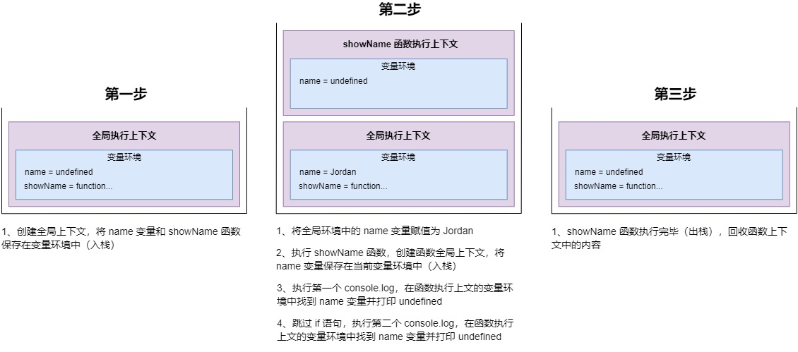
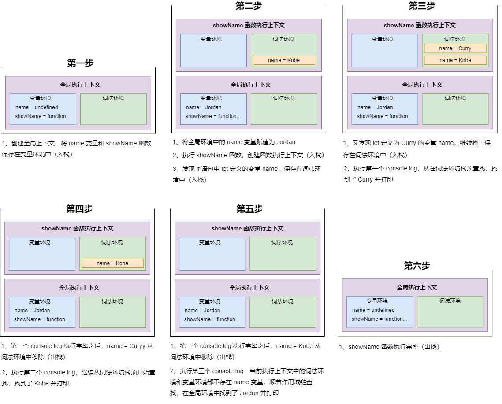

# 变量提升和块级作用域

</br>

### 什么是变量提升？

在 JavaScript 代码执行过程中，JavaScript 引擎**把变量的声明部分和函数的声明部分提升到代码开头的行为**

```javascript
console.log(a); // undefined
var a = 1;
```

</br>
</br>

### 变量提升的原因

在运行 JavaScript 代码时，会经历两个阶段：**编译阶段**和**代码执行阶段**

#### 编译阶段

经过编译后的 JavaScript 会生成两部分内容：

1. 创建一个执行上下文，并**将函数和变量的声明保存在当前执行上下文的变量环境中**

2. 生成可执行的代码

</br>

#### 代码执行阶段

执行代码时，JavaScript 引擎会从当前执行上下文中的变量环境中去查找自定义的变量和函数

</br>
</br>

### 何时会创建执行上下文

1. 运行全局代码的时候，在编译阶段会创建**全局执行上下文**

2. 运行一个函数的时候，在编译阶段会创建**该函数的执行上下文**，一般情况下，函数执行结束之后，创建的函数执行上下文会被销毁

3. 使用 eval 函数的时候，在编译阶段，eval 的代码也会创建执行上下文。

</br>
</br>

### 作用域和块级作用域

作用域是指**在程序中定义变量的区域，该位置决定了变量的生命周期**。在 ES6 之前，只存在**全局作用域**和**函数作用域**，之后 ES6 推出了**块级作用域**，一对花括号就能形成一个块级作用域

</br>
</br>

### 为什么 ES6 会推出块级作用域

因为 JavaScript 变量提升这种特性，从而导致了很多与直觉不符的代码，这也是 JavaScript 的一个重要设计缺陷

</br>

#### 案例分析

```javascript
var name = "Jordan";
function showName() {
	console.log(name); // undefined
	if (false) {
		var name = "Kobe";
	}
	console.log(name); // undefined
}
showName();
```



</br>

#### 问题

即使 if 语句不会执行，if 语句中定义的变量也会变量提升，导致函数没法访问全局环境中的 name 变量。因此 ES6 **引入了 let 和 const 关键字，从而使 JavaScript 也能像其他语言一样拥有了块级作用域**

</br>
</br>

### JavaScript 如何同时支持变量提升和块级作用域

1. 创建执行上下文后，通过 var 声明的变量和声明的函数，在编译阶段全都被存放到**变量环境**里面了

2. 而通过 let/const 声明的变量，在编译阶段则会被存放到**词法环境**中

3. JavaScript 通过**栈结构**去进行管理**执行上下文和词法环境**

</br>

#### 案例分析

```javascript
var name = "Jordan";
function showName() {
	if (true) {
		const name = "Kobe";
		{
			const name = "Curry";
			console.log(name); // Curry
		}
		console.log(name); // Kobe
	}
	console.log(name); // Jordan
}
showName();
```



</br>
</br>

### 暂时性死区

指虽然通过 let/const 声明的变量已经在词法环境中了，但是在没有赋值之前访问该变量，JavaScript 引擎就会抛出错误

```javascript
let name = "Jordan";
{
	console.log(name); // 报错：Cannot access 'name' before initialization
	let name = "Kobe";
}
```

</br>
</br>

### 总结

在编译阶段：

1. var 定义的变量：**创建**、**初始化**，并保存在**变量环境**

```javascript
console.log(name); // undefined
var name = "Jordan";
```

</br>

2. 声明的函数：**创建**、**初始化**、**函数赋值**，并会保存在**变量环境**

```javascript
showName(); // Jordan
function showName() {
	console.log("Jordan");
}
```

</br>

3. let/const 定义的变量：**仅创建**，并保存在**词法环境**

```javascript
console.log(name); // 报错：Cannot access 'name' before initialization
const name = "Jordan";
```

</br>
</br>
