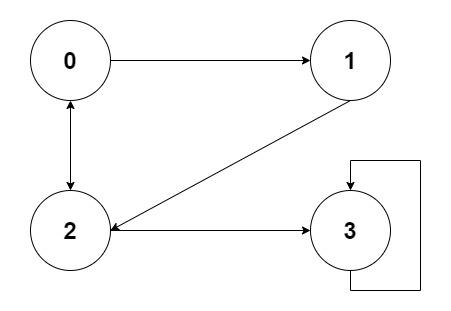

# 深度和广度优先遍历

### JavaScript 模拟图



```javascript
const graph = {
    0: [1, 2],
    1: [2],
    2: [0, 3],
    3: [3],
};
```

</br>
</br>

### 深度优先遍历

尽可能深地搜索图的分支

1. 访问根节点

2. 对根节点的**没访问过的相邻节点**挨个进行深度优先遍历

```javascript
// 利用Set数据结构，可以自动去重
const visited = new Set();

// 递归遍历节点
function deep(n) {
    console.log(n);
    visited.add(n);
    graph[n].forEach((node) => {
        // 如果已经没有访问过该节点，继续递归访问该节点
        if (!visited.has(node)) {
            deep(node);
        }
    });
}

deep(2); // 2 0 1 3
```

</br>
</br>

### 广度优先遍历

先访问离根节点最近的节点

1. 新建一个队列，把根节点入队

2. 把对头出队并访问

3. 把对头的**没访问过的相邻节点**入队

```javascript
// 新建一个队列
const queue = [2];
const visited = new Set();

while (queue.length) {
    const n = queue[0];
    // 访问队头节点
    console.log(n);

    graph[n].forEach((node) => {
        // 如果已经没有访问过该节点，继续递归访问该节点
        if (!visited.has(node)) {
            // 进入队列继续访问
            queue.push(node);
            // 记录下已访问的队头节点
            visited.add(n);
        }
    });

    // 出队列
    queue.shift();
}

// 2 0 3 1
```

</br>
</br>
