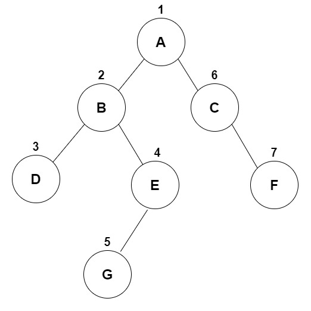

### 结论

前序遍历：根结点 ---> 左子树 ---> 右子树

中序遍历：左子树---> 根结点 ---> 右子树

后序遍历：左子树 ---> 右子树 ---> 根结点

</br>

### 先序遍历



1. 访问根节点

2. 对左子树先序遍历

3. 再对右子树先序遍历

```javascript
const tree = {
    value: "A",
    left: {
        value: "B",
        left: {
            value: "D",
        },
        right: {
            value: "E",
            left: {
                value: "G",
            },
        },
    },
    right: {
        value: "C",
        right: {
            value: "F",
        },
    },
};

const nodes = [];
function deep(node) {
    nodes.push(node.value);
    // 递归访问它的左子树
    node.left && deep(node.left);
    // 递归访问它的又子树
    node.right && deep(node.right);
}
deep(tree); // A B D E G C F
```

</br>
</br>

### 中序遍历


1. 对左子树中序遍历

2. 访问根节点

3. 对右子树中序遍历

```javascript
const tree = {
    value: "A",
    left: {
        value: "B",
        left: {
            value: "D",
        },
        right: {
            value: "E",
            left: {
                value: "G",
            },
        },
    },
    right: {
        value: "C",
        right: {
            value: "F",
        },
    },
};

const nodes = [];
function deep(node) {
    if (!node) {
        return;
    }
    // 递归访问它的左子树
    node.left && deep(node.left);
    console.log(node.value);
    // 递归访问它的右子树
    node.right && deep(node.right);
}
deep(tree); // D B G E A C F
```

</br>
</br>

### 后序遍历


1. 对左子树后序遍历

2. 对右子树后序遍历

3. 访问根节点

```javascript
const tree = {
    value: "A",
    left: {
        value: "B",
        left: {
            value: "D",
        },
        right: {
            value: "E",
            left: {
                value: "G",
            },
        },
    },
    right: {
        value: "C",
        right: {
            value: "F",
        },
    },
};

const nodes = [];
function deep(node) {
    if (!node) {
        return;
    }
    // 递归访问它的左子树
    node.left && deep(node.left);
    // 递归访问它的右子树
    node.right && deep(node.right);
    console.log(node.value);
}
deep(tree); // D G E B F C A
```
