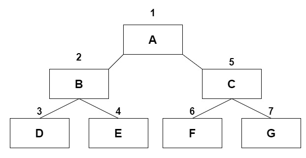
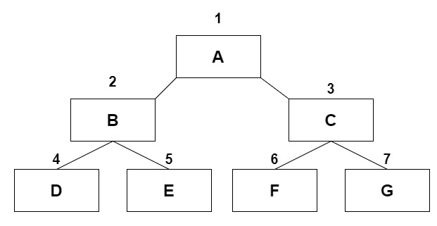

### 深度优先遍历

</br>



1. 访问根节点

2. 对根节点的 children 挨个进行深度优先遍历

```javascript
const tree = {
    value: "A",
    children: [
        {
            value: "B",
            children: [
                {
                    value: "D",
                },
                {
                    value: "E",
                },
            ],
        },
        {
            value: "C",
            children: [
                {
                    value: "F",
                },
                {
                    value: "G",
                },
            ],
        },
    ],
};

const nodes = [];
function deep(node) {
    console.log(node.value);
    if (node.children) {
        node.children.forEach((item) => {
            deep(item);
        });
    }
}
deep(tree); // A B D E C F G
```

</br>
</br>
</br>

### 广度优先遍历



1. 新建一个队列，把根节点入队

2. 把对头出队并访问

3. 把对头的 childre 挨个入队

4. 重复第二、第三步骤，直到队列为空

```javascript
const tree = {
    value: "A",
    children: [
        {
            value: "B",
            children: [
                {
                    value: "D",
                },
                {
                    value: "E",
                },
            ],
        },
        {
            value: "C",
            children: [
                {
                    value: "F",
                },
                {
                    value: "G",
                },
            ],
        },
    ],
};

const nodes = [];
function deep(node) {
    const queue = [node];
    while (queue.length) {
        // 记录下队列头部的节点
        const head = queue[0];
        nodes.push(head.value);
        // 头部节点出队
        queue.shift();
        // 遍历出队节点的children节点，并依次入队
        if (head.children) {
            head.children.forEach((item) => {
                queue.push(item);
            });
        }
    }
}
deep(tree); // A B C D E F G
```

</br>
</br>
