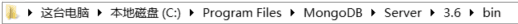
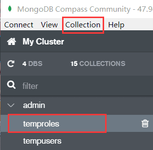

# mongodb 的基本使用

</br>

### 常用命令

- show dbs： 显示数据库列表

- show collections： 显示当前数据库中的集合

- use XXX： 切换/创建 XXX 数据库

- show users： 展示当前数据库下的用户信息

- db.createCollection(name, options)：创建集合，options 为可选参数

- db.dropUser('xxx')： 删除用户

- db.dropDatabase()： 删除当前使用数据库

- db.getName()： 查看当前使用的数据库

- db.createUser： 创建用户

- db.help()： 查看命令提示

</br>
</br>

### 数据表的导入与导出

- **命令操作**

```javascript
mongoexport -d <数据库名称> -c <collection名称> -o <json文件名称>
mongoimport -d <数据库名称> -c <collection名称> --file <要导入的json文件名称>

// 如果你的数据库有用户认证，还需要加上-u（用户名） -p（密码）参数
mongoexport ...... -u <用户名> -p <密码>
mongoimport ...... -u <用户名> -p <密码>

// 其他配置参数，可以通过--help命令查看
mongoexport --help
mongoimport --help
```

PS：如果你是 windows 系统 ，需要进入到 mongodb 的 bin 目录下执行以上操作



</br>

- **MongoDB Compass Community**

选中一个数据表，会出现 Collection 选项，在 Collection 的下拉菜单中，就可以选择 import data 和 export collection（导入和导出数据）



</br>
</br>

### 数据库的备份与恢复

- **数据备份**

```javascript
// 查看备份配置参数
mongodump --help

// 将本地的blog数据库备份到/usr/blog目录下
mongodump -d blog -o /usr/blog -u xxx -p xxxx
```

-h：指定 MongoDB 所在服务器地址，默认为 127.0.0.1:27017

-d：需要备份的数据库名称

-o：备份的数据存放位置，例如：/usr/test

-u：用户名

-p：密码

</br>

- **数据恢复**

数据恢复的操配置参数与备份类似

```javascript
// 查看备份配置参数
mongodump --help

// 以/usr/blog目录下的数据恢复blog数据库
mongorestore -d blog /usr/blog
```

</br>
</br>
