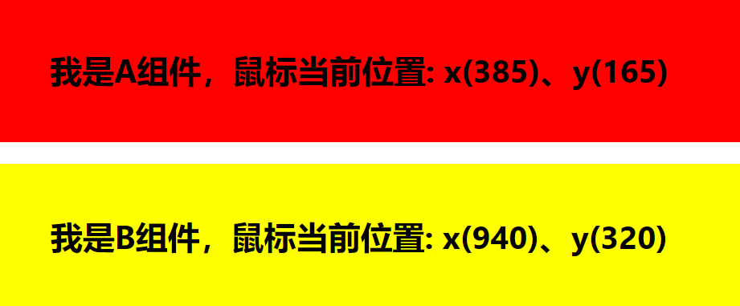

# hook诞生的意义

> 例如实现这样一个需求：监听鼠标在某个区域移动的位置



<br></br>


### 一、使用class语法的render props实现

```javascript
// Mouse组件
class Mouse extends React.Component {
    constructor(props) {
        super(props);
        this.state = { x: 0, y: 0 };
    }
    mouseMove = (e) => {
        this.setState({
            x: e.clientX,
            y: e.clientY
        })
    }
    render() {
        return (
            <div onMouseMove={this.mouseMove}>
                {this.props.render(this.state)}
            </div>
        )
    }
}

// ComponentA组件
class ComponentA extends React.Component {
    render() {
        const { location } = this.props;
        return (
            <div style={{width: '100%', height: '20vh', lineHeight: '20vh', background: 'red'}}>
                <h1>我是A组件，鼠标当前位置: x({location.x})、y({location.y})</h1>
            </div>

        )
    }
}

// ComponentB组件
class ComponentB extends React.Component {
    render() {
        const { location } = this.props;
        return (
            <div style={{width: '100%', height: '20vh', lineHeight: '20vh', background: 'yellow'}}>
                <h1>我是B组件，鼠标当前位置: x({location.x})、y({location.y})</h1>
            </div>

        )
    }
}

// App组件
class App extends React.Component {
    render() {
        return (
            <>
                <Mouse render={state => <ComponentA location={state} />}></Mouse>
                <Mouse render={state => <ComponentB location={state} />}></Mouse>
            </>
        )
    }
}
```

<br></br>


### 二、使用class语法的HOC(高阶组件)实现

```javascript
// WithMouse方法
function WithMouse(Component) {
    return class extends React.Component {
        constructor(props) {
            super(props);
            this.state = { x: 0, y: 0 };
        }
        mouseMove = (e) => {
            this.setState({
                x: e.clientX,
                y: e.clientY
            })
        }
        render() {
            return (
                <div onMouseMove={this.mouseMove}>
                    <Component location={this.state} {...this.props} />
                </div>
            )
        }
    }
}

// ComponentA、ComponentB组件与render props编码一致
// .......

// App组件
class App extends React.Component {
    render() {
        const WithMouseComponentA = WithMouse(ComponentA);
        const WithMouseComponentB = WithMouse(ComponentB);
        return (
            <>
                <WithMouseComponentA />
                <WithMouseComponentB />
            </>
        )
    }
}
```

<br></br>


### 三、使用Hook

```javascript
// 实现Notice高阶组件
function WithNotice(Component) {
    console.log(Component);
    return class extends React.Component {
        constructor(props) {
            super(props);
            this.state = {
                msg: '今天不上学，放假一天',
            };
        }
        render() {
            return (
                <Component {...this.props} info={this.state} />
            )
        }
    }
}

// 此处省略小明、小红组件的代码，与render props一致
// ......

// 小明小红共享消息通知
function App() {
    const NoticeWithXiaoMing = WithNotice(XiaoMing);
    const NoticeWithXiaoHong = WithNotice(XiaoHong);
    return (
        <div className="App">
            <NoticeWithXiaoMing />
            <NoticeWithXiaoHong />
        </div>
    );
}
```


<br></br>


### 一、更好的复用状态逻辑


