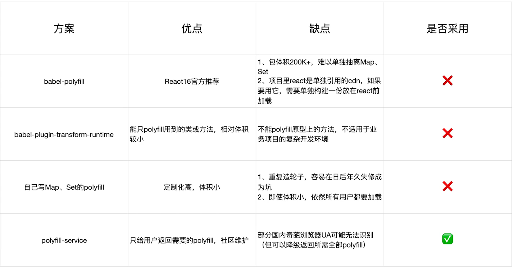

# 优化构建产物

 

### Tree Shaking 擦除无用的 javaScript 和 CSS

**1、概念：**

1 个模块可能有多个方法，只要其中的某个方法使用到了，则整个文件都会被 bundle 里面去，tree shaking 就是只把用到的方法打入 bundle，没用到的方法会在 uglify 阶段被擦除掉

**2、使用：**

webpack 默认支持，在.babelrc 里面设置 modules:false 即可，mode: production 的情况下默认开启

**3、要求：**

必须是 ES6 语法，CJS 方式不支持

**4、在 webpack 中如何使用 tree shaking CSS？**

使用 [purgecss-webpack-plugin](https://github.com/FullHuman/purgecss/tree/master/packages/purgecss-webpack-plugin)

 
 

### webpack 图片压缩

配置使用 [image-webpack-loader](https://www.npmjs.com/package/image-webpack-loader)

 
 

### 动态 Polyfill

Polyfill 是一个 js 库，主要抚平不同浏览器之间对 js 实现的差异。但是使用 babel-polyfill.js 时，他会包含所有补丁，不管浏览器是否支持，也不管你的项目是否有用到，都全量引入了。使用动态 ployfill 就会在需要补丁的浏览器会加载补丁代码，不需要补丁的浏览器不会加载代码

 
 
