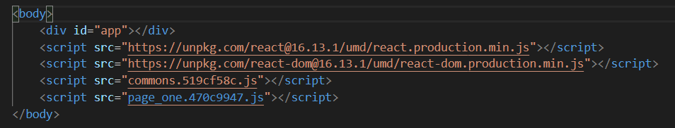

# 公共资源分离和提取

</br>

### 分离：

使用 html-webpack-externals-plugin 插件，将 react、react-dom 等基础包通过 cdn 方式引入，不打入 bundle 中

**1、安装依赖**

```
npm i html-webpack-externals-plugin -D
```

**2、webpack 配置**

```javascript
const HtmlWebpackExternalsPlugin = require("html-webpack-externals-plugin");
module.exports = {
    plugins: [
        new HtmlWebpackExternalsPlugin({
            // 如果有多个 HtmlWebpackPlugin 实例，请使用它指定要将资产注入到哪些文件的全局文件。默认情况下会将资产添加到所有文件。
            // files: ["A.html", "B.html"],
            externals: [
                {
                    module: "react",
                    entry: "https://unpkg.com/react@16.13.1/umd/react.production.min.js",
                    global: "React",
                },
                {
                    module: "react-dom",
                    entry: "https://unpkg.com/react-dom@16.13.1/umd/react-dom.production.min.js",
                    global: "ReactDom",
                },
            ],
        }),
    ],
};
```

-   module：包的名称

-   entry：url 引入的地址

-   global：由供应商的 dist 文件全局导出的对象的名称。例如对于 React，请使用 React，因为 react.js 创建一个 window.React 全局。对于不导出的模块（例如 CSS），请忽略此属性或使用 null。

**3、打包结果**



</br>
</br>

### 提取

利用 SplitChunksPluginj 进行公共脚本分离，该插件已经在 webpack4 中内置

**详细配置如下：**

```javascript
module.exports = {
    optimization: {
        splitChunks: {
            // async 异步引入的库进行分离，initial 同步引入的库进行分离，all 所有引入的库都进行分离（推荐）
            chunks: "async",
            // 抽离的公共包最小的大小
            minSize: 30000,
            // 保证 chunk 被分割后的剩余体积不小于该值，防止出现特别小的单个代码块；默认为 minSize
            minRemainingSize: 0,
            // 抽离的公共包最大的大小
            maxSize: 0,
            // 该公共包被使用的次数
            minChunks: 1,
            // 名称分隔符，默认是~
            automaticNameDelimiter: "~",
            // cacheGroups: 缓存组，可以继承和/或覆盖 splitChunks 中的任何选项
            cacheGroups: {
                // 分离 react 和 react-dom 出来
                commons: {
                    test: /(react|react-dom)/, //匹配分离的包的规则
                    name: "vendors", //分离出来的名称
                    chunks: "all",
                },
            },
        },
    },
};
```

</br>
</br>

### 注意

speed-measure-webpack-plugin 插件和 html-webpack-externals-plugin 有冲突，使用了 speed-measure-webpack-plugin 后，html-webpack-externals-plugin 无法将 CDN 外链的配置插入 html 中

```json
{
    "html-webpack-externals-plugin": "^3.8.0",
    "html-webpack-plugin": "^4.3.0",
    "speed-measure-webpack-plugin": "^1.3.3"
}
```

**解决方法：** html 静态模板中去配置 CDN 引入，或者移除 speed-measure-webpack-plugin 插件
