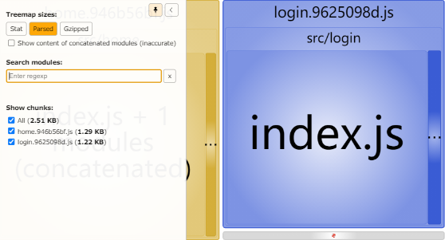
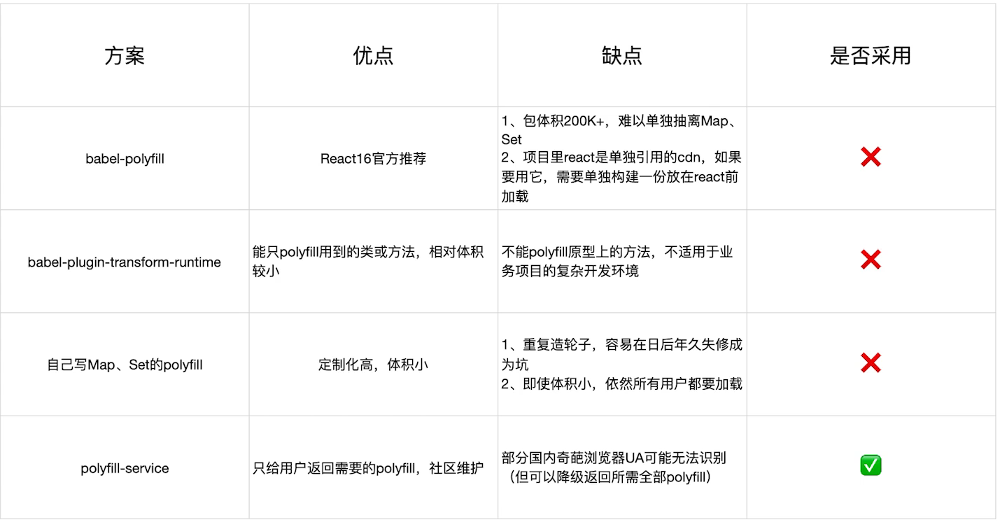

# 分析和优化构建速度以及构建体积

</br>

### 构建速度分析

使用 [speed-measure-webpack-plugin](https://www.npmjs.com/package/speed-measure-webpack-plugin)，分析整个打包总耗时以及每个插件和 loader 的耗时情况

**1、安装依赖**

```
npm i SpeedMeasurePlugin -D
```

**2、webpack 配置**

```javascript
const SpeedMeasurePlugin = require("speed-measure-webpack-plugin");
const smp = new SpeedMeasurePlugin();
module.exports = smp.wrap(webpackConfig);
```


</br>
</br>

### 构建体积分析

使用 [webpack-bundle-analyzer](https://www.npmjs.com/package/webpack-bundle-analyzer)，分析依赖的第三方模块文件大小以及业务里面的组件代码大小

**1、安装依赖**

```
npm install --save-dev webpack-bundle-analyzer -D
```

**2、webpack 配置**

```javascript
const { BundleAnalyzerPlugin } = require("webpack-bundle-analyzer");
module.exports = {
    plugins: [
        new BundleAnalyzerPlugin({
            analyzerMode: "disabled", // 不启动展示打包报告的http服务器
            generateStatsFile: true, // 是否生成stats.json文件
        }),
    ],
};
```

**3、配置 package.json**

通过 npm run analysis 命令可以查看构建包体积分析的结果

```json
{
    "scripts": {
        "analysis": "webpack-bundle-analyzer --port 8888 ./dist/stats.json"
    }
}
```



</br>
</br>

### 优化构建速度

1. 使用高版本的 webpack 和 node.js

2. 多进程/多实例构建

3. 分包，预编译模块

4. 利用缓存提高二次构建速度

</br>
</br>

### 多进程/多实例构建

使用 [thread-loader](https://www.webpackjs.com/loaders/thread-loader) 解析资源，把这个 loader 放置在其他 loader 之前，就会在一个单独的 worker 池中运行

**1、安装依赖**

```
npm i thread-loader -D
```

**2、webpack 配置**

```javascript
const threadLoader = require("thread-loader");
module.exports = {
    module: {
        rules: [
            {
                test: /\.(js)$/,
                use: ["thread-loader", "babel-loader"],
            },
        ],
    },
};
```

</br>
</br>

### 分包，预编译模块

此前使用分包的方式，是将 react 和 react-dom 以 CDN 的形式引入项目中。我们还可以使用 DLLPlugin 和 DLLReferencePlugin 进行优化，将 react、react-dom、redux、react-redux..等等公共资源构建成为一个包，只打包一次公共资源包，之后就直接使用。

</br>
</br>

### 利用缓存提高二次构建速度

**1、开启 babel-loader 缓存**

开启成功后，node_moudle 下面会新增一个.cache 目录，提升二次解析速度

```javascript
module.exports = {
    module: {
        rules: [
            {
                test: /\.(js)$/,
                use: ["babel-loader?cacheDirectory=true"],
            },
        ],
    },
};
```

**2、开启压缩缓存**

使用 terser-webpack-plugin 插件缓存，开启压缩缓存，提升二次压缩速度

```
npm i terser-webpack-plugin -D
```

```javascript
const TerserPlugin = require("terser-webpack-plugin");
module.exports = {
    optimization: {
        minimize: {
            parallel: true, // 使用多进程并行运行来提高构建速度
            cache: true, // 开启压缩缓存
        },
    },
};
```

**3、模块缓存**

使用 cache-loader 或者 hard-source-webpack-plugin 用于缓存 webpack 内部模块处理的中间结果，提升二次模块转换速度

```
npm install hard-source-webpack-plugin -D
```

```javascript
const HardSourceWebpackPlugin = require("hard-source-webpack-plugin");
module.exports = {
    plugins: [new HardSourceWebpackPlugin()],
};
```

</br>
</br>

### 缩小构建目标

```javascript
module.exports = {
    // 配置模块如何解析
    resolve: {
        // 告诉 webpack 解析模块时应该搜索的目录
        modules: ["node_modules"],
        // 当从 npm 包中导入模块时，在 package.json 中使用哪个字段导入模块
        mainFields: ["main"],
        // 顺序解析这些后缀名
        extensions: [".js"],
    },
};
```

</br>
</br>

### Tree Shaking 擦除无用的 javaScript 和 CSS

**1、概念：**

1 个模块可能有多个方法，只要其中的某个方法使用到了，则整个文件都会被 bundle 里面去，tree shaking 就是只把用到的方法打入 bundle，没用到的方法会在 uglify 阶段被擦除掉

**2、使用：**

webpack 默认支持，在.babelrc 里面设置 modules:false 即可，mode: production 的情况下默认开启

**3、要求：**

必须是 ES6 语法，CJS 方式不支持

**4、在 webpack 中如何使用 tree shaking CSS？**

使用 [purgecss-webpack-plugin](https://github.com/FullHuman/purgecss/tree/master/packages/purgecss-webpack-plugin)

</br>
</br>

### webpack 图片压缩

配置使用 [image-webpack-loader](https://www.npmjs.com/package/image-webpack-loader)

</br>
</br>

### 动态 Polyfill

Polyfill 是一个 js 库，主要抚平不同浏览器之间对 js 实现的差异。但是使用 babel-polyfill.js 时，他会包含所有补丁，不管浏览器是否支持，也不管你的项目是否有用到，都全量引入了。使用动态 ployfill 就会在需要补丁的浏览器会加载补丁代码，不需要补丁的浏览器不会加载代码



</br>
</br>
