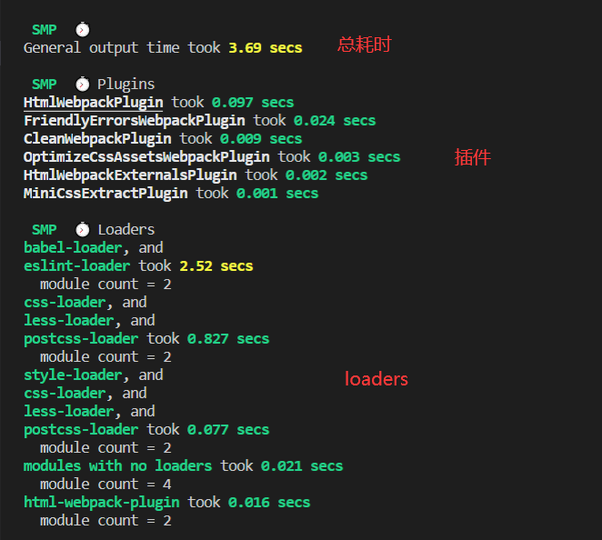
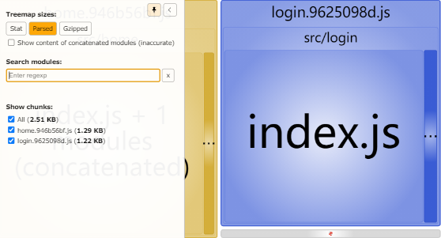

# 分析构建速度和构建体积

</br>

### 构建速度分析

使用 [speed-measure-webpack-plugin](https://www.npmjs.com/package/speed-measure-webpack-plugin)，分析整个打包总耗时以及每个插件和 loader 的耗时情况

**1、安装依赖**

```
npm i SpeedMeasurePlugin -D
```

**2、webpack 配置**

```javascript
const SpeedMeasurePlugin = require("speed-measure-webpack-plugin");
const smp = new SpeedMeasurePlugin();
module.exports = smp.wrap(webpackConfig);
```



</br>
</br>

### 构建体积分析

使用 [webpack-bundle-analyzer](https://www.npmjs.com/package/webpack-bundle-analyzer)，分析依赖的第三方模块文件大小以及业务里面的组件代码大小

**1、安装依赖**

```
npm install --save-dev webpack-bundle-analyzer -D
```

**2、webpack 配置**

```javascript
const { BundleAnalyzerPlugin } = require("webpack-bundle-analyzer");
module.exports = {
    plugins: [
        new BundleAnalyzerPlugin({
            analyzerMode: "disabled", // 不启动展示打包报告的http服务器
            generateStatsFile: true, // 是否生成stats.json文件
        }),
    ],
};
```

**3、配置 package.json**

通过 npm run analysis 命令可以查看构建包体积分析的结果

```json
{
    "scripts": {
        "analysis": "webpack-bundle-analyzer --port 8888 ./dist/stats.json"
    }
}
```



</br>
</br>
