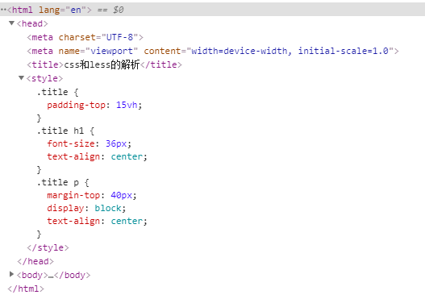

# 解析 CSS 和 Less

</br>

### 如何解析 less 文件

-   less-loader 用于将 less 解析为 css

-   css-loader 用于加载 .css 文件

-   style-loader 用于将 CSS 以 style 标签的形式插入 header 中

```
npm i less less-loader css-loader style-loader -D
```

```javascript
module: {
    rules: [
        {
            test: /\.less$/,
            use: [
                "style-loader", // 最后将解析的css插入header中
                "css-loader", // 再解析css
                "less-loader", // 先将less解析为css
            ],
        },
    ];
}
```

**注意：** use 数组中的 loader 解析，是从右到左的链式调用，应该先使用 css-loader 去解析 css，然后再通过 style-css 去插入 header 中



</br>
</br>

### 补齐 CSS 前缀

由于浏览器对 CSS 的支持不同，还需要使用 autoprefixer 插件自动补齐前缀，搭载着 PostCss-loader 一起使用

-   IE 浏览器内核：Trident（-ms）

-   火狐浏览器内核：Geko（-moz）

-   谷歌浏览器内核、edge 浏览器内核：webkit（-webkit）

-   Opera 浏览器内核：presto（-o）

**1、安装依赖**

```
npm i  autoprefixer postcss-loader -D
```

**2、新增 postcss.config.js 配置文件**

```javascript
module.exports = {
    plugins: [require("autoprefixer")],
};
```

**3、新增 .browserslistrc 配置文件**

该文件是用来限定目标浏览器，告诉 autoprefixer 打包处理前缀时，对哪些浏览器进行兼容处理

```
last 2 versions
>1%
cover 99.5%
```

**4、修改 webpack 配置**

```javascript
module: {
    rules: [
        {
            test: /\.less$/,
            use: ["style-loader", "css-loader", "less-loader", "postcss-loader"],
        },
    ];
}
```

</br>
</br>

### CSS 单独打包

style-loader 只会将解析后的 CSS 以 style 标签的形式插入 html 中，这并不是一种友好的方式。我们可以使用 mini-css-extract-plugin 插件单独打包 CSS 文件，并以 link 链接的方式在 html 中引入。

**1、安装依赖**

```
npm i mini-css-extract-plugin -D
```

**2、修改 wenpack 配置**

```javascript
const MiniCssExtractPlugin = require("mini-css-extract-plugin");
module.exports = {
    module: {
        rules: [
            {
                test: /\.less$/,
                use: [
                    MiniCssExtractPlugin.loader, // 最后css额外打包
                    "css-loader", // 再解析css
                    "less-loader", // 将less解析为css
                    "postcss-loader", // css处理器
                ],
            },
        ];
    },
    plugins: [
        // CSS单独打包
        new MiniCssExtractPlugin({
            filename: "css/bundle.css",
        }),
    ],
}
```


