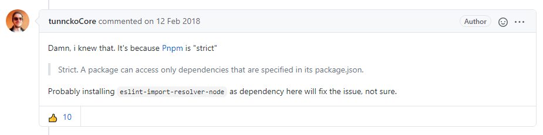
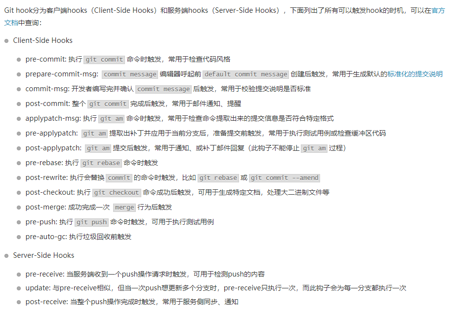
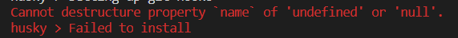

# 配置 eslint

</br>

### 选择 eslint 规范

我们没有必要从 0 开始打造自己的 eslint 规范，圈内有许多开源的 eslint 规范，我们可以直接基于这些规范进行开发和定制化：

-   爱彼迎团队：eslint-config-airbnb

-   腾讯 alloyteam 团队：eslint-config-alloy

-   腾讯 ivweb 团队：eslint-config-ivweb

</br>
</br>

### 安装依赖

这里，我们选择了爱彼迎团队的 eslint 规范进行构建，需要安装以下依赖：

```javascript
// 安装 eslint 及其相关依赖
npm i eslint babel-eslint eslint-loader -D

// 安装 eslint-config-airbnb 规范
npm i eslint-config-airbnb eslint-plugin-import eslint-plugin-react
eslint-plugin-react-hook eslint-plugin-jsx-a11y -D
```

**注意：** eslint-config-airbnb 是基于 ECMAScript 6+ 和 React 的规范，它需要安装 eslint、eslint-plugin-import、eslint-plugin-react、eslint-plugin-react-hook 和 eslint-plugin-jsx-a11y。如果不是使用的 React 进行项目开发, 可以参考 eslint-config-airbnb-base

</br>
</br>

### eslint 配置文件

新增 .eslintrc.js 配置文件，详情请参考：[https://cn.eslint.org/docs/user-guide/configuring](https://cn.eslint.org/docs/user-guide/configuring)

```javascript
module.exports = {
    parser: "babel-eslint", // 解析器
    extends: "airbnb", // 继承于airbnb规范的eslint
    env: {
        // 指定所启用的环境（避免使用全局变量报错）
        browser: true,
        node: true,
    },
    rules: {
        // 自定义eslint规则
        indent: ["error", 4], // 缩进四个空格
    },
};
```

自定义 Eslint 配置规则：[https://cn.eslint.org/docs/user-guide/configuring](https://cn.eslint.org/docs/user-guide/configuring)

</br>
</br>

### 配置 eslint-loader

我们需要使用 eslint-loader 去解析我们的 js 代码，修改 webpack 配置：

```javascript
{
    test: /.js$/,
    include: [
        path.resolve('./src')
    ],
    use: [
        'babel-loader',
        'eslint-loader'
    ]
},
```

</br>
</br>

### Resolve error: unable to load resolver "node" 报错



安装 eslint-import-resolver-node 解决问题：

```
npm i eslint-import-resolver-node -D

```

</br>
</br>
</br>

# 使用 husky 提交代码前 eslint 检测

</br>

### eslint 自动修复

1、全局安装 eslint

```
npm i eslint -g
```

2、使用 eslint [options] [file|dir|glob]\* 命令自动修复代码

```
eslint --fix --ext .jsx,.js src/
```

</br>
</br>

### git hook



图片来源：[git hook 实践心得](https://imweb.io/topic/5b13aa38d4c96b9b1b4c4e9d)

</br>
</br>

### pre-commit 之前进行代码检测

**1、版本要求**

```
Node >= 10
Git >= 2.13.0
```

**2、安装依赖**

```
npm i husky -D
```

**3、配置 package.json**

```json
{
    "scripts": {
        "lint": "eslint --fix --ext .js src/"
    },
    "husky": {
        "hooks": {
            "pre-commit": "npm run lint && git add ."
        }
    }
}
```

</br>
</br>

### 安装 husky 4.2.5 版本报错



参考：[https://github.com/typicode/husky/issues/640](https://github.com/typicode/husky/issues/640)、[https://github.com/cnpm/cnpm/issues/317](https://github.com/cnpm/cnpm/issues/317)

</br>
</br>
