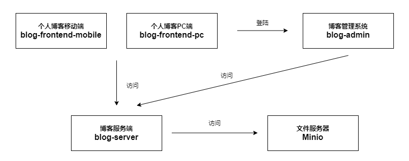

# 开发环境的搭建

经过前期的技术调研，服务端是基于egg.js进行开发，博客PC端和移动端是基于next.js进行开发，管理系统是基于create-react-app脚手架，以及我们的文件服务器，共计五个项目，也就意味着开发环境下需要开启5个端口，大致流程如下：

 

# 端口规划

- 文件服务器：5757端口

- 博客服务端：7070端口

- 个人博客PC端：7071端口

- 个人博客移动端：7072端口

- 博客管理系统：7073端口