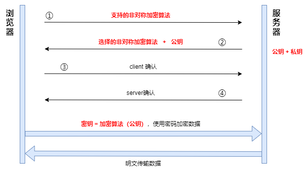
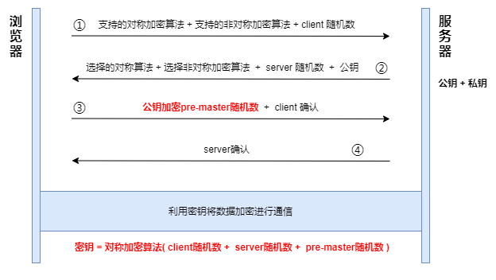
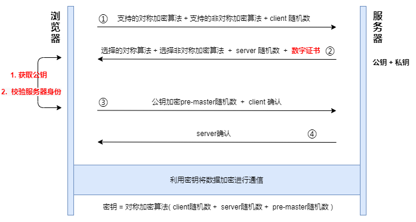

# 一文读懂 HTTPS

 

### 结论

HTTPS = HTTP + TSL/SSL（对称加密 + 非对称加密） + 数字证书

 
 

### 为什么需要 HTTPS

通过 HTTP 协议，客户端与服务端通信时，是**以明文的方式进行数据传输**，而整个通讯过程，数据还可能会通过 WiFi 路由器、运营商，因此**传输过程中数据极有可能被窃取或篡改**

 
 

### 什么是 HTTPS

简单来说 HTTPS 就是建立在 HTTP 基础之上，实现了**对传输数据的加密和解密**

 
 

### TSL/SSL

1. TLS/SSL 他们是两个安全传输层协议，用于在两个通信应用程序之间提供保密性和数据完整性

2. SSL 是 TLS 的前身，1996 年推出 SSL3.0 版本，1999 年就基于 SSL3.0 发布了 TSL1.0 版本，2018 年发布了 TSL1.3 版本

3. HTTPS 基于 TSL 协议，使用了**对称加密算法和非对称加密算法对数据进行加密**

 
 

### 什么是对称加密算法

**对称加密是指加密和解密都使用的是相同的密钥**，通过这四次通信，浏览器端和服务器端都有相同的 client 随机数 和 service 随机数，它们再使用相同的加密方法将两个随机数混合生成一个密钥，有了密钥之后，双方就可以进行数据的加密传输

**问题**

加密算法、client-random、service-random 在传输过程中是明文的，黑客也可以拿到协商的加密算法和双方的随机数

 
 

### 什么是非对称加密算法

1. 非对称加密算法有 A、B 两把密钥，如果你用 A 密钥来加密，那么只能使用 B 密钥来解密；反过来，如果你要 B 密钥来加密，那么只能用 A 密钥来解密

2. 在 HTTPS 中，服务器会将其中的一个密钥通过明文的形式发送给浏览器，我们把这个密钥称为**公钥**，服务器自己留下的那个密钥称为**私钥**。顾名思义，**公钥是每个人都能获取到的，而私钥只有服务器才能知道，不对任何人公开**

**问题**

服务端数据无法加密传输给浏览器

 
 

### 对称加密 + 非对称加密

对称加密算法可以实现双向数据加密，非对称加密算法可以实现加密数据无法被黑客破解，我们再将两者进行结合

最关键的是第三步：

1. 浏览器会再次生成一个 pre-master 的随机数，并使用公钥加密传给服务端，然后服务端通过私钥解密得到 pre-master

2. 如此一来，浏览器和服务端都得到了 client 随机数 + server 随机数 + pre-master 随机数，并且没有服务端的私钥，黑客是无法获取 pre-master 随机数的

3. 最后再利用这三个随机数进行对称加密，也就保障了加密数据的安全性，且能实现双向加密

**问题**

1. 通过 DNS 劫持将 IP 地址替换成了黑客的 IP 地址，这样我访问的其实是黑客的服务器了

2. DNS 劫持：即通过某种技术手段，篡改正确域名和 IP 地址的映射关系，使得域名映射到了错误的 IP 地址

 
 

### 数字证书

**作用**

1. 通过数字证书向浏览器证明服务器的身份

2. 数字证书里面包含了服务器公钥

 

**由来**

1. 向 CA 机构提交公钥、公司、站点等信息并等待认证，信息审核通过，CA 会向网站签发认证的数字证书，同时包含一个 CA 生成的签名

2. CA 使用 Hash 函数来计算极客时间提交的明文信息，并得出信息摘要；然后 **CA 再使用它的私钥对信息摘要进行加密，加密后的密文就是 CA 颁给极客时间的数字签名**，可以**通过数字签名来验证是否是该 CA 颁发的**（数字签名就好比我们的身份证，标识着我们的身份）

3. 操作系统中会内置信任的顶级 CA 的证书信息，小型的 CA 机构又可以向顶级的 CA 机构申请成为中间 CA

 
 

### HTTPS 如何加密数据

即：对称加密 + 非对称加密 + 数字证书

 
 
