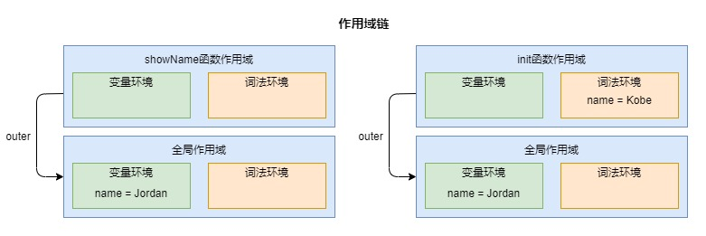
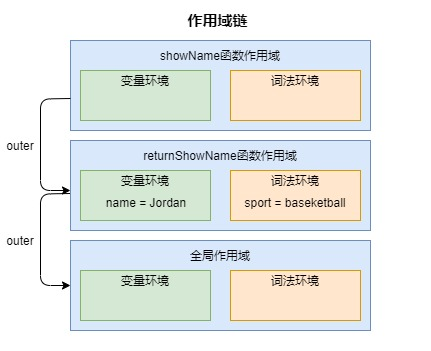

# 作用域链和闭包

</br>

### 作用域

作用域是指**在程序中定义变量的区域，该位置决定了变量的生命周期**，在 JavaScript 中，存在**全局作用域**、**函数作用域**、**块级作用域**

</br>
</br>

### 词法作用域

词法作用域**是由代码中函数声明的位置来决定的，是在编码过程中确定的**，通过它就能够**预测代码在执行过程中如何查找标识符**

**示例 1**

```javascript
// 词法作用域为：
// a函数作用域 - 全局作用域
// b函数作用域 - 全局作用域
function a() {}
function b() {}
```

</br>

**示例 2**

```javascript
// 词法作用域为：
// c函数作用域 - b函数作用域 - a函数作用域 - 全局作用域
function a() {
    function b() {
        function c() {}
    }
}
```

</br>
</br>

### 作用域链

在每个执行上下文的变量环境中，都包含了一个**外部引用 outer**，用来指向外部的执行上下文，**outer 的指向规则由词法作用域决定**，当访问一个变量时：

1. 先访问当前执行上下文中，**变量环境和词法环境中**是否存在该变量

2. 如果不存在，继续根据 outer 的指向继续访问上一个执行上下文中的变量

通过 outer 的不断指向，就会生成一个链条，**该链条就是作用域链**

</br>

#### 案例分析

```javascript
function showName() {
    console.log(name);
}
function init() {
    const name = "Kobe";
    showName();
}
var name = "Jordan";
init(); // Jordan
```



1. 根据词法作用域和 outer 指向规则，可以得到如上图所使的两条作用域链

2. 执行到 showName 函数时，在作用域链上访问 name 变量输出：Jordan

</br>
</br>

### 闭包

在 JavaScript 中，根据词法作用域的规则，内部函数总是可以访问其外部函数中声明的变量。**当一个外部函数返回一个内部函数后，执行这个外部函数，即使该外部函数已经执行结束了，但是内部函数依然能访问到外部函数的变量，我们就把这些变量的集合称为闭包**

```javascript
function returnShowName() {
    var name = "Jordan";
    const sport = "baseketball";
    function showName() {
        console.log(`${name} like ${sport}`);
    }
    return showName;
}
const func = returnShowName();
func(); // Jordan like baseketball
```



1. 作用域链：showName —— returnShowName —— 全局作用域

2. 虽然 returnShowName 函数执行完之后，会回收该函数中所定义的变量 name 和 sport，但是根据作用域链规则 showName 函数依然能访问到这两个变量，因此输出：Jordan like baseketball，这就产生了闭包

</br>

#### 函数执行完后，为什么没有销毁掉闭包变量？

以上述代码为例：

1. 当内部函数引用了外部函数的变量，JavaScript 引擎会判断这是一个闭包，于是 Javascrpt 会在**堆空间创建一个 “closure(returnShowName)” 的对象**

2. 虽然函数 returnShowName 执行完之后，执行上下文已经被销毁了，但是 “closure(returnShowName)” 的对象还保存在堆内存中

3. 通过 func 方法访问 name 和 sport 变量时，实际是访问 closure(returnShowName) 对象中的 name 和 sport 属性

</br>
</br>

### 思考题

```javascript
var person = {
    name: "Jordan",
    showName: function () {
        console.log(name);
    },
};
function init() {
    const name = "Kobe";
    return person.showName;
}
var name = "Curry";
const showName = init();
showName(); // Curry
person.showName(); // Curry
```

1. 根据词法作用域，确定作用域链：

    - init 函数作用域 —— 全局函数作用域

    - function () { console.log(name); } 函数作用域 —— 全局函数作用域

2. 执行 showName 函数时，function () { console.log(name); } 函数作用域中不存在 name 变量，直接返回全局作用域中的 name 变量

3. 同理执行 person.showName() 函数时，function () { console.log(name); } 函数作用域中不存在 name 变量，直接返回全局作用域中的 name 变量

</br>
</br>

### 总结

1. **作用域链是由词法作用域决定的**

2. **而词法作用域是由代码结构来确定的**

</br>
</br>
