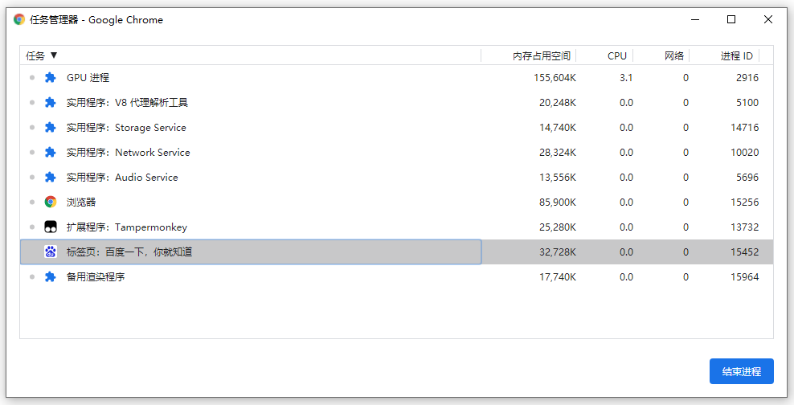

# 浏览器的多进程架构

</br>

### 前言

1. 文章主要以 Chrome 浏览器为参照，虽然不同浏览器的架构实现细节可能不同，但通过了解 Chrome 浏览器的多进程架构，可以让我们在宏观上建立起对浏览器的知识体系

2. 文章主要参考[《李兵老师-浏览器工作原理与实践》](https://time.geekbang.org/column/intro/216)课程，并对部分内容进行了合并和补充，再以自己的理解和归纳去进行总结

</br>
</br>

### 打开一个页面，却打开了多个进程？



当我们使用 chrome 浏览器打开 [https://www.baidu.com/](https://www.baidu.com/) 时，通过 **右上角 ——> 更多工具 ——> 任务管理器** 可查看到 chrome 为我们打开了 N 个进程：

1. 浏览器进程：即图中的 “浏览器”，主要负责**界面显示、用户交互、子进程管理，同时提供存储等功能**

2. GPU 进程：顾名思义，用于图像的绘制，例如：CSS 的 3D 效果，浏览器最终展示的 UI 界面

3. 渲染进程（多个）：即图中的 “标签页：百度一下,你就知道”，主要用来将 HTML、CSS 和 JavaScript 转换为用户可以与之交互的网页

4. 插件进程（多个）：即图中的 “扩展程序：tampermonkey”，主要负责每个插件的运行

5. 网络进程：即图中的 “Network Service”，主要负责页面的网络资源加载

6. V8 代理解析工具：解析 PAC 代理脚本（这是一种网页浏览器技术，用于定义浏览器该如何自动选择适当的代理服务器来访问一个网址）

7. Storage Service：暂不清楚，网上也没有找到相关资料...（难道是将浏览器进程中的存储功能抽离出来成为单独的一个进程？）

8. Audio Service：负责处理浏览器音频/视频（具体的作用暂不清除...）

</br>
</br>

### 为什么要采用多进程架构？

如果所有模块都共用一个进程会存在以下问题：

1. 不稳定：任意功能模块的崩溃都会导致浏览器的崩溃。例如：使用的插件崩溃了，整个浏览器也就崩溃了

2. 不流畅：同一时刻，只能运行一个模块，容易阻塞。例如：插件运行死循环，那么整个页面的渲染将会受影响

3. 不安全：恶意插件、页面脚本的威胁

</br>
</br>

### 浏览器如何分配渲染进程


如图所示，当我打开了三个标签页，Chrome 却只为我们创建了 2 个渲染进程，这是因为 Chrome 浏览器会将**浏览上下文组中属于同一站点的标签分配到同一个渲染进程中**

</br>

**什么是同一站点？**

A、B 两个**网站协议和域名相同**

</br>

**什么是浏览器上下文组？**

在 A 网页中，通过 a 标签打开 B 网页；或者通过 JavaScript 中的 window.open 方法来打开 B 网页，基于以上两种方式，A B 两个网页就称为浏览器上下文组。在 B 网页中，window.opener 的值就是指向极客邦标签页中的 window

</br>

**特殊情况**

如果 a 标签的 rel 属性加上了 "noopener noreferrer" 字样（noreferrer 是为了兼容旧浏览器。），说明从 A 页面打开新的 B 页面，A 页面不想跟 B 页面共用一个渲染进程，不想让 B 页面能访问到 A 页面的 window 对象

```html
<a target="_blank" rel="noopener noreferrer">new tab</a>
```

</br>
</br>
