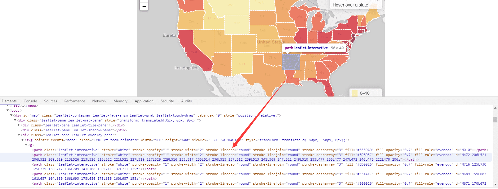
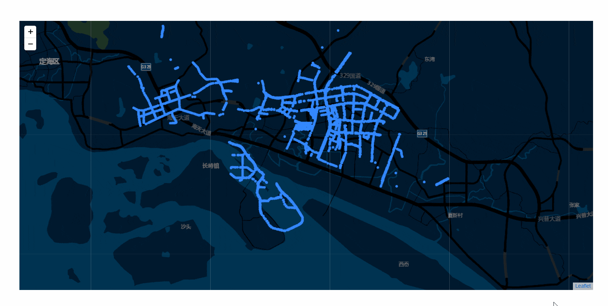
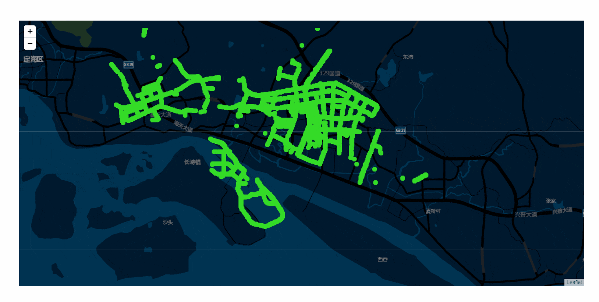

# SVG VS Canvas 图层渲染

 
 

### 前言

上一周临时接了一个舟山大屏的项目，其中有一个需求是：在地图中展示舟山所有接入 OneNET 平台的设备点。鉴于之前对开源地图 [leaflet](https://leafletjs.com/index.html) 小有研究，此次的需求我就直接基于 leaflet 进行开发

在上一篇文章 **[《基于 leaflet 开发地图飞线》](https://github.com/HeJueting/Blog/tree/master/%E5%89%8D%E7%AB%AF%E9%9A%8F%E7%AC%94/%E5%9F%BA%E4%BA%8Eleaflet%E5%BC%80%E5%8F%91%E5%9C%B0%E5%9B%BE%E9%A3%9E%E7%BA%BF)** 中，我简要介绍并实践了 leaflet 的自定义图层开发，也提到过 svg 和 canvas 自己都没有接触过，就盲选的 svg 进行实践。其实也不算盲选，我查看过 leaflet 内置图层的元素，也是基于 svg 实现的，如下图所示：

 

**但是，此次展示的点位是整个舟山市的设备，设备数量庞大，基于以上实现方式，接入真实数据后，页面直接卡顿到怀疑人生！！！**

 
 

### 卡顿的原因

1. 此次光是接口数据，经过刷选后就高达 600KB，且又不能分页展示，还要实时更新

2. leaflet 一次性渲染 4000 多个点位，且每一次地图的移动，缩放都会对成千上万个 dom 元素进行更新，导致浏览器 GPU 负荷过大

 

### 解决方法

1. 适当增大数据实时更新的时间（之前设置的 5s 请求一次数据更新，频率太快了）

2. 使用 canvas，更新一步到位

 
 

### 测试实践

记得 2 年前才开始入门前端时，看到过这么一句话：“dom 操作的代价是很昂贵的”。vue、react 等框架出现，也是为了屏蔽复杂的 dom 操作，交给更专业的“师傅”去处理。在此情此景中，不难发现**罪魁祸首便是这成千上万的 dom 元素的创建和更新**

#### SVG 实现

 

#### Canvas 实现

 

此次测试我只放置了 8000 个描点，在实际需求中，舟山接入 OneNET 平台设备类型高达 14 种，点位轻松破 “万” ，因此 svg 与 canvas 的体验差距会更大。此外，值得注意的是，leaflet 的 marker 描点会以普通的 img 元素存在于页面中，用不到 8000 个点位，就可以很明显地感受到页面的卡顿

 
 

**注意**：图片可能表现得并不直观，具体代码我已经放置仓库的 [demo](https://github.com/HeJueting/Blog/tree/master/%E5%89%8D%E7%AB%AF%E9%9A%8F%E7%AC%94/%E9%AB%98%E6%80%A7%E8%83%BD%E7%9A%84%E5%9B%BE%E5%B1%82%E6%B8%B2%E6%9F%93) 文件夹中，欢迎大家 clone 下来在本地体验一下渲染的差距

 
 
