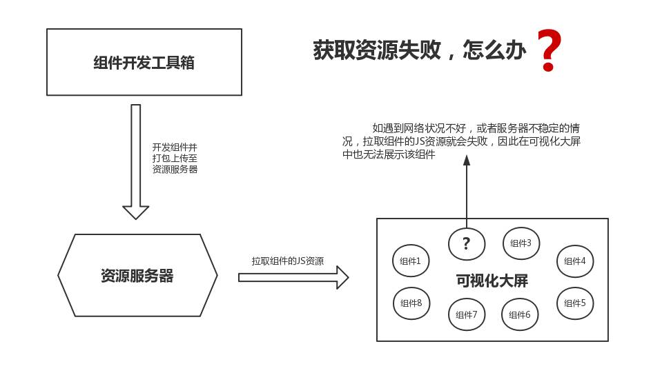
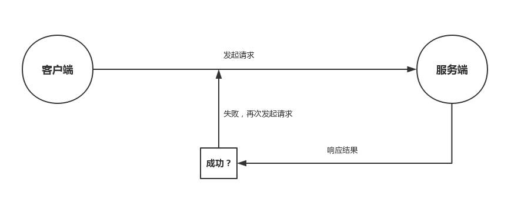
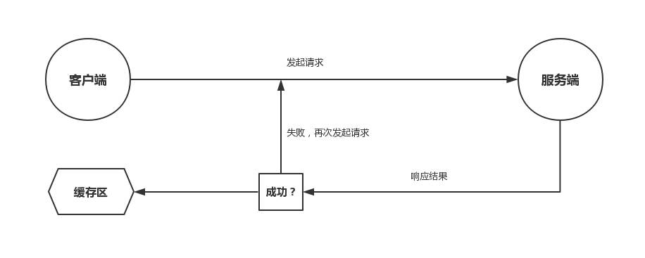

# url 资源 —— 缓存加载

</br>
</br>

### 前言

在 oneview 数据可视化项目中，所有加入编辑区的组件都是通过组件工具箱开发并打包放至一个资源服务器上，当一个可视化大屏加载时，它会先从这个资源服务器上拉取这些组件资源，因此，当碰到网络状况不好时，有可能会出现资源拉取失败，进而组件加载失败的问题。



**其实只要从服务器端产生交互（静态资源 or 接口数据），就有可能遇到这个问题，因此决定记录一下实现的思路**

</br>
</br>

### 思考

解决这个问题的思路很简单，也比较容易想到，通过 while 循环不断轮询这个请求地址，直到成功为止



</br>

但是在该项目中，还需要将已经加载的组件进行缓存，减少不必要的 http 请求



</br>
</br>

### 实现

1. 限定轮询次数（防止服务器挂掉了）

2. 利用 promise 能记住自己被 resolve 或者 reject 的结果的特性，进行缓存

```javascript
import Axios from "axios";

// 创建一个cacheMap对象，通过key-value的形式保存已经缓存的组件资源
const cacheMap = new Map();

async function getItemByUrl(url) {
    // 将这个资源的url当作独一无二的key值
    let key = url;
    // 从 cacheMap 缓存中获取该资源
    let promise = cacheMap.get(key);
    // 如果没有该缓存记录，则请求该url资源
    if (!promise) {
        // 注意，这里是一个异步操作，Axios.get返回的会是一个promise对象
        promise = Axios.get(url)
            .then((res) => {
                if (res.data && res.data.code == -1) {
                    return Promise.reject({ status: "error", res });
                } else {
                    return Promise.resolve(res);
                }
            })
            .catch((err) => {
                // 在请求回来后，如果出现问题，把 promise 从 cacheMap 中删除 以避免第二次请求继续出错
                cacheMap.delete(key);
                return err;
            });

        // 将这个 promise 对象加入 cacheMap 缓存中
        // 因为promise的状态一旦改变，就不会再变，任何时候都可以得到这个结果，因此利用这个特性，该promise对象的状态改变后，缓存区中也会相对改变
        cacheMap.set(key, promise);
    }
    return promise;
}

// 规定最多请求5次（如果无限轮询，防止服务器挂了）
async function getCorrectRes(url) {
    let i = 5;
    let result = null;
    let hasCorrect = false;
    while (i > 0 && !hasCorrect) {
        result = await getItemByUrl(url);
        if (result.status !== "error") {
            hasCorrect = true;
        }
        i--;
    }
    return result;
}

// 请求资源
let result = await getCorrectRes("http://localhost/test.js");
```

</br>
</br>
