# 使用 Chrome 检测网页性能

</br>

### 前言

**Chrome 版本： 91.0.4472.77**

</br>
</br>
</br>

### Lighthouse

</br>

#### 简介

Lighthouse 是一个开源的自动化工具，用于改进网络应用的质量。在 Chrome 中，已经集成了该工具，它可以**自动检测网页各项指标，并生成一份报告**，供我们参考。值得注意的是，当前版本下，你**需要翻墙**才能使用该功能。

</br>
</br>

#### 如何使用

1. 打开新的无痕浏览器（防止浏览器缓存对检测工具的影响）

2. 打开控制台，选择 lighthouse 选项

3. 点击 generate report 生成报告

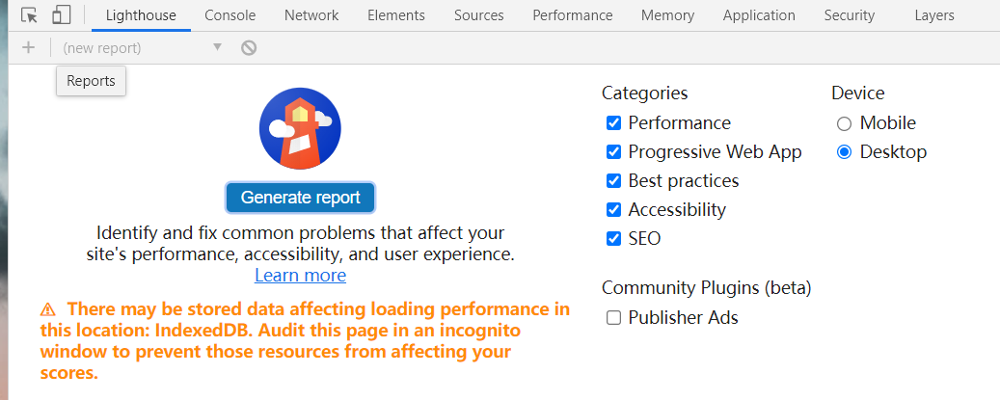

</br>
</br>

#### 报告构成

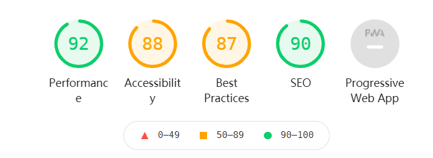

如图所示，分析报告主要由以下四个维度组成：

1. Performance：**监测并分析 Web 性能**

2. Accessibility：监测并分析是否实施了[无障碍功能](https://developers.google.com/web/fundamentals/accessibility?hl=zh-cn)

3. Best practices：监测并分析 Web 应用是否采用了最佳实践策略

4. SEO：监测并分析 Web 应用是否采实施了 SEO 搜素引擎优化

5. Progressive Web App：监测并分析 PWA 程序的性能

</br>
</br>

#### 性能分析

对于我们而言，主要是 Performance 模块对我们网页进行性能分析，该模块共分为四个板块：

</br>

**Metrics：：性能指标的评分**

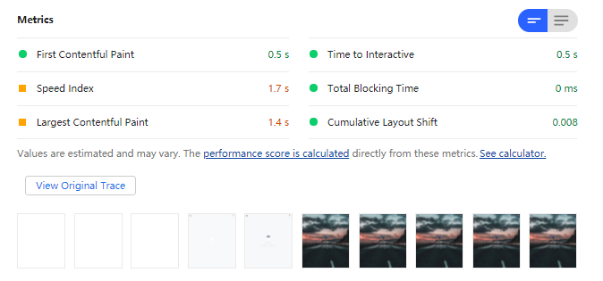

1. First Contentful Paint：当页面中绘制了第一个像素时所用的时间，简称 FCP

2. Speed Index：首屏渲染时间

3. Largest Contentful Paint：当首屏内容完全绘制完成时所用的时间，简称 LCP

4. Time to Interactive：表示页面中所有元素都达到了可交互的时长，简称 TTI

5. Total Blocking Time：FCP 到 TTI 之间主线程被阻塞时长的总和，简称 TBT

6. Cumulative Layout Shift：累计布局偏移得分，简单理解：当用户浏览一个页面的时候，若是想要点击一个按钮或者其他交互时，页面的布局突然出然抖动，可能会造成用户的交互行为造成期望之外的结果，简称 CLS

</br>

**opportunities：建议优化项**

如下图所示：

1. 建议我使用 HTTP/2 协议

2. 建议我使用适当大小的图片

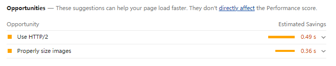

</br>

**Diagnostics：手动诊断**

采集了一些可能存在性能问题的指标，这些指标可能会影响到页面的加载性能

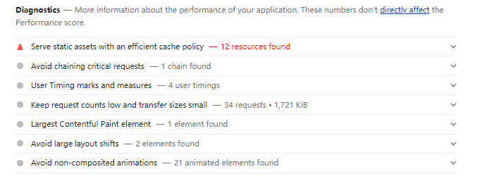

</br>

**Passed audits：优化策略审核**

用来统计了该网站使用了哪些优化策略，不同网站的结果和数量均不同


</br>
</br>
</br>

### Performance

</br>

#### 简介

与 Lighthouse 有所不同，Perofrmance 不会给出性能得分，也不会给出优化建议，它只是单纯地采集性能数据，并将采集到的数据按照时间线的方式来展现，我们要做的就是依据原始数据来分析 Web 应用的性能问题

</br>
</br>

#### 如何使用

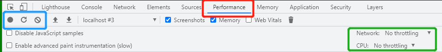

1. 首先打开控制台，找到 Performance 选项

2. 黑色按钮：**用来记录交互阶段性能数据**，需要手动开启/停止录制过程

3. 带箭头的刷新按钮：**用来记录加载阶段的性能数据**，点击后 Performance 会重新刷新页面，并等到页面完全渲染出来后，就会自动停止录制

4. Network：限制网络加载速度

5. CPU：限制 CPU 的运算速度

</br>
</br>

#### 报告构成

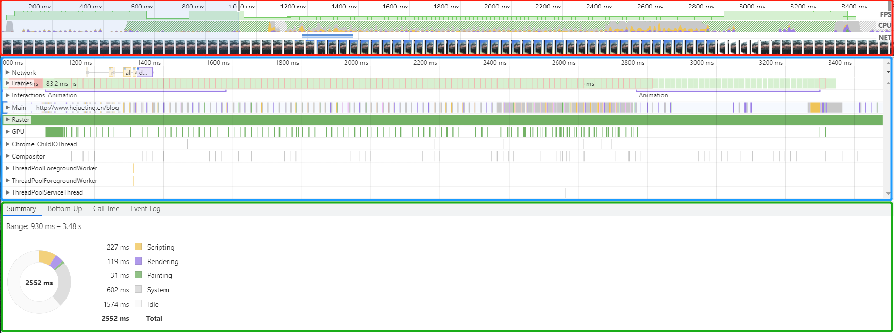

Performance 最后生成的报告主要由三部分组成：

1. **概览面板（红色框）**：宏观上检测几个**关键指标**的变化

2. **性能分析面板（蓝色框）**：主要用来**展现特定时间段内的多种性能指标数据**

3. **详情面板（绿色框）**：统计特定时间段内的多种性能指标数据详情

</br>
</br>

#### 概览面板

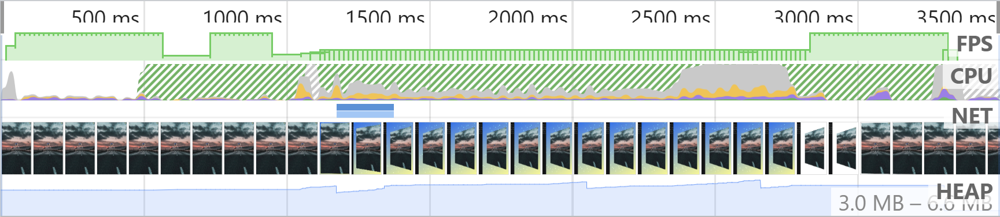

概览面板中引入了几个关键指标：

**1、页面帧速 (FPS)**

如果出现了红色块，那么就表示红色块附近渲染出一帧所需时间过久，帧的渲染时间过久，就有可能导致页面卡顿。一般来说，绿色的长条越高，说明 FPS 越高，用户体验越好

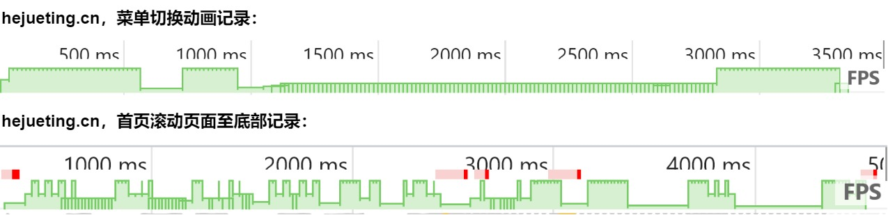

</br>

**2、CPU 资源消耗（CPU）**

如果图形占用面积太大，表示 CPU 使用率就越高，那么就有可能因为某个任务占用太多的主线程时间，从而影响其他任务的执行。在 CPU 图表中的各种颜色与详情面板中的 Summary 模块的颜色是相互对应的

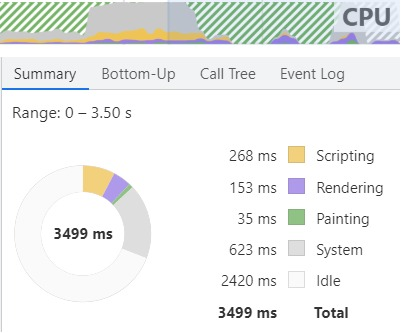

</br>

**3. 网络请求流量（NET）**

宏观展示某个时段正在处理网络资源

</br>

**4. 浏览器每一帧绘制的图像**

</br>

**5. V8 内存使用量（HEAP）**

如果记录的过程中，内存使用量一直在增加，就可能是某种原因导致了内存泄漏

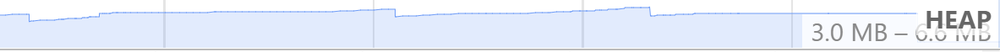

</br>
</br>

#### 性能分析面板

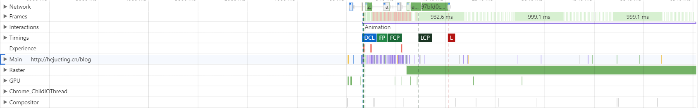

我们一般通过概览面板来定位到可能存在问题的时间节点，接着查看性能分析面板中性能指标的具体数据进行问题分析

1. Network：记录展示了页面中的每个网络请求所消耗的时长

2. Frames：浏览器生成每帧的记录

3. Interactions：记录用户交互操作

4. Timings：记录一些关键的时间节点在何时产生的数据信息，例如：FCP（绘制了第一个像素时间点）、LCP（页面完全绘制的时间点）

5. Main：记录**渲染主线程的任务执行过程**

6. Compositor：记录了合成线程的任务执行过程

7. Raster：合成线程又维护了一个光栅化线程池，主要目的是让 GPU 执行光栅化的任务（图块生成位图的任务）

8. GPU：记录了 GPU 进程主线程的任务执行过程

9. Chrome_ChildIOThread：IO 线程的任务记录

</br>
</br>

#### 详情面板

通过在性能分析面板中选中性能指标中的任何历史数据，然后选中记录的细节信息就会展现在详情面板中

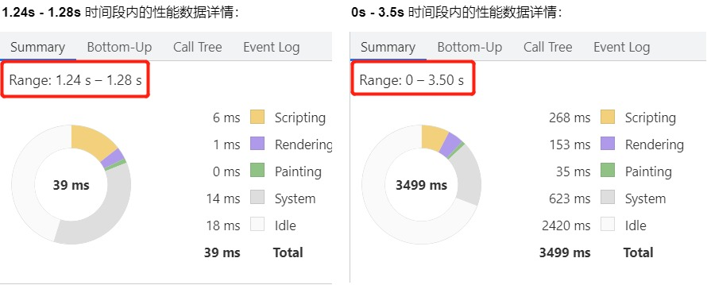

</br>
</br>
</br>

### 如何渲染主线程 Main 的任务

使用 Performance 分析页面时，最重要的就是通过查看 Main 指标数据，分析渲染主线程执行了哪些任务，以下代码为例：

```html
<!DOCTYPE html>
<html lang="en">
    <head>
        <link rel="stylesheet" type="text/css" href="http://localhost/test.css" />
    </head>
    <body>
        <script>
            for (let i = 0; i < 1000; i++) {
                console.log("执行循环操作");
            }
        </script>
        <p id="txt">Hello World</p>
        <script>
            setTimeout(() => {
                for (let i = 0; i < 1000; i++) {
                    console.log("执行循环操作");
                }
                document.getElementById("txt").style.color = "blue";
            }, 100);
        </script>
    </body>
</html>
```

```css
body {
    background: green;
}
p {
    color: red;
}
```

</br>s

**宏观分析**

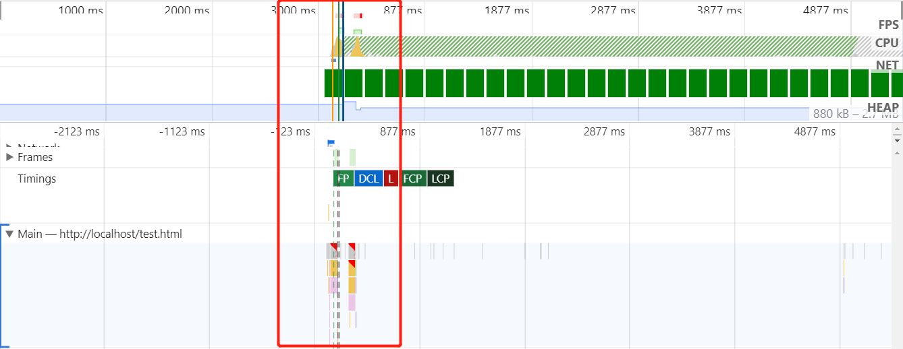

通过上图可以发现渲染主线程 Main 主要集中在红框区域任务密集，且零星还看到了红色的线条，我们需要详细地看看渲染主线程做了什么事情

</br>

**1、Parse HTML**

28.4ms —— 29.4ms：解析 HTML 文件，构建 DOM 树

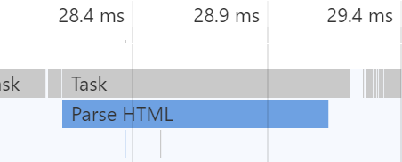

</br>

**2、Parse Stylesheet**

32.2ms —— 32.3ms：解析 CSS 样式表

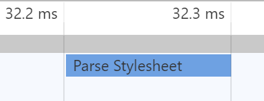

</br>

**3、Recalculate Style && Layout**

32.7 —— 33.0：根据 DOM 树和 Stylesheet 计算 dom 的样式和位置

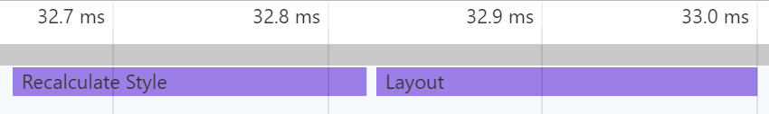

</br>

**4、Update LayerTree**

33.1 —— 33.2：构建一个新的布局树，并划分图层

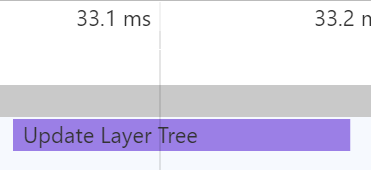

</br>

**4、Update Layer Tree**

33.1 —— 33.2：构建一个新的布局树


