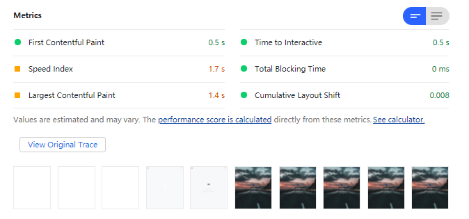
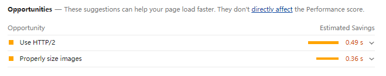
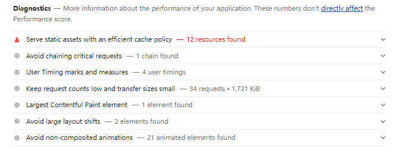
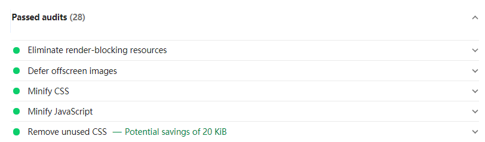

# 使用 Chrome 检测网页性能

 

### 前言

**Chrome 版本： 91.0.4472.77**

 
 
 

### Lighthouse

 

#### 简介

Lighthouse 是一个开源的自动化工具，用于改进网络应用的质量。在 Chrome 中，已经集成了该工具，它可以**自动检测网页各项指标，并生成一份报告**，供我们参考。值得注意的是，当前版本下，你**需要翻墙**才能使用该功能。

 
 

#### 如何使用

1. 打开新的无痕浏览器（防止浏览器缓存对检测工具的影响）

2. 打开控制台，选择 lighthouse 选项

3. 点击 generate report 生成报告

 
 

#### 报告构成

如图所示，分析报告主要由以下四个维度组成：

1. Performance：**监测并分析 Web 性能**

2. Accessibility：监测并分析是否实施了[无障碍功能](https://developers.google.com/web/fundamentals/accessibility?hl=zh-cn)

3. Best practices：监测并分析 Web 应用是否采用了最佳实践策略

4. SEO：监测并分析 Web 应用是否采实施了 SEO 搜素引擎优化

5. Progressive Web App：监测并分析 PWA 程序的性能

 
 

#### Performance 性能分析

对于我们而言，主要是 Performance 模块对我们网页进行性能分析，该模块共分为四个板块：

 

**Metrics：：性能指标的评分**

1. First Contentful Paint：当页面中绘制了第一个像素时所用的时间，简称 FCP

2. Speed Index：首屏渲染时间

3. Largest Contentful Paint：当首屏内容完全绘制完成时所用的时间，简称 LCP

4. Time to Interactive：表示页面中所有元素都达到了可交互的时长，简称 TTI

5. Total Blocking Time：FCP 到 TTI 之间主线程被阻塞时长的总和，简称 TBT

6. Cumulative Layout Shift：累计布局偏移得分，简单理解：当用户浏览一个页面的时候，若是想要点击一个按钮或者其他交互时，页面的布局突然出然抖动，可能会造成用户的交互行为造成期望之外的结果，简称 CLS

 

**opportunities：建议优化项**

如下图所示：

1. 建议我使用 HTTP/2 协议

2. 建议我使用适当大小的图片

 

**Diagnostics：手动诊断**

采集了一些可能存在性能问题的指标，这些指标可能会影响到页面的加载性能

 

**Passed audits：优化策略审核**

用来统计了该网站使用了哪些优化策略，不同网站的结果和数量均不同

 
 
 

### Performance
