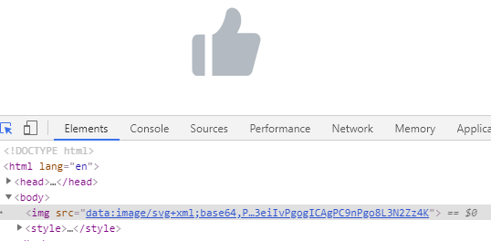
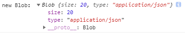
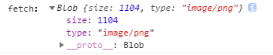
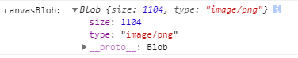
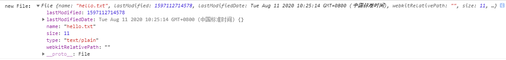
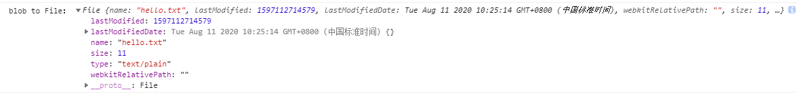
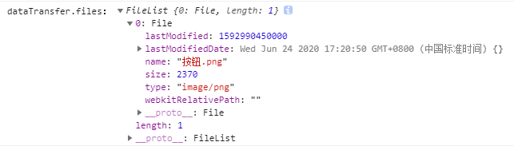
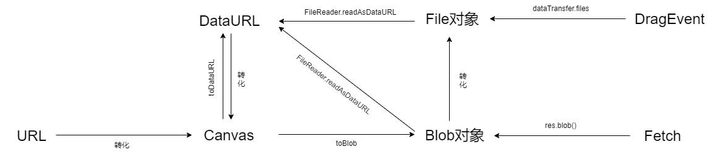

# 图片处理（url、base64、blob、file）

</br>
</br>

### 前言

在进行图片处理的时，经常会与 url、base64、blob 打交道，在此记录一下三者之间的转换关系

</br>
</br>

### URL

在 WWW 上，每一信息资源都有统一的且在网上唯一的地址，该地址就叫 URL（Uniform Resource Locator,统一资源定位器），它是 WWW 的统一资源定位标志，就是指网络地址。

```html

```

例如这里的 *https://www.baidu.com/test.png* 便是某张图片的 url 地址，它由三部分组成：存放资源的主机域名、资源文件名、资源类型

</br>
</br>

### base64 和 DataURL

</br>

#### 什么是 base64

Base64 是网络上最常见的用于传输 8Bit 字节码的编码方式之一，Base64 就是一种**基于 64 个可打印字符来表示二进制数据的方法**。通过 **atob()** 方法对经过 base-64 编码的字符串进行解码。相反地，通过 **btoa()** 函数能够将某个数据转为 base-64 编码的 ASCII 字符串。例如：以下图片就是以 base64 形式进行展示，但严格来说，src 中的数据格式应该叫做 Data URL



参考：[Base64 的编码与解码](https://developer.mozilla.org/zh-CN/docs/Web/API/WindowBase64/Base64_encoding_and_decoding)

</br>

#### 什么是 DataURI

Data URI scheme 简称 Data URI，即前缀为 data: 协议的 URL，其允许内容创建者向文档中嵌入小文件。Data URL 应有由以下四个部分组成：

1. 前缀（data:）

2. 指示数据类型的 MIME 类型（image/svg+xml）

3. base64 标记（;base64）

4. base64 数据（PHN2ZyB4bWxu...）

```json
data:image/jpg;base64,R0lGODlhAQABAIAAAAUEBAAAACwAAAAAAQABAAACAkQBADs=
```

</br>

#### 如何得到 DataURL

1. canvas.toDataURL 方法

该方法返回一个包含图片展示的 data URI

```javascript
// 获取图片
const diamonds = document.getElementById("diamonds");
// 创建canvas
const canvas = document.createElement("canvas");
const ctx = canvas.getContext("2d");
canvas.setAttribute("width", `${diamonds.width}px`);
canvas.setAttribute("height", `${diamonds.height}px`);

diamonds.onload = function () {
    ctx.drawImage(diamonds, 0, 0);
    // 将canvas转为图片
    const base64Url = canvas.toDataURL();
    console.log(base64Url);
};
```

</br>

2. FileReader.readAsDataURL 方法

该方法会读取指定的 Blob 或 File 对象。读取操作完成的时候，readyState 会变成已完成 DONE，并触发 loadend 事件，同时 result 属性将包含一个 data:URL 格式的字符串（base64 编码）以表示所读取文件的内容

```html
<input id="inputFile" type="file" onchange="fileLoad()" />
```

```javascript
function fileLoad() {
    const inputFile = document.getElementById("inputFile");
    const reader = new FileReader();
    // 拿到这个文件的file对象，并作为readAsDataURL的参数
    reader.readAsDataURL(inputFile.files[0]);
    // readAsDataURL读取完成后，触发load事件
    reader.addEventListener(
        "load",
        function () {
            // 该文件的DataURL作为reader的result属性输出
            console.log(reader.result);
        },
        false
    );
}
```

参考：[DataURL](https://developer.mozilla.org/zh-CN/docs/Web/HTTP/data_URIs)、[HTMLCanvasElement.toDataURL](https://developer.mozilla.org/zh-CN/docs/Web/API/HTMLCanvasElement/toDataURL)、[FileReader](https://developer.mozilla.org/zh-CN/docs/Web/API/FileReader)、[FileReader.readAsDataURL](https://developer.mozilla.org/zh-CN/docs/Web/API/FileReader/readAsDataURL)

</br>
</br>

### Blob 对象

</br>

#### 什么是 Blob 对象

Blob 对象是 File 对象的父类，表示一个文件的数据内容，它通常用来读写文件

</br>

#### 如何得到 Blob 对象

1. new Blob([array], options)

```javascript
new Blob([JSON.stringify({ name: "hejueting" })], {
    type: "application/json",
});
```



Blob() 构造函数会返回一个新的 Blob 对象，该构造函数接受两个参数:

-   第一个参数是数组，成员是*字符串*或*二进制对象*（[ArrayBuffer](https://developer.mozilla.org/zh-CN/docs/Web/JavaScript/Reference/Global_Objects/ArrayBuffer)、[ArrayBufferView](https://developer.mozilla.org/zh-CN/docs/Web/JavaScript/Reference/Global_Objects/TypedArray)、[Blob](https://developer.mozilla.org/zh-CN/docs/Web/API/Blob)、[DOMString](https://developer.mozilla.org/zh-CN/docs/Web/API/DOMString)），表示新生成的 Blob 实例对象的内容

-   第二个参数是一个配置对象

    -   type，默认值为 ""，它代表了将会被放入到 blob 中的数组内容的 MIME 类型

    -   endings，默认值为"transparent"，用于指定包含行结束符\n 的字符串如何被写入

</br>

2. fetch(url)

```javascript
fetch("http://localhost/img/diamonds.png")
    .then((res) => res.blob())
    .then((blob) => {
        console.log("fetch：", blob);
    });
```

利用 JS 提供的 Fetch API，也可以得到 Blob 对象



</br>

3. canvas.toBlob

除了 toDataURL 方法外，canvas 还有 toBlob 方法将 canvas 画布内容转为一个 Blob 对象

```javascript
const canvas = document.createElement("canvas");
const ctx = canvas.getContext("2d");
// 获取图片
const diamonds = document.getElementById("diamonds");
// 设置宽高
canvas.setAttribute("width", `${diamonds.width}px`);
canvas.setAttribute("height", `${diamonds.height}px`);
diamonds.onload = function () {
    ctx.drawImage(diamonds, 0, 0);
    // 将canvas转为图片
    canvas.toBlob((blob) => {
        console.log("canvasBlob：", blob);
    });
};
```



</br>

参考：[Blob](https://developer.mozilla.org/zh-CN/docs/Web/API/Blob)、[Fetch](https://developer.mozilla.org/zh-CN/docs/Web/API/Fetch_API/Using_Fetch)、[canvas.toBlob](https://developer.mozilla.org/zh-CN/docs/Web/API/HTMLCanvasElement/toBlob)

</br>
</br>

### file 对象

</br>

#### 什么是 File 对象

文件（File）接口提供有关文件的信息，并允许网页中的 JavaScript 访问其内容

</br>

#### 如何得到 File 对象

1. new File([bits], name, options)

```javascript
const file = new File(["Hello World"], "hello.txt", {
    type: "text/plain",
});
```



File 构造函数接受三个参数:

-   第一个参数与 Blob 构造函数一样，接收一个数组，成员是*字符串*或*二进制对象*（[ArrayBuffer](https://developer.mozilla.org/zh-CN/docs/Web/JavaScript/Reference/Global_Objects/ArrayBuffer)、[ArrayBufferView](https://developer.mozilla.org/zh-CN/docs/Web/JavaScript/Reference/Global_Objects/TypedArray)、[Blob](https://developer.mozilla.org/zh-CN/docs/Web/API/Blob)、[DOMString](https://developer.mozilla.org/zh-CN/docs/Web/API/DOMString)），表示新生成的 File 实例对象的内容

-   第二个参数是表示文件名称

-   第三个参数是一个配置对象

    -   type，默认值为 ""，它代表了将会被放入到 blob 中的数组内容的 MIME 类型

    -   lastModified: 数值，表示文件最后修改时间的 Unix 时间戳（毫秒）。默认值为 Date.now()

</br>

2. blob 对象转 file 对象

由于 File 对象的第一个参数也可以是一个 blob 对象，因此通过 blob 对象也可以直接生成 file 对象

```javascript
const blob = new Blob(["Hello World"], {
    type: "text/plain",
});
const blobToFile = new File([blob], "hello.txt", {
    type: "text/plain",
});
```



</br>

3. dataTransfer.files

```javascript
const fileBox = document.getElementById("fileBox");
// 阻止将该文件打开新的浏览器窗口进行文件展示
fileBox.addEventListener("dragenter", (e) => {
    e.preventDefault();
    e.stopPropagation();
});
fileBox.addEventListener("dragover", (e) => {
    e.preventDefault();
    e.stopPropagation();
});
fileBox.addEventListener("dragleave", (e) => {
    e.preventDefault();
    e.stopPropagation();
});
fileBox.addEventListener("drop", (e) => {
    e.preventDefault();
    e.stopPropagation();
    // 获取文件
    let files = e.dataTransfer.files;
    console.log("dataTransfer.files：", files);
});
```



</br>

参考：[File](https://developer.mozilla.org/zh-CN/docs/Web/API/File)、[DragEvent](https://developer.mozilla.org/zh-CN/docs/Web/API/DragEvent)、[DataTransfer](https://developer.mozilla.org/zh-CN/docs/Web/API/DataTransfer)

</br>
</br>

### 关系

经过以上分析，我们可以简单梳理出 DataURL、Blob、File 三者之间的关系:



</br>
</br>

完整的代码已经上传到 GitHub，请点击[这里](https://github.com/HeJueting/Blog/tree/master/%E5%89%8D%E7%AB%AF%E9%9A%8F%E7%AC%94/%E5%9B%BE%E7%89%87%E5%A4%84%E7%90%86%EF%BC%88url%E3%80%81base64%E3%80%81blob%E3%80%81file%EF%BC%89)查看

</br>
</br>
