# 基于leaflet开发地图飞线

</br>
</br>


### 前言

> 近期 oneview 应用编辑器的地图组件要进行重构，参考了阿里的 data-v 的实现后，决定采用支持自定义开发和扩展的 [leaflet](https://leafletjs.com/) 开源地图库。
>
> 由于之前没有接触过 SVG 和 leaflet ，实现过程也算曲折，借此记录一下自己的实现过程和思路

</br>
</br>


### 前期调研

> 阿里 data-v 的地图飞线层实现如下图所示：

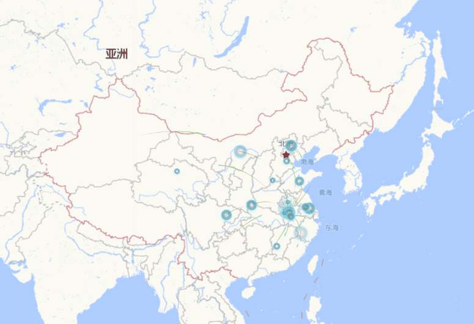

</br>

> 由上图可知，我们首先得利用 cavans 或者 svg 画出这些飞线和气泡。阿里是通过 canvas 实现的，三个 canvas 分别对应了**飞线**、**气泡**、**飞线头部**（每条飞线是有一个线头的，由于图片清晰度原因，不好从图片中直接观察到）。

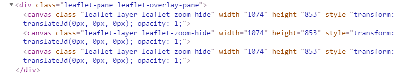

</br>

对于 leaflet 而言，canvas 和 svg 两种绘制方式都支持。由于之前 canvas 和 svg 我都没有接触过，就盲选了 SVG 进行学习和开发。

</br>
</br>


### 绘制气泡

> 相对于飞线而言，气泡是比较容易实现的

</br>

##### ● 圆圈

通过 **[circle](https://developer.mozilla.org/zh-CN/docs/Web/SVG/Element/circle)** 元素我们可以绘制一个简单的圆圈：

1. cx： 横坐标
2. cy： 纵坐标
3. r： 圆的半径
4. fill： 填充颜色

```html
//1. cx： 横坐标； 2. cy： 纵坐标； 3. r  ： 圆的半径； 4. fill： 填充颜色
<svg width="1000" height="700">
    <circle cx="200" cy="200" r="50" fill="#69c0ff"/>
</svg>
```

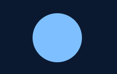

</br>

##### ● 渐变

仔细观察，我们会发现阿里飞线层的气泡颜色是有渐变的，svg 提供了线性渐变和径向渐变两种方式： **[linearGradient](https://developer.mozilla.org/zh-CN/docs/Web/SVG/Element/linearGradient)** 和 **[radialGradient](https://developer.mozilla.org/zh-CN/docs/Web/SVG/Element/radialGradient)**。

```html
<svg width="1000" height="700">
    <defs>
        <!-- 线性渐变 -->
        <linearGradient id="lineGradient">
            <stop offset="0%"   stop-color="red"/>
            <stop offset="100%" stop-color="yellow"/>
        </linearGradient>

        <!-- 径向渐变(颜色渐变) -->
        <radialGradient id="radialGradient-1"> 
            <stop offset="0%" stop-color="red"/>
            <stop offset="100%" stop-color="yellow"/>
        </radialGradient>

        <!-- 径向渐变(透明度渐变) -->
        <radialGradient id="radialGradient-2">
            <stop offset="0%"   stop-color="#69c0ff" stop-opacity="0"/>
            <stop offset="40%"   stop-color="#69c0ff" stop-opacity="0"/>
            <stop offset="100%" stop-color="#69c0ff" stop-opacity="1"/>
        </radialGradient>
    </defs>

    <rect x="100" y="100" width="100" height="100" fill="url(#lineGradient)" />
    <circle cx="350" cy="150" r="50" fill="url(#radialGradient-1)" />
    <circle cx="550" cy="150" r="50" fill="url(#radialGradient-2)" />
</svg>
```

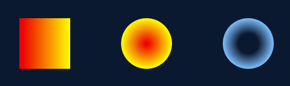

</br>

##### ● 放大动画

通过 radialGradient 径向渐变，我们已经大致画出了这个冒泡的圆圈，现在只需要加入放大动画即可, svg 也自带了 **[animate](https://developer.mozilla.org/zh-CN/docs/Web/SVG/Element/animate)** 动画元素。

```html
<svg width="1000" height="700">
    <defs>
        <radialGradient id="radialGradient-2">
            <stop offset="0%"   stop-color="#69c0ff" stop-opacity="0"/>
            <stop offset="40%"   stop-color="#69c0ff" stop-opacity="0"/>
            <stop offset="100%" stop-color="#69c0ff" stop-opacity="1"/>
        </radialGradient>
    </defs>

    <circle cx="550" cy="150" fill="url(#radialGradient-2)" >
        <animate attributeName="r" dur="2s" repeatCount="indefinite" values="0;50"/>
    </circle>
</svg>
```

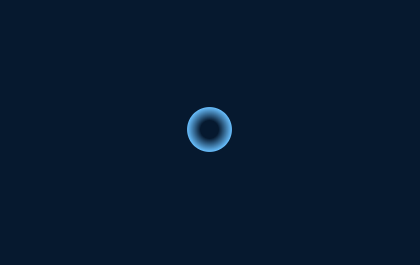

</br>

圆圈的突然消失还是有些不协调，我们可以优化一下，再加入一个改变透明度的动画，让他慢慢显示与消失。

```html
<circle cx="550" cy="150" fill="url(#radialGradient-2)" >
    <animate attributeName="opacity" dur="2s" repeatCount="indefinite" values="0;1;1;0" />
    <animate attributeName="r" dur="2s" repeatCount="indefinite" values="0;50"/>
</circle>
```


</br>
</br>


### 绘制飞线

> 飞线的绘制，相对于气泡而言，略有难度，svg 提供了 **[path](https://developer.mozilla.org/zh-CN/docs/Web/SVG/Tutorial/Paths)** 元素用于绘制线条，通过定义属性d，我们可以确定 path 元素的形状。

</br>


##### ● 绘制直线

>直线命令

1. M（m）： 表示线条的起点，参数是一个坐标点，"M10 20"
2. L（l）： 表示线条所移动到的新位置，也就是下一个位置处，参数是一个坐标点，"L20 30"
3. H（h）： 绘制水平线，参数是x轴上的坐标点，"H200"
4. V（v）： 绘制垂直线，参数是y轴上的坐标点，"V300"
5. Z（z）： 闭合路径命令，用来连接最后一个坐标点与起始坐标点的位置

```html
<svg width="1000" height="700">
    <path d="M100 100 L100 200" stroke="white" stroke-width="2"/>
    <path d="M150 100 V200" stroke="red" stroke-width="2"/>
    <path d="M200 150 H300" stroke="gold" stroke-width="2"/>
    <path d="M350 100 L400 200" stroke="green" stroke-width="2"/>
    <path d="M500 100 L450 200 L550 200 L500 100" stroke="blue" stroke-width="2" fill="none"/>
    <path d="M650 100 L600 200 L700 200 Z" stroke="yellow" stroke-width="2" fill="none"/>
</svg>
```

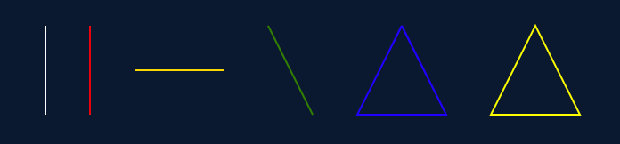

</br>


##### ● 贝塞尔曲线

> 对于 SVG 曲线而言，只有二阶和三阶贝塞尔曲线，因此使用 path 路径绘制曲线前，我们还需要先简单了解一下什么是贝塞尔曲线？
> 
> 贝塞尔曲线其实就是按照一定规则生成的一条曲线，它主要有 **起始点**、**控制点**、**终止点** 组成，通过调整控制点的的位置，曲线形状也会发生相应的变化。

**1、二阶贝塞尔曲线**：1个起点（P₀）、1个终点（P₂）、1个控制点（P₁）


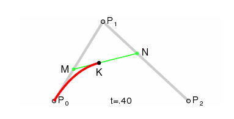

如上图所示，动图很直观地展示了二阶贝塞尔曲线的形成过程，曲线上的点也会满足一个规律：**P₀M/P₀P₁ = P₁N/P₁P₂**

**2、三阶贝塞尔曲线**：1个起点（P₀）、1个终点（P₃）、2个控制点（P₁、P₂）


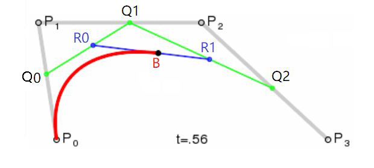

三阶贝塞尔曲线的形成规律与二阶的也类似，**P₀Q₀/P₀P₁ = P₁Q₁/P₁P₂ = P₂Q₂/P₂P₃**

</br>

(PS：对于飞线的实现，只需要简单了解一下二阶贝塞尔曲线即可。因此，对于贝塞尔曲线的掌握，我也只是皮毛，如果你有兴趣话可以自行 goole 一下)

</br>


##### 绘制曲线 

> 曲线命令

1. Q：二阶贝塞尔曲线，参数：Q x1 y1, x y，例如："Q10 20 30 40"，(10,20)是控制点，(30,40)目标点
2. T：连接二阶贝塞尔曲线，参数：T x y，它的前面只能是 Q 点或者 T 点。
3. C：三阶贝塞尔曲线，参数：C x1 y1, x2 y2, x y
4. S：连接三阶贝塞尔曲线，参数：S x2 y2, x y

</br>

（PS：实现飞线需要重点掌握 Q 点的使用即可，有关于曲线命令的更多细节，有兴趣的话可以参照 **[path文档](https://developer.mozilla.org/zh-CN/docs/Web/SVG/Tutorial/Paths)** 进行深入学习）

```html
<svg width="1000" height="700">
	<path d="M100 100 Q150 200 200 100" stroke="white" stroke-width="2" fill="none"/>
	<path d="M250 100 Q300 200 350 100 T 450 100" stroke="white" stroke-width="2" fill="none"/>
	<path d="M500 100 C 530 30 555 30 585 100" stroke="yellow" fill="none"/>
	<path d="M650 100 C 680 30, 705 30, 735 100 S 790 180, 820 100" stroke="yellow" fill="none"/>
</svg>
```

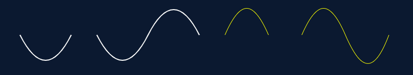

</br>


##### 如何设计飞线？ 

> 仔细观察 data-v 的飞线，类似于一条二阶贝塞尔曲线，且它的控制点在**起点和终点连线的垂直平分线上**，如下图所示，A 和 B 分别代表起点和终点，C 点是 AB 连线上的中点，如果**已知 A B 两点坐标，再已知 QC 连线的距离**，即可轻松求出 Q 点坐标。

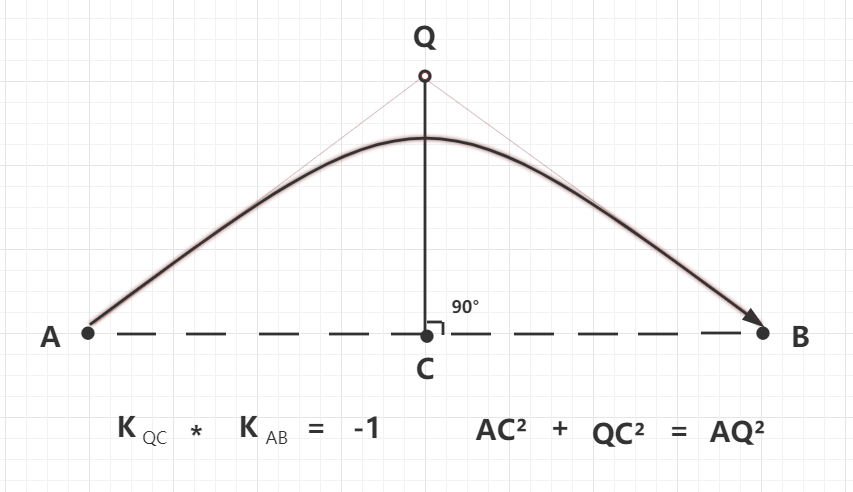

```javascript
/**
 * 计算二阶贝塞尔曲线
 * A, B 接收的坐标点如：{x:0,y:0}； QC代表QC线段的长度
 */
function getCurve (A, B, QC) {
    // 统一转换成成数组[X,Y]
    A = [Number(A.x), Number(A.y)];
    B = [Number(B.x), Number(B.y)];

    // 计算两点间的中间点
    let C = [
        Math.abs((B[0] + A[0]) / 2),
        Math.abs((B[1] + A[1]) / 2),
    ];

    // 计算这两点之间的长度
    let length = getLength(A, B);

    let Qx, Qy;
    // 这条线平行于y轴
    if (A[0] == B[0]) {
        Qx = (C[0] + QC).toFixed(3);
        Qy = C[1];
    }
    // 这条线平行于x轴
    else if (A[1] == B[1]) {
        Qx = C[0];
        Qy = (C[1] + QC).toFixed(3);
    }
    // 任意的一条线
    else {
        /**
        * 利用斜率去求得这个二阶贝塞尔曲线Q点
        * k1 = (B[0] - A[0]) / (B[1] - A[1]);
        * k2 = (Qx - C[0]) / (Qy - C[1]);
        * k1 * k2 = -1;
        */
        let k = (B[0] - A[0]) / (B[1] - A[1]);

		//根据上图所示的公式，自己试着列示求解哟~
        Qx = Math.sqrt(Math.pow(QC, 2) / (1 + Math.pow(k, 2))) + C[0];
        Qy = C[1] - k * (Qx - C[0]);
    }

    // 计算两点之间的长度
    function getLength(point1, point2) {
        return Math.floor(
            Math.sqrt(
                Math.pow(point2[1] - point1[1], 2) +
                Math.pow(point2[0] - point1[0], 2),
            ),
        );
    }

    return `M${A} Q${Qx},${Qy} ${B}`;
}
```

</br>

> 如果现在已知 **起点A(100,200)**、**终点B(400,200)**、**QC距离100**，那么我们可以求出这个 path 元素的**属性d："M100,200 Q250,300 400,200"**：

```html
<svg width="1000" height="700">
    <path d="M100,200 Q250,300 400,200" stroke="#05D380" stroke-width="2" fill="none"/>
</svg>
```

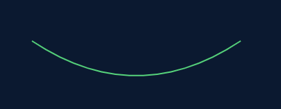

</br>


##### 让飞线动起来

> **方式一：** 不断变更 path 路径中的属性 d

这种实现方式，具体可参考：[地图与飞线](https://www.jianshu.com/p/69dd56c28248)

</br>

> **方式二：** mask蒙层 + animateMotion动画

记得以前看过一篇文章里面有这么一句话：“能用 CSS 实现的动画，就别用 JS 去实现”。既然 Svg 提供了 animate 和 animateMotion 动画，我们就需要多多思考一下：使用它能达到我们想要的效果吗？

</br>

**1、** 使用 [mask蒙层](https://developer.mozilla.org/zh-CN/docs/Web/SVG/Tutorial/Clipping_and_masking)元素你可以在既有的元素上添加上一个遮罩层（该元素只展示遮罩层范围的内容）

```html
<svg width="1000" height="700">
    <defs>
		<mask id="mask">
            <circle cx="100" cy="200" r="100" opacity="1" fill="#fff"></circle>
        </mask>
    </defs>
	
	<!-- 模拟这个mask蒙层的圆圈 -->
    <circle cx="100" cy="200" r="100" opacity="0.2" fill="red"></circle>
	<!-- 模拟这跟完整的飞线 -->
    <path d="M100,200 Q250,300 400,200" stroke="#05D380" stroke-width="2" fill="none" opacity="0.2"/>
	<!-- 实际上使用了mask蒙层的飞线 -->
    <path d="M100,200 Q250,300 400,200" stroke="#05D380" stroke-width="2" fill="none" mask="url(#mask)"/>
</svg>
```

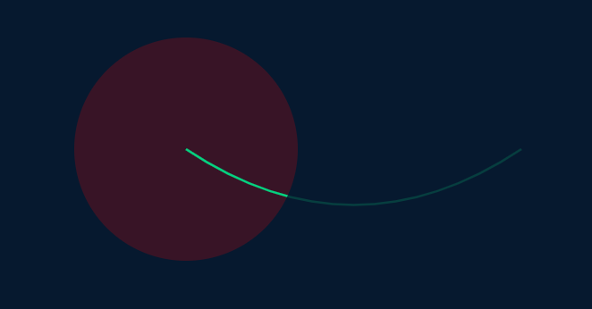

</br>

**2、** 给 mask 蒙层添加一个 [animateMotion 路径动画](https://developer.mozilla.org/zh-CN/docs/Web/SVG/Element/animateMotion)

```
<svg width="1000" height="700">
    <defs>
        <mask id="mask">
            <circle cx="0" cy="0" r="100" opacity="1" fill="#fff">
                <animateMotion calcMode="linear" dur="2s" path="M100,200 Q250,300 400,200" rotate="auto" repeatCount="indefinite" />
            </circle>
        </mask>
    </defs>

    <!-- 模拟这个mask蒙层移动的动画效果 -->
    <circle cx="0" cy="0" r="100" opacity="0.2" fill="red">
        <animateMotion calcMode="linear" dur="2s" path="M100,200 Q250,300 400,200" rotate="auto" repeatCount="indefinite" />
    </circle>
	<!-- 模拟这跟完整的飞线 -->
    <path d="M100,200 Q250,300 400,200" stroke="#05D380" stroke-width="2" fill="none" opacity="0.2"/>
	<!-- 实际上使用了mask蒙层的飞线 -->
    <path d="M100,200 Q250,300 400,200" stroke="#05D380" stroke-width="2" fill="none" mask="url(#mask)"/>
</svg>
```

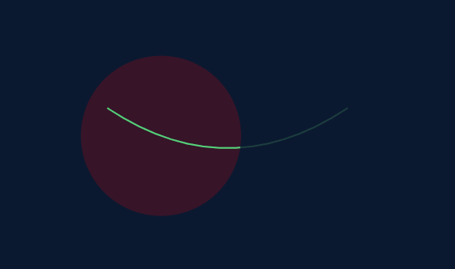

</br>

**3、** 使用 [clipPath](https://developer.mozilla.org/zh-CN/docs/Web/SVG/Element/clipPath) 剪切掉 mask 蒙层右半部分

```html
<svg width="1000" height="700">
    <defs>
        <clipPath id="cutOff">
            <!-- 注意这个地方的transform旋转角度，90或者180，需要根据飞线移动方向和飞线的凸起方向来判断 -->
            <rect x="0" y="0" width="200" height="200" transform="rotate(180)" />
        </clipPath>
        <mask id="mask">
            <circle cx="0" cy="0" r="100" opacity="1" fill="#fff" clip-path="url(#cutOff)">
                <animateMotion calcMode="linear" dur="2s" path="M100,200 Q250,300 400,200" rotate="auto" repeatCount="indefinite" />
            </circle>
        </mask>
    </defs>

    <!-- 模拟这个移动的mask蒙层 -->
    <circle cx="0" cy="0" r="100" opacity="0.2" fill="red">
        <animateMotion calcMode="linear" dur="2s" path="M100,200 Q250,300 400,200" rotate="auto" repeatCount="indefinite" />
    </circle>
    <!-- 模拟这个移动的mask蒙层 -->
    <rect x="0" y="0" width="100" height="100" transform="rotate(180)" fill="yellow" opacity="0.2">
        <animateMotion calcMode="linear" dur="2s" path="M100,200 Q250,300 400,200" rotate="auto" repeatCount="indefinite" />
    </rect>
    <!-- 模拟这根完整的飞线 -->
    <path d="M100,200 Q250,300 400,200" stroke="#05D380" stroke-width="2" fill="none" opacity="0.2"/>
    <!-- 实际上使用了mask蒙层的飞线 -->
    <path d="M100,200 Q250,300 400,200" stroke="#05D380" stroke-width="2" fill="none" mask="url(#mask)"/>
</svg>
```

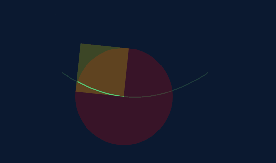

</br>

至此，我们已经实现了一条飞线了，加上之前的气泡元素，我们来看看效果：

```html
<svg width="1000" height="700">
    <defs>
        <radialGradient id="bubble-gradient">
            <stop offset="0%"   stop-color="#69c0ff" stop-opacity="0"/>
            <stop offset="40%"   stop-color="#69c0ff" stop-opacity="0"/>
            <stop offset="100%" stop-color="#69c0ff" stop-opacity="1"/>
        </radialGradient>

        <clipPath id="cutOff">
            <!-- 注意这个地方的transform旋转角度，90或者180，需要根据飞线移动方向和飞线的凸起方向来判断 -->
            <rect x="0" y="0" width="200" height="200" transform="rotate(180)" />
        </clipPath>
        <mask id="mask">
            <circle cx="0" cy="0" r="100" opacity="1" fill="#fff" clip-path="url(#cutOff)">
                <animateMotion calcMode="linear" dur="2s" path="M100,200 Q250,300 400,200" rotate="auto" repeatCount="indefinite" />
            </circle>
        </mask>
    </defs>

    <!-- 气泡 -->
    <circle cx="400" cy="200" fill="url(#bubble-gradient)" >
        <animate attributeName="opacity" dur="2s" repeatCount="indefinite" values="0;1;1;0" />
        <animate attributeName="r" dur="2s" repeatCount="indefinite" values="0;20"/>
    </circle>

    <!-- 飞线 -->
    <path d="M100,200 Q250,300 400,200" stroke="#05D380" stroke-width="2" fill="none" mask="url(#mask)"/>
</svg>
```

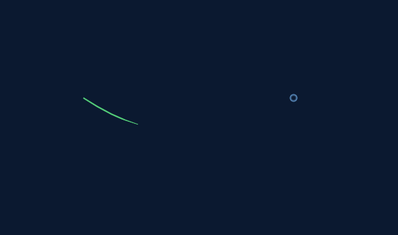

</br>


##### 飞线的优化

> 添加飞线头

```html
<svg width="1000" height="700">
	<!-- 省略上面部分相同代码...... -->
    <defs>
        <radialGradient id="head-gradient" cx="50%" cy="50%" r="40%">
            <stop offset="0%" stop-color="#FBF320" stop-opacity='1' />
            <stop offset="100%" stop-color="#FBF320" stop-opacity='0' />
        </radialGradient>
    </defs>

    <!-- 飞线头部 -->
    <circle cx="0" cy="0" r="6" fill="url(#head-gradient)">
        <animateMotion calcMode="linear" dur="2s" path="M100,200 Q250,300 400,200" rotate="auto"
            repeatCount="indefinite" />
    </circle>
</svg>
```

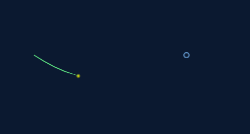

</br>

> 淡出动画

```html
<animate attributeName="opacity" dur="2s" repeatCount="indefinite" values="1;1;1;1;0" />
```

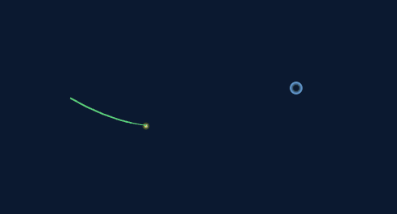

</br>

> 地图飞线的最终代码

```html
<svg width="1000" height="700">
    <defs>
        <radialGradient id="bubble-gradient">
            <stop offset="0%"   stop-color="#69c0ff" stop-opacity="0"/>
            <stop offset="40%"   stop-color="#69c0ff" stop-opacity="0"/>
            <stop offset="100%" stop-color="#69c0ff" stop-opacity="1"/>
        </radialGradient>

        <clipPath id="cutOff">
            <!-- 注意这个地方的transform旋转角度，90或者180，需要根据飞线移动方向和飞线的凸起方向来判断 -->
            <rect x="0" y="0" width="200" height="200" transform="rotate(180)" />
        </clipPath>
        <mask id="mask">
            <circle cx="0" cy="0" r="100" opacity="1" fill="#fff" clip-path="url(#cutOff)">
                <animate attributeName="opacity" dur="2s" repeatCount="indefinite" values="1;1;1;1;0" />
                <animateMotion calcMode="linear" dur="2s" path="M100,200 Q250,300 400,200" rotate="auto" repeatCount="indefinite" />
            </circle>
        </mask>

        <radialGradient id="head-gradient" cx="50%" cy="50%" r="40%">
            <stop offset="0%" stop-color="#FBF320" stop-opacity='1' />
            <stop offset="100%" stop-color="#FBF320" stop-opacity='0' />
        </radialGradient>
    </defs>

    <!-- 气泡 -->
    <circle cx="400" cy="200" fill="url(#bubble-gradient)" >
        <animate attributeName="opacity" dur="2s" repeatCount="indefinite" values="0;1;1;0" />
        <animate attributeName="r" dur="2s" repeatCount="indefinite" values="0;20"/>
    </circle>

    <!-- 飞线头部 -->
    <circle cx="0" cy="0" r="6" fill="url(#head-gradient)">
        <animate attributeName="opacity" dur="2s" repeatCount="indefinite" values="1;1;1;1;0" />
        <animateMotion calcMode="linear" dur="2s" path="M100,200 Q250,300 400,200" rotate="auto"
            repeatCount="indefinite" />
    </circle>

    <!-- 飞线 -->
    <path d="M100,200 Q250,300 400,200" stroke="#05D380" stroke-width="2" fill="none" mask="url(#mask)"/>
</svg>
```
</br>
</br>


### 开发leaflet组件

> 国内有关于 leaflet 的文档比较少，且大多数都是英文文档。为了快速应对开发需求，我整理了以下思路进行学习和了解（仅供参考）

- [源码下载](https://github.com/Leaflet/Leaflet)

    进行自定义图层（plugin）开发之前，你首先得对 leaflet 源码有一点点了解。主要参考一下它本身所提供的 plugin 代码架构（例如 Circle，Marker）

</br>

- [文档1 extending-1](https://leafletjs.com/examples/extending/extending-1-classes.html)

    大致了解源码后阅读文档1，我们会发现 leaflet 源码，它都是通过 extend 方法进行对象的合并，然后输出一个新的对象。因此所有的 plugin 都是通过 **XXX.extend({})** 去进行创建的。
</br>

- [文档2 extending-2](https://leafletjs.com/examples/extending/extending-2-layers.html)

    文档1主要介绍了一下 leaflet 的架构和 extend 方法的基本使用，文档2则教我们实操自定义图层（plugin），文档2的末尾也提供了相关的代码

```javascript
L.CustomLayer = L.Layer.extend({
    onAdd: function(map) {...}
    onRemove: function(map) {...}
    _update: function() {...}
})
```

</br>

> 虽然有了以上文档的参考，但是为了不同应对不同场景下的 plugin 实现，我们可能也需要看看官方文档或者 leaflet 源码相关代码。例如 event 事件的返回结果， map 对象上有哪些方法 ......我的需求是往地图图层中插入 svg 代码，基于这个需求，我的 plugin 插件大致的模板如下：

```javascript
//这里的 L 代表引入的 leaflet
L.CustomLayer = L.Layer.extend({
    _mapRenderer: null,             //渲染后的map地图相关属性
    _latLngToPointFn: null,         //将经纬度坐标转化成map地图坐标的方法

    // 该图层的构造函数，同 constructor 一样
    initialize: function (points, options) {
        this.points = points || [];
        L.setOptions(this, options);
    },

    // 图层加入map地图触发
    onAdd: function (map) {
        this._mapRenderer = map.getRenderer(this);
        this._latLngToPointFn = map.latLngToLayerPoint;

        // 拿到地图中插入图层的盒子
        var pane = map.getPane(this.options.pane);
        var svg = pane.children[0];

        // 创建svg容器
        this._container = document.createElementNS('http://www.w3.org/2000/svg', 'g');

        // 初始化svg的内容
        this._initSvgHTML();

        // 向页面中插入svg
        svg.appendChild(this._container);

        // svg插入到页面中后，某些内容还需要重置
        this._ReSetAtRender();

        // 绑定事件（leaflet还有提供了其他事件，参见：https://leafletjs.com/reference-1.5.0.html）
        // 但是zoom事件会造成svg中的元素需要重新定位，因此需要监听并重进行重绘
        map.on('zoomend', this._update, this);
    },

    // 图层从map地图中删除触发
    onRemove: function (map) {
        // 从dom结构中删除该svg图层
        L.DomUtil.remove(this._container);
        // 解绑事件
        map.off('zoomend', this._update, this);
    },

    // 更新整个svg内容，改动较小的内容，可以直接自定义reSetXXX进行局部修改svg内容
    _update: function (e) {
        // e.target可以拿到map地图这个对象
        var map = e.target;
        // 移除这个图层又重新添加
        this.onRemove(map);
        this.onAdd(map);
    },
    //更新svg的某个元素属性（提供给外部使用的）
    reSetXXX: function () {},

    //得到这个svg的dom节点内容
    _initSvgHTML: function () {
        this.container = "自定义图层的SVG代码......";
    },

    //svg插入到页面后触发
    _ReSetAtRender: function () {},
});

// 可以从外部传入params来控制我们的图层
let CustomLayer = function (params) {
    return new L.CustomLayer(params);
};

export default CustomLayer;
```
</br>

> 继承于 Layer 对象的图层都会加入到 **overlay-pane** 这个盒子中，getPane 方法便是获得这个 dom 对象

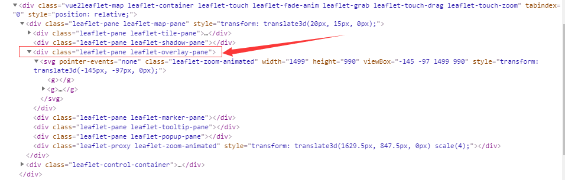

</br>

> 最终效果展示

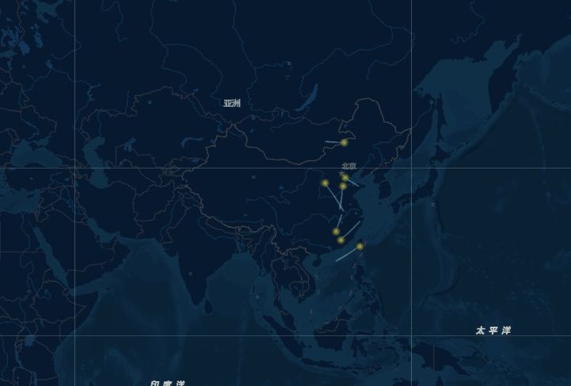

</br>
</br>


### 踩坑

##### 1、CSS3动画

> 千万别将 CSS 动画与 SVG 的自带动画 animate 和 animateMotion 一起混用！

原因：CSS 动画和 SVG 动画在解析和渲染上是有所不同的，如果两者解析出来的时间差过大，会产生动画不整齐不连贯的视觉效果

</br>

> 别忘了设置 svg 盒子的宽高

原因：因为有一次忘了设置 svg 盒子的宽高，svg 的内容无法正常显示。我一直以为是 svg 内容的格式有误造成的，浪费了好多时间......

</br>
</br>


</br>
</br>

**总结： 以上内容基于 leaflet 1.5.1版本，初次接触 SVG 和 leaflet，使用姿势有误的地方，欢迎点评 ~ 具体代码我已经放置仓库的 [demo](https://github.com/HeJueting/Blog/tree/master/%E5%89%8D%E7%AB%AF%E9%9A%8F%E7%AC%94/%E5%9F%BA%E4%BA%8Eleaflet%E5%BC%80%E5%8F%91%E5%9C%B0%E5%9B%BE%E9%A3%9E%E7%BA%BF) 文件夹中，欢迎大家clone下来参考**


</br>
</br>

### 博客原文：[hejueting.cn](www.hejueting.cn)


</br>

