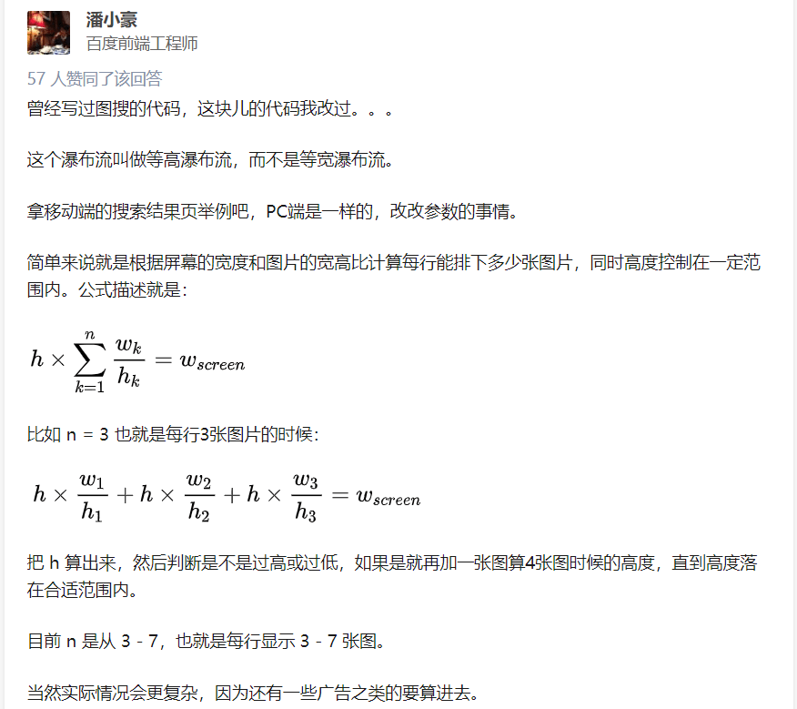

### 探索图片瀑布流
</br>
</br>

### 前言

> 由于个人的博客集成了相册功能，避免不了照片展示的问题，因此寻找了许多种解决方案进行尝试......
>  
> 注：文章主要介绍了一下我一步步探索改进的过程

</br>
</br>


### 固定宽高

**● 首先，自行尝试的是固定这些图片的宽高，再利用felx进行布局展示，可是面对不同比例的图片会拉伸得难以入目**

```html
<div class="wrap">
    
    
	<!--...省略部分代码...-->
    
    
</div>
```
```css
.wrap{
    width: 100%;
    padding:2vw;
    display: flex;
    flex-wrap: wrap;
    box-sizing: border-box;
    background: #b8f6fe;
}
.wrap img{
    width: 19vw;
    height: 13vw;
    margin: 2vw;
}
```


</br>
</br>


### 固定高度

**● 既然图片被拉伸得惨不忍睹，于是我想：给他固定一个高度，不就好了？**

```css
/*修改css*/
.wrap img{
    height: 13vw;
    margin: 2vw;
}
```


</br>
</br>


### flex-grow

**● 可是这样一来，图片排版布局又会丑到难以入目。听说flex布局有一个flex-grow属性可以让其在水平方向上按一定比例拉伸，于是我又眼前一亮：**

```javascript
/*添加js*/
let wrap = document.getElementById("wrap");
for(let i=0; i<wrap.children.length; i++){
    // 由于图片的高度一样，宽度便决定着他们水平方向伸缩的比例
    let img = wrap.children[i]
    wrap.children[i].style["flex-grow"] = img.width / img.height;
}
```


</br>
</br>


### 尾部处理

**● 从原理上来说，flex-grow还是会拉伸整张图片，但只会按照一定比例将整行空余位置进行分配拉伸，因此图片整体看来并不会感到不适感。但是最后一行往往空余位置较多（图片数量不足），此时再根据空余位置来拉伸，图片明显丑到自闭，我们应该想办法让最后一行的图片不进行拉伸**

> 方法：还是利用flex-grow水平拉伸的原理，如果图片尾部总有一个“占坑”的，且它的flex-grow无限大，那么最后一排的图片伸缩的比例将忽略不计。于是我们可以利用after这个伪类元素

```css
/*修改css*/
.wrap::after{
    content: "";
    flex-grow: 9999;
}
```


</br>
</br>


### 初探goole图片瀑布流的实现

**● 至此，图片瀑布流的功能已大致实现，我又去查看了一下goole图片的布局。**
</br>

> 先蛋疼一秒钟 ......

</br>

花了一下午的时间，分析它的dom结构，分析它的css，然后“意淫”出了一种及其“傻逼”的方式去实现，然后图片的展示总会展示不全（因为固定思维，一来又把高度给固定死），无奈地搜了搜：goole图片瀑布流的实现，看到这个知乎回答，才恍然大悟：
</br>



</br>

**图片来自：[百度图片的横向瀑布流是怎么实现的？](https://www.zhihu.com/question/63590283/answer/211457881)**

</br>
</br>

具体原理我就不再阐述了，大佬的回答很精辟！简单地进行了实现（肯定还有很多待优化的地方），不得不说这种JS的实现方式图片的展示确实要好看一些，提一下实现过程中的几个坑点吧：
</br>

> ● 计算每一行的图片可用的宽度，除了margin,padding,还有一个**滚动条的宽度**
> 
> ● 窗口改变时，注意**img.naturalWidth和img.width的区别**
> 
> ● 最后一行图片的展示需要做特殊处理

</br>


</br>


代码已经放在github上：[goole瀑布流实现demo](https://github.com/HeJueting/Blog/tree/master/%E5%9B%BE%E7%89%87%E7%80%91%E5%B8%83%E6%B5%81)
