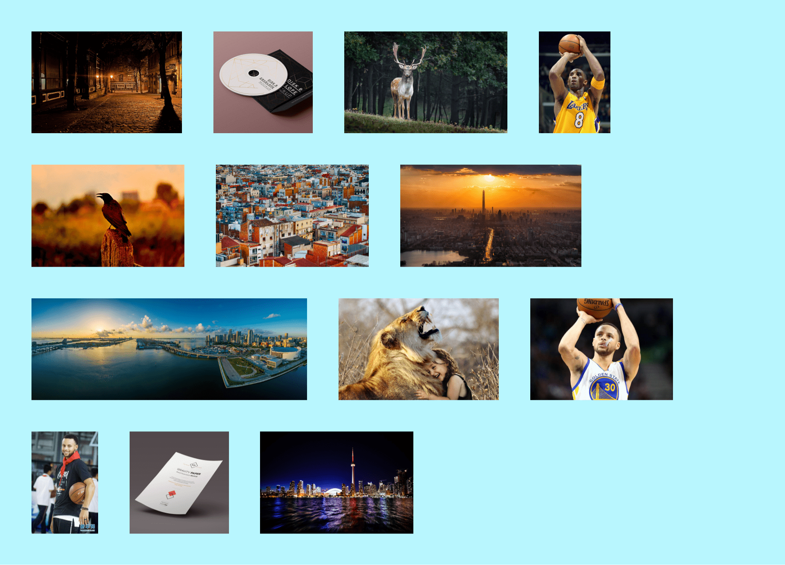
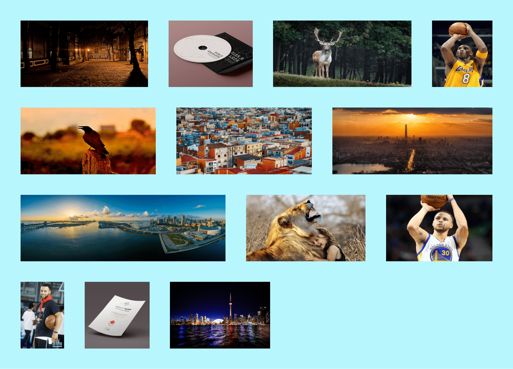

### 探索图片瀑布流

</br>
</br>

### 前言

由于个人的博客集成了相册功能，避免不了照片展示的问题，因此寻找了许多种解决方案进行尝试......文章主要介绍了一下我一步步探索改进的过程

</br>
</br>

### 固定宽高

首先，自行尝试的是固定这些图片的宽高，再利用 felx 进行布局展示，可是面对不同比例的图片会拉伸得难以入目

```html
<div class="wrap">
    
    
    <!--...省略部分代码...-->
    
    
</div>
```

```css
.wrap {
    width: 100%;
    padding: 2vw;
    display: flex;
    flex-wrap: wrap;
    box-sizing: border-box;
    background: #b8f6fe;
}
.wrap img {
    width: 19vw;
    height: 13vw;
    margin: 2vw;
}
```


</br>
</br>

### 固定高度

既然图片被拉伸得惨不忍睹，于是我想：给他固定一个高度，不就好了？

```css
/*修改css*/
.wrap img {
    height: 13vw;
    margin: 2vw;
}
```



</br>
</br>

### flex-grow

可是这样一来，图片排版布局又会丑到难以入目。听说 flex 布局有一个 flex-grow 属性可以让其在水平方向上按一定比例拉伸，于是我又眼前一亮：

```javascript
/*添加js*/
let wrap = document.getElementById("wrap");
for (let i = 0; i < wrap.children.length; i++) {
    // 由于图片的高度一样，宽度便决定着他们水平方向伸缩的比例
    let img = wrap.children[i];
    wrap.children[i].style["flex-grow"] = img.width / img.height;
}
```


</br>
</br>

### 尾部处理

从原理上来说，flex-grow 还是会拉伸整张图片，但只会按照一定比例将整行空余位置进行分配拉伸，因此图片整体看来并不会感到不适感。但是最后一行往往空余位置较多（图片数量不足），此时再根据空余位置来拉伸，图片明显丑到自闭，我们应该想办法让最后一行的图片不进行拉伸

解决方法：还是利用 flex-grow 水平拉伸的原理，如果图片尾部总有一个“占坑”的，且它的 flex-grow 无限大，那么最后一排的图片伸缩的比例将忽略不计。于是我们可以利用 after 这个伪类元素

```css
/*修改css*/
.wrap::after {
    content: "";
    flex-grow: 9999;
}
```



</br>
</br>

### 初探 goole 图片瀑布流的实现

至此，图片瀑布流的功能已大致实现，我又去查看了一下 goole 图片的布局

</br>

先蛋疼一秒钟 ......花了一下午的时间，分析它的 dom 结构，分析它的 css，然后“意淫”出了一种及其“傻逼”的方式去实现，然后图片的展示总会展示不全（因为固定思维，一来又把高度给固定死），无奈地搜了搜：goole 图片瀑布流的实现，看到这个知乎回答，才恍然大悟：


</br>

**图片来自：[百度图片的横向瀑布流是怎么实现的？](https://www.zhihu.com/question/63590283/answer/211457881)**

</br>

具体原理我就不再阐述了，大佬的回答很精辟！简单地进行了实现（肯定还有很多待优化的地方），不得不说这种 JS 的实现方式图片的展示确实要好看一些，提一下实现过程中的几个坑点吧：

</br>

-   计算每一行的图片可用的宽度，除了 margin,padding,还有一个**滚动条的宽度**

-   窗口改变时，注意**img.naturalWidth 和 img.width 的区别**

-   最后一行图片的展示需要做特殊处理

```html
<!DOCTYPE html>
<html lang="en">
    <head>
        <meta charset="UTF-8" />
        <meta name="viewport" content="width=device-width, initial-scale=1.0" />
        <meta http-equiv="X-UA-Compatible" content="ie=edge" />
        <link href="./css/goole.css" type="text/css" rel="stylesheet" />
        <title>goole瀑布流</title>
    </head>
    <body>
        <div class="wrap" id="wrap">
            
            
            
            
            
            
            
            
            
            
            
            
            
        </div>

        <script src="./js/goole.js"></script>
    </body>
</html>
```

```javascript
resetImgs();

// 页面大小改变后，200毫秒延时更新图片瀑布流
let timer;
window.addEventListener("resize", () => {
    if (timer) {
        clearTimeout(timer);
    }
    timer = setTimeout(() => {
        resetImgs();
    }, 200);
});

// 重置图片瀑布流的展示
function resetImgs() {
    // 遍历得到所有的图片资源
    let wrap = document.getElementById("wrap");
    let index = 0;
    let images = [];
    for (let i = 0; i < wrap.children.length; i++) {
        images.push(wrap.children[i]);
    }

    while (index < wrap.children.length) {
        // 根据images计算出该行图片数量和高度
        let { height, number } = getNumberAndHeight(images);
        for (let i = 0; i < number; i++) {
            // 根据图片本身宽高，设置他的宽度
            images[i].style.width = Math.floor((images[i].naturalWidth * height) / images[i].naturalHeight) + "px";
            // 设置图片的高度
            images[i].style.height = height + "px";
            // 设置右边距、下边距
            images[i].style.marginRight = "20px";
            images[i].style.marginBottom = "20px";
            // 最后一张图片右边距为0
            if (i === number - 1) {
                images[i].style.marginRight = "0px";
            }
        }
        // 从images中删除已经设置好的图片
        images = images.slice(number);
        // 转到下一行
        index += number;
    }
}

// 得到该行图片的数量和高度
function getNumberAndHeight(images) {
    // 规定图片高度范围为：0 ~ 220
    let heightRange = [0, 220];
    let number = 0;
    let height = 0;
    let arr = [];
    for (let i = 0; i < images.length; i++) {
        // 不断将image追加到arr中，直到height符合规定
        arr.push(images[i]);
        height = calculateHeight(arr);
        // 如果图片高度范围符合规定值，跳出循环，arr的长度就是这一行图片的数量
        if (height >= heightRange[0] && height <= heightRange[1]) {
            number = arr.length;
            break;
        }
    }
    // 最后一行做特殊处理
    // number为0，说明这一行不满足高度范围（其实就是最后一行），默认设置为200高度
    if (number === 0) {
        return {
            number: images.length,
            height: 200,
        };
    }
    return {
        number: number,
        height: height,
    };
}

// 计算图片的高度
function calculateHeight(images) {
    let blankWidth = document.body.clientWidth - 20 * (1 + images.length) - 17;
    let height = 0;
    let ratios = 0;
    for (let i = 0; i < images.length; i++) {
        ratios += images[i].naturalWidth / images[i].naturalHeight;
    }
    height = Math.floor(blankWidth / ratios);
    return height;
}
```


</br>

所有的 demo 代码已经放在 github 上：[瀑布流实现 demo](https://github.com/HeJueting/Blog)

</br>
</br>
