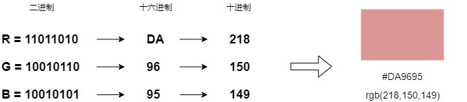
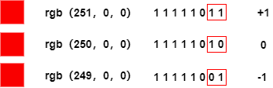
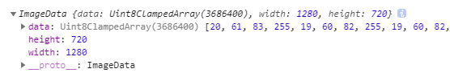
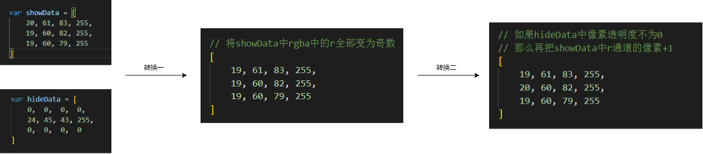
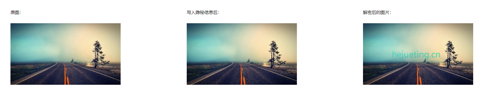

# 有趣的水印

</br>
</br>


### 前言

> 为了刺激view过期用户续费，需要实现水印的一个功能，在调研的过程中，发现许多好玩的东西

在总结该文章时，同时也弥补了一下图片相关的处理方式，建议先阅读：[图片处理（url、base64、blob、file）](https://github.com/HeJueting/Blog/issues/17)


</br>
</br>


### 给网页添加水印

#### 实现方式

- 网页的最顶层新增一个遮罩层用来展示“水印”

- 利用background-repeat的repeat属性，让这个“水印”重复展示

- 如果水印直接由UI大佬提供了设计图，直接一步到位

</br>
</br>


#### canvas绘制

- 如果UI大佬没有直接提供设计图，我们也可以使用canvans来设计水印

- HTMLCanvasElement.toDataURL将canvas内容转换为一个图片的url

- 将这个图片以background的形式插入页面中


</br>


**index.html文件**

```html
<style>
#root {
    width: 100%;
    height: 100%;
    pointer-events:none;
    background-repeat:repeat;
}
</style>
<body>
    <div id="root"></div>
    <script type="text/javascript" src="./index.js"></script>
</body>
```

</br>

**index.js文件**
```javascript
// 创建canvas元素
var canvas = document.createElement('canvas');
// 创建context
var ctx = canvas.getContext("2d");

// 设置宽高
canvas.setAttribute('width', '300px');
canvas.setAttribute('height', '300px');

// 绘制文本
ctx.font = "24px Microsoft YaHei";            //字体大小
ctx.fillStyle = 'rgba(184, 184, 184, 0.8)';   //字体颜色
ctx.rotate(Math.PI / 180 * 30);               //旋转角度
ctx.fillText(`机密文件`, 150, 50);     //渲染的内容和位置

// 绘制图片
var img = new Image();
img.src = '../img/diamonds.png'; 
img.crossOrigin = "Anonymous";        //解决"被污染"的问题
img.onload = function(){
    ctx.drawImage(img, 100, 30);

    // 将canvas转为图片
    var base64Url = canvas.toDataURL();
    // 获取div盒子
    var dom = document.getElementById("root");
    // 以background的形式插入页面
    dom.setAttribute('style', `background-image:url('${base64Url}')`);
}
```


</br>


**注意**

- 需要设置img的crossOrigin属性，因为canvas无法读取从外部引入img或svg元素，这种机制可以避免未经许可拉取远程网站信息而导致的用户隐私泄露（参考：[MDN-启用了 CORS 的图片](https://developer.mozilla.org/zh-CN/docs/Web/HTML/CORS_enabled_image)）

- 需要在img元素加载完成后再去转换canvas元素，否则图片将不会被解析

- pointer-events属性设置为none，会使该元素不会成为鼠标事件的target，避免影响网页的正常使用（参考：[MDN-pointer-events](https://developer.mozilla.org/zh-CN/docs/Web/CSS/pointer-events)）

</br>


**参考**

- [MDN-canvas使用](https://developer.mozilla.org/zh-CN/docs/Web/API/Canvas_API/Tutorial/Basic_usage)

- [MDN-toDataURL](https://developer.mozilla.org/zh-CN/docs/Web/API/HTMLCanvasElement/toDataURL)


</br>
</br>


#### 水印防修改


水印的实现方式简单，破解方式也更简单，稍微懂行的人就能打开控制台去掉水印，因此我们还需要加强对水印的保护。在[《监听iframe页面高度》](https://github.com/HeJueting/Blog/tree/master/%E5%89%8D%E7%AB%AF%E9%9A%8F%E7%AC%94/%E7%9B%91%E5%90%ACiframe%E9%A1%B5%E9%9D%A2%E9%AB%98%E5%BA%A6)文章中，有提到[MutationObserver](https://developer.mozilla.org/en-US/docs/Web/API/MutationObserver)的使用，此情此景，我们也可以使用该API去监控水印的变化。

</br>

```javascript
// 生成水印的方法
function initWatermark(){
    // 创建canvas元素
    let canvas = document.createElement('canvas');
    // 创建context
    let ctx = canvas.getContext("2d");

    // 设置宽高
    canvas.setAttribute('width', '300px');
    canvas.setAttribute('height', '300px');

    // 绘制文本
    ctx.font = "24px Microsoft YaHei";            //字体大小
    ctx.fillStyle = 'rgba(184, 184, 184, 0.8)';   //字体颜色
    ctx.rotate(Math.PI / 180 * 30);               //旋转角度
    ctx.fillText(`机密文件`, 150, 50);     //渲染的内容和位置


    // 绘制图片
    let img = new Image();
    img.src = './img/diamonds.png'; 
    img.crossOrigin = "Anonymous";        //解决"被污染"的问题
    img.onload = function(){
        ctx.drawImage(img, 100, 30);

        // 将canvas转为图片
        const base64Url = canvas.toDataURL();


        // 获取页面中的watermark盒子
        let dom = document.getElementById('watermark');
        // 如果dom不存在
        if(!dom){
            // 创建div盒子
            dom = document.createElement('div');
            dom.setAttribute('id', `watermark`);
        }
        // 设置这个div盒子的属性
        let styleStr = `
            position: fixed;
            left:0;
            top:0;
            width: 100%;
            height: 100%;
            box-sizing: border-box;
            z-index: 99999;
            pointer-events:none;
            background-repeat:repeat;
            background-image:url('${base64Url}');
        `;
        dom.setAttribute('style', styleStr);
        // 插入body中
        document.body.appendChild(dom);


        // 监视这个div盒子
        // 观察器的配置（需要观察什么变动）
        const config = { 
            attributes: true, 
            childList: true
        };

        // 创建一个观察器实例并传入回调函数
        const observer = new MutationObserver(()=>{
            const newDom = document.getElementById('watermark');
            console.log("发生改变~");
            // 如果dom不存在或者style发生改变
            if(!newDom || (newDom && newDom.getAttribute('style') !== styleStr)) {
                // 取消监听
                observer.disconnect();
                // 重新生成水印
                initWatermark();
            }
        });

        // 在body元素上监听子节点的变化
        observer.observe(document.body, {
            childList: true
        });
        // 在水印dom元素上监听他的属性变化
        observer.observe(dom, {
            attributes: true
        });
    }
}


initWatermark();
```

</br>
</br>


### 给图片添加水印


**1、图片渲染时**

- 将图片转为canvas

- 使用canvas制作水印

- 以canvas的形式加载这个图片


```javascript
// 初始化图片时，给图片加水印
setImageWaterMark('./img/bac.jpg' ,(canvas)=>{
    document.getElementById('imageBox').appendChild(canvas);
});


// 给图片加水印
function setImageWaterMark(url ,done){
    // 创建canvas元素
    let canvas = document.createElement('canvas');
    // 创建context
    let ctx = canvas.getContext('2d');
    // 创建image元素
    let image = new Image();
    image.src = url;
    image.crossOrigin = 'anonymous';

    image.onload = function() {
        // 以图片宽高设置canvas的大小
        canvas.setAttribute('width', `${image.width}px`);
        canvas.setAttribute('height', `${image.height}px`);

        // 绘制这个image图片
        ctx.drawImage(image, 0, 0);
        // 再绘制文本水印
        ctx.font = '16px Microsoft YaHei';
        ctx.textAlign = 'right';
        ctx.fillStyle = 'rgba(255, 255, 255, 1)';
        ctx.fillText(`hejueting.cn`, 1000, 400);
        
        // 逻辑处理 ... 
        done(canvas);
    }
}
```


</br>


**2、下载图片**

- 使用fetch Api以blob对象形式，从服务端拉取图片资源

- 将blob对象转为base64图片格式

- 用canvas加载这个base64格式的图片，并添加水印

- 将canvas转为base64图片，利用a标签模拟下载功能

```javascript
// 点击下载图片
const btn = document.getElementById('btn');
btn.addEventListener('click', e => {
    fetch('http://localhost/img/bac.jpg').then(
        res => res.blob()
    ).then(blob => {
        const reader  = new FileReader();
        reader.readAsDataURL(blob);
        // readAsDataURL读取完成后，触发load事件
        reader.addEventListener("load", function () {
            const base64 = reader.result;
            // 将该图片添加上水印并下载
            setImageWaterMark(base64 ,(canvas)=>{
                // 转为base64
                const imageBase64 = canvas.toDataURL();
                // 模拟下载图片
                let a = document.createElement('a');
                a.href = imageBase64;
                a.download = ''
                a.click()
            });
        }, false);
    });
})
```

</br>
</br>


### 图片隐写术

> “图片隐写术” 的方式多种多样，其中很多内容都超出前端的范畴，在这里，我只简单地探索了一下基于LSB图片隐写的技术

**1、吃瓜**

在学习如何给网页和图片制作水印的过程中，无意间也吃了两个瓜：

- 2013年年底，美团网因大众点评网盗取前者网站摄影图片，向法庭提起诉讼，大众点评网因此赔偿了4.94万元

- 2016年阿里的月饼门事件后，有人截图泄露公司内网对该事处置内容，最后被查出予以开除

以上两个瓜都跟 “图片” 有关，这里的 “图片” 也都暗藏着信息......

</br>


**2、什么是图片隐写术？**

简单来说，就是将一些隐秘信息写入了图片中，由于我们试别图片的能力有限，对于改动信息后的图片，我们毫无察觉


例如上方的图片，左边的颜色为“#FF6666”，右边的颜色为“FE6666”，但对于肉眼而言，几乎看不出两者的区别。

</br>


**3、LBS隐写**

对于图片中图像像素一般由RGB（红绿蓝）三原色组成，每一种颜色取值范围为0x00 ~ 0xFF，即256种颜色，一共包含了256*256*256 = 16777216种颜色，而人类眼睛可以区分约1000万种不同的颜色，这也就意味着人类的眼睛无法区分余下的6777216种颜色。



LSB隐写就是修改RGB颜色分量种最低二进制位，也就是最低有效位（LSB），而人类的眼睫不会注意到这细小的变化。



由上图可知，在R通道，十进制250表示红色，我们修改了它二进制中的最低位，分别+1和-1，但颜色看起来依旧没有变化。利用这一特点，我们就可以修改最低位中的信息，实现信息的隐写。这种修改最低位信息的算法就叫做LSB加密算法，提取最低位有效信息的算法叫做LSB解密算法。

</br>


**4、canvas隐写信息**

canvas是基于像素的图片API，提供了一个*ctx.getImageData(sx, sy, sw, sh)*方法去获取ImageData对象

- **获取图片ImageData数据**

```javascript
// 创建canvas元素
let canvas = document.createElement('canvas');
// 创建context
let ctx = canvas.getContext('2d');
// 创建image元素
let image = new Image();
image.src = './img/bac.jpg';
image.crossOrigin = 'anonymous';
image.onload = function() {
    // 以图片宽高设置canvas的大小
    canvas.setAttribute('width', `${image.width}px`);
    canvas.setAttribute('height', `${image.height}px`);
    // 绘制这个image图片
    ctx.drawImage(image, 0, 0);
    // 获取像素数据
    console.log(ctx.getImageData(0, 0, image.width, image.height));
}
```




- **分析ImageData数据**

从上面截图我们可以看出 ImageData 中记录了个长度为 3686400 的 data 数组，1280*720*4 的值恰巧也等于3686400，不难推出，整个图片由 1280*720 个像素组成，这里的 4 代表着 rgba 四个值（a即alpha，控制着透明度）


- **隐写思路设计**

假设我们有 *showData* 和 *hideData* 两个图片信息（这两个图片需要大小一致，以保证每一个像素形成一一对应关系）



showData 从原图到转换二之后的图，经过上述分析，我们肉眼是无法察觉变化的，但是我们却悄悄将隐藏信息 hideData 写入其中。当要展示 hideData 隐藏的信息，我们可以通过 R 通道的奇偶值去进行处理。


- **核心代码实现**


```javascript
(async function(){
    const imageData = await getImageData("./img/bac.jpg");
    const markData = getMarkData(1280, 720);

    // 加密
    for(let i=0; i<imageData.data.length; i+=4){
        // 将ImageData中R通道的色值全部转为奇数
        if(imageData.data[i] % 2 === 0){
            imageData.data[i] --;
        }
        // // 找到markData中alpha不为0的像素,将R通道更新为偶数
        if(markData.data[i + 3] !== 0) {
            imageData.data[i] ++;
        }
    }
    let encryptionCanvas = document.createElement('canvas');
    let encryptionCtx = encryptionCanvas.getContext('2d');
    encryptionCanvas.setAttribute('width', `1280px`);
    encryptionCanvas.setAttribute('height', `720px`);
    encryptionCtx.putImageData(imageData, 0, 0);
    document.getElementById('encryption').appendChild(encryptionCanvas);


    // 解密
    for(let i=0; i<imageData.data.length; i+=4){
        // 如果R通道为偶数，直接置为0
        if(imageData.data[i] % 2 === 0){
            imageData.data[i] = 0;
        }
    }
    let decryptCanvas = document.createElement('canvas');
    let decryptCtx = decryptCanvas.getContext('2d');
    decryptCanvas.setAttribute('width', `1280px`);
    decryptCanvas.setAttribute('height', `720px`);
    decryptCtx.putImageData(imageData, 0, 0);
    document.getElementById('decrypt').appendChild(decryptCanvas);

})();


// 获得图片像素数据
function getImageData(url) {
    return new Promise(function(resolve,reject){
        // 创建canvas元素
        let canvas = document.createElement('canvas');
        // 创建context
        let ctx = canvas.getContext('2d');
        // 创建image元素
        let image = new Image();
        image.src = url;
        image.crossOrigin = 'anonymous';

        image.onload = function() {
            // 以图片宽高设置canvas的大小
            canvas.setAttribute('width', `${image.width}px`);
            canvas.setAttribute('height', `${image.height}px`);
            // 绘制这个image图片
            ctx.drawImage(image, 0, 0);
            // 获取像素数据
            resolve(ctx.getImageData(0, 0, image.width, image.height));
        }
    })
}
// 获得水印像素数据
function getMarkData(width, height) {
    // 创建canvas元素
    let canvas = document.createElement('canvas');
    // 创建context
    let ctx = canvas.getContext('2d');
    // 设置宽高
    canvas.setAttribute('width', `${width}px`);
    canvas.setAttribute('height', `${height}px`);
    // 再绘制文本水印
    ctx.font = '96px Microsoft YaHei';
    ctx.textAlign = 'right';
    ctx.fillStyle = 'rgba(255, 255, 255, 1)';
    ctx.fillText(`hejueting.cn`, 900, 400);
    
    return ctx.getImageData(0, 0, width, height);
}
```



</br>


参考：[隐写术之图片隐写](http://chenjingjiu.cn/index.php/2019/04/18/steganography/)、[LBS图片隐写](https://segmentfault.com/a/1190000016223897)


</br>
</br>


### 总结

本想简单实现一下水印的需求，没想到背后还有这么多好玩的东西，学无止境呀 ~


</br>
</br>


相关的案例代码已经放置在github仓库中，请移步[查看]()。**注意：对于部分案例代码，请搭配 nginx 进行预览**