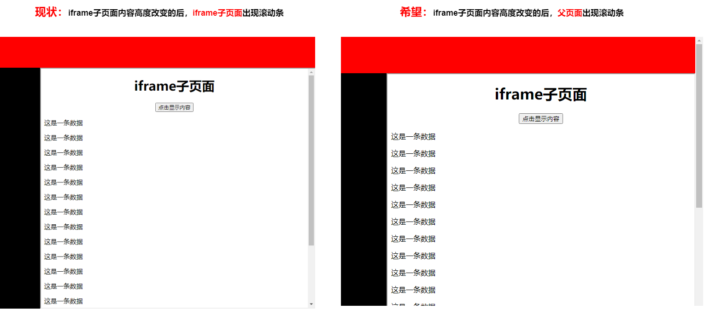

# 监听iframe页面高度

</br>
</br>


### 前言

今天碰到这样一个需求：子页面以iframe的形式嵌入到父页面中，但是iframe子页面内容的高度的改变，iframe子页面的滚动条不会出现，而父页面的滚动条会发生变化



</br>
</br>


### 思考

> 能用CSS解决的问题一定不用JS去解决


**方法一：通过CSS让iframe子页面高度自动增加** 

遗憾的是，iframe元素的高度只能由父页面的去控制，它的高度并不会随着其html内容的高度变化而变化

</br>

**方法二：使用JS动态修改iframe子页面的高度** 

无奈，只有尝试在父页面中动态修改iframe元素的高度

</br>
</br>


### 实现思路

1、监听iframe子页面的高度变化

2、父页面通过JS修改iframe元素的高度

</br>
</br>


### MutationObserver

JS并没有直接提供resize的方法去监听一个dom元素的属性，而是通过MutationObserver接口去监视dom元素的变化。在之前的[《监听iframe页面高度》](https://github.com/HeJueting/Blog/tree/master/%E5%89%8D%E7%AB%AF%E9%9A%8F%E7%AC%94/%E7%9B%91%E5%90%ACiframe%E9%A1%B5%E9%9D%A2%E9%AB%98%E5%BA%A6)文章中便提到了MutationObserver去监听dom元素的改变。此情此景，我们也可以使用MutationObserver去监听水印的“消失”

</br>

**MDN的案例**

```javascript
// 选择需要观察变动的节点
var targetNode = document.getElementById('id');

// 观察器的配置（需要观察什么变动）
var config = { attributes: true, childList: true, subtree: true };

// 当观察到变动时执行的回调函数
var callback = function(mutations) {
    for(var mutation of mutations) {
		console.log("变动的类型：" + mutation.type);
		console.log(mutation);
    }
};

// 创建一个观察器实例并传入回调函数
var observer = new MutationObserver(callback);

// 以上述配置开始观察目标节点
observer.observe(targetNode, config);

// 之后，可停止观察
observer.disconnect();
```

</br>


**observe、disconnect方法**

new MutationObserver 构造函数会返回一个新的 MutationObserver，observe方法用于监听这个 MutationObserver的变化，disconnect方法用于停止监听


</br>


**config参数**

> 属性变化

1、attributes：设为 true 时，可监听元素的属性值变更。默认值为 false。

2、attributeFilter：特定属性名称的数组，例如["style", "text"]。如果未包含此属性，则对所有属性的更改都会触发变动通知。

3、attributeOldValue：当监视节点的属性改动时，将此属性设为 true 时，将记录任何有改动的属性的上一个值。


> 字符数据变化

1、characterData：设为 true 时，可监听指定目标节点或子节点树中节点所包含的字符数据的变化。

2、characterDataOldValue：设为 true 时，记录在文本在受监视节点上发生更改时，节点文本的先前值。


> 子节点变化

1、childList：设为 true 时，可监听目标节点（如果 subtree 为 true，则包含子孙节点）添加或删除新的子节点。默认值为 false。

2、subtree：设为 true 时，将监视范围扩展至目标节点整个节点树中的所有节点。默认值为 false。


</br>
</br>


### 踩坑

刚开始，我的思路是在父页面去监听子页面的高度的改变而动态改变iframe元素的高度，于是乎：

**1、获取iframe内部元素**

```javascript
// 通过contentWindow去获取iframe标签内部的元素
var iframe = document.getElementById('iframe_id');
var dom = iframe.contentWindow.document.body;
```

</br>


**2、如何判断iframe是否加载完成**

```javascript
iframe.onload = () => {
    //iframe加载完成
}
```

</br>


**3、Uncaught DOMException: Blocked a frame with origin "null" from accessing a cross-origin frame**

如果两个网页不同源，就会因为跨源导致报错，也就无法拿到对方的DOM

```javascript
var iframe = document.getElementById('iframe_id');
iframe.onload = () => {
	var dom = iframe.contentWindow.document.body;
}
```


</br>
</br>


### 如何解决iframe跨域通信


**1、片段标识符**

url#xxx，#号后面的内容就被称为片段标识符。父页面把信息写入子页面url后面，子页面通过onhashchange去获取 # 号后面的内容（window.location.hash），同样子窗口也可以改变父窗口的

</br>


**2、document.domain属性**

如果两个网页一级域名相同，只是二级域名不同，只要设置相同的document.domain，父页面就能获取到子页面的dom元素

</br>


**3、window.name属性**

浏览器窗口有window.name属性。这个属性的最大特点是，无论是否同源，只要在同一个窗口里，前一个网页设置了这个属性，后一个网页可以读取它。

</br>


**4、postMessage**

以上方法都比较取巧，HTML5引入的全新API去解决跨域通信问题，这个API为window对象新增了一个window.postMessage方法，允许跨窗口通信，不论这两个窗口是否同源。


</br>
</br>


### 代码实现


**子页面**

```javascript
// 选择需要观察变动的节点
const observeDom = document.body;

// 记录当前body的clientHeight值
let clientHeight = observeDom.clientHeight;

// 初始化默认高度
window.parent.postMessage({ iframeHeight: observeDom.clientHeight }, '*');

// 观察器的配置
// 注意：clientHeight并不是attributes属性值，所以可以监听他的子孙的变化
var config = {
    childList: true,
    subtree: true,
};

// 当观察到变动时执行的回调函数
var callback = mutations => {
    for (var mutation of mutations) {
        // 如果body的高度发生了改变
        if (observeDom.clientHeight != clientHeight) {
            clientHeight = observeDom.clientHeight;
            window.parent.postMessage({ iframeHeight: observeDom.clientHeight }, '*');
        }
    }
};

// 创建一个观察器实例并传入回调函数
this.observer = new MutationObserver(callback);
// 以上述配置开始观察目标节点
this.observer.observe(observeDom, config);

```

</br>


**父页面**

```javascript
// 获取iframe子页面的dom节点
const iframeDom = document.getElementById("iframe");

// 监听
window.addEventListener("message", (e)=>{
    if(e.data.iframeHeight) {
        iframeDom.style.height = e.data.iframeHeight + 'px';
    }
}, false);
```

</br>


完整的代码示例已上传到GitHub仓库，请移步查看[demand（iframe高度固定）](https://github.com/HeJueting/Blog/tree/master/%E5%89%8D%E7%AB%AF%E9%9A%8F%E7%AC%94/%E7%9B%91%E5%90%ACiframe%E9%A1%B5%E9%9D%A2%E9%AB%98%E5%BA%A6)和[demo（iframe高度变化）](https://github.com/HeJueting/Blog/tree/master/%E5%89%8D%E7%AB%AF%E9%9A%8F%E7%AC%94/%E7%9B%91%E5%90%ACiframe%E9%A1%B5%E9%9D%A2%E9%AB%98%E5%BA%A6)文件夹

 
</br>
</br>


参考：[浏览器同源政策及其规避方法](http://www.ruanyifeng.com/blog/2016/04/same-origin-policy.html)

参考：[MDN-MutationObserver](https://developer.mozilla.org/zh-CN/docs/Web/API/MutationObserver)

参考：[MDN-window.postMessage](https://developer.mozilla.org/zh-CN/docs/Web/API/Window/postMessage)


</br>
</br>

### 博客原文：[hejueting.cn](www.hejueting.cn)

</br>