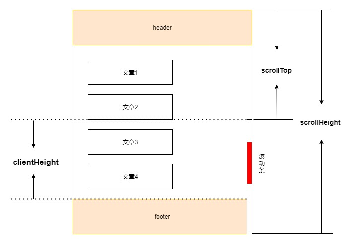

# 虚拟列表

</br>

### 前言

近期找工作的时候，面试的时候，有提及到 **“如何渲染大量的列表数据”** ? 我的第一想法便是分页加载，当然以前也接触过点聚合的方式去处理地图的批量数据点渲染。除此之外，面试官还想听到 **“虚拟列表”** 这种方案。鉴于还没有真正实践过，于是我又开始捣鼓个人博客，希望把此项技术运用于项目中。

</br>
</br>

### 基本原理

虚拟列表的基本原理比较简单，如下所示：

1. 首先只显示 4 条文章信息

2. 当**滚动条快滚动到底部时，又新增 4 条文章信息进行展示**，直到所有的文章信息都展示完成。


</br>
</br>

### 方案一（clientHeight + scrollHeight + scrollTop）

监听鼠标滚动事件，可得到：

**1、clientHeight：** 网页可视区域的高度，简单来说也就是肉眼可见的页面高度

**2、scrollHeight：** 当元素内容过长产生滚动条时，整个元素的高度，包括可视区域和被遮住部分的高度

**3. scrollTop：** 当滚动条向下滚动后，元素顶部被遮住部分的高度

当 （scrollHeight - scrollTop === clientHeight + footer 高度） 的时候，意味着 footer 即将展示



```javascript
// 监听body元素的鼠标滚动事件
document.body.addEventListener("scroll", (e) => {
    var { scrollTop, scrollHeight, clientHeight } = e.target;
    // 这里的180表示footer的高度
    if (scrollHeight - scrollTop < clientHeight + 180) {
        // 更新虚拟列表，渲染新的列表节点
    }
});
```

</br>
</br>

### 方案二（getBoundingClientRect）

除了上述方案以外，JS 还提供了 [getBoundingClientRect](https://developer.mozilla.org/zh-CN/docs/Web/API/Element/getBoundingClientRect)，该方法会返回一个对象，该对象有以下属性：

**1、width：** 元素本身的宽度

**2、height：** 元素本身的高度

**3、left 和 top：** 元素左上角，相对于视口左上角的距离

**4、bottom 和 right：** 元素右下角，相对于视口左上角的距离

当 top === clientHeight 的时候，意味着 footer 即将展示


```javascript
// 监听body元素的鼠标滚动事件
document.body.addEventListener("scroll", (e) => {
    var rectObj = footerDom.getBoundingClientRect();
    if (rectObj.top <= document.body.clientHeight) {
        // 更新虚拟列表，渲染新的列表节点
    }
});
```

</br>
</br>

### 方案三（IntersectionObserver）

方案一跟方案二都有一个共性，**都利用了鼠标滚轮事件去计算 footer 元素是否即将展示**，但 JS 其实提供了 [Intersection Observer API](https://developer.mozilla.org/zh-CN/docs/Web/API/Intersection_Observer_API)，它可以检测目标元素与祖先元素或 [viewport](https://developer.mozilla.org/zh-CN/docs/Glossary/Viewport) 相交情况变化的方法，该 API 可适用于以下需求：

1. 图片懒加载——当图片滚动到可见时才进行加载

2. 内容无限滚动——也就是用户滚动到接近内容底部时直接加载更多，而无需用户操作翻页，给用户一种网页可以无限滚动的错觉

3. 检测广告的曝光情况——为了计算广告收益，需要知道广告元素的曝光情况

4. 在用户看见某个区域时执行任务或播放动画

```javascript
// 监听器的options配置项
const options = {
    // 指定与target的相交元素，必须是target元素的父级元素。如果未指定或者为null，则默认为浏览器视窗
    root: document.querySelector("#scrollArea"),
    // target与root的外边距，与CSS中的margin属性相同
    rootMargin: "0px",
    // target和root相交程度达到该值的时候，注册的回调函数将会被执行。例如：1.0 表示 100% 相交，0.25 表示 25% 相交
    // 它也可以是一个数组，例如：[0.25, 0.5] 表示 25% 和 50% 相交时都触发回调函数
    threshold: 1.0,
};

// 监听器触发的回调函数
const callback = (entries) => {
    // entries 包含了以下信息：
    // {
    //     boundingClientRect：与方案二 getBoundingClientRect 的结果一样，是一个对象，包含了：width/height、top/bottom/left/right...等信息
    //     intersectionRatio：target元素的可见比例，如果全部展示就是1，如果完全未显示就是0
    //     intersectionRect：target元素与视口（或根元素）交叉区域的信息，同样包含了：width/height、top/bottom/left/right...等信息
    //     isIntersecting：如果为true，表示达到了thresholds属性值当中规定的其中一个阈值；如果是false，target元素不在给定的阈值范围内
    //     isVisible：该元素是否被任何其他页面内容覆盖
    //     rootBounds：root根元素的矩形区域的信息，包含了：width/height、top/bottom/left/right...等信息
    //     target: 监听的目标元素
    // }
};

// 初始化一个监听器，他接受两个参数：callback、options
var Observer = new IntersectionObserver(callback, options);

// 监听的目标元素
Observer.observe(target);
```

</br>
</br>

### 总结

总体看下来，**虚拟列表也使用了 “分页的思想” 去动态加载列表数据，跟传统的分页功能类似，都是分批渲染以减小页面初始化时浏览器的渲染压力。** 两者的不同点在于，虚拟列表是由服务端一次性返回批量数据，再交由前端来处理；而传统的分页功能是由服务端每次返回固定的数量的数据，再由前端来渲染这些数据。

PS：以上三种虚拟列表的实现方案的 demo 代码均放在了 github 仓库中，欢迎[下载查看](https://github.com/)

</br>
</br>
