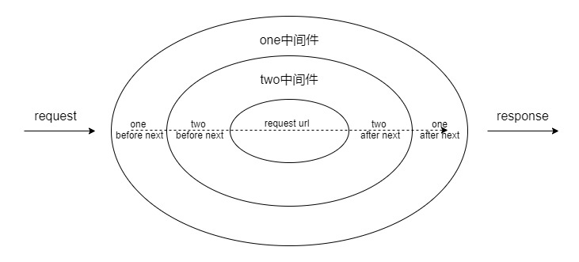

# 洋葱模型

</br>

### 前言

在参与字节跳动的第三轮面试时，碰巧问到了如何手写洋葱模型这个问题。很遗憾，面试过程中并没有做出来，因此我决定用一篇文章来总结洋葱模型。

</br>
</br>

### koa 中间件的使用

koa 的中间件使用的就是洋葱模型，因此先来看看 koa 中，我们是如何使用中间件的

```javascript
const Koa = require("koa");
const app = new Koa();

// 中间件 one
async function one(ctx, next) {
	console.log("one before next");
	await next();
	console.log("one after next");
}
// 中间件 two
async function two(ctx, next) {
	console.log("two before next");
	await next();
	console.log("two after next");
}

// 使用 one、two 两个中间件
app.use(one);
app.use(two);

app.use(async (ctx) => {
	console.log("request url:", ctx.url);
	ctx.body = "Hello World";
});

app.listen(3000);

// 访问 localhost:3000 ，打印结果如下：
// one before next
// two before next
// request url: /
// two after next
// one after next
```

</br>
</br>

### 什么是洋葱模型

与传统的中间件运行机制不同的是，洋葱模型以 next 为分界线，**next 之前的逻辑按 use 中间件的顺序按序执行，next 之后的逻辑反序执行**



</br>
</br>

### 为什么这样设计

解决中间件存在**相互依赖**的应用场景，如果单纯链式调用中间件，前面的中间件无法获取后面中间件所设置的数据。例如：利用洋葱模型，中间件 one 和中间件 two 均可以相互依赖他们内部设置的数据

```javascript
// 中间件 one
async function one(ctx, next) {
	ctx.one = "one";
	await next();
	console.log("ctx.two：", ctx.two);
}
// 中间件 two
async function two(ctx, next) {
	ctx.two = "two";
	await next();
	console.log("ctx.one：", ctx.one);
}

// ctx.one： one
// ctx.two： two
```

</br>
</br>

### 如何实现洋葱模型

#### 简单模拟

```javascript
function one() {
	console.log("one before next");
	two();
	console.log("one after next");
}
function two() {
	console.log("two before next");
	three();
	console.log("two after next");
}
function three() {
	console.log("three");
}
one();

// one before next
// two before next
// three
// two after next
// one after next
```

</br>
</br>

#### 链式调用

从上述打印结果来看，我们已经满足洋葱模型的执行流程了。但这还不够优雅，我们需要不断在中间件中通过 await 执行下一个中间件，因此我们还需要封装一个方法，让他们可以实现链式调用

```javascript
function one(next) {
	console.log("one before next");
	next();
	console.log("one after next");
}
function two(next) {
	console.log("two before next");
	next();
	console.log("two after next");
}
function three(next) {
	console.log("three");
}

// 接收并执行多个中间件
function runMiddleware(middlewares) {
	// 标识当前执行到哪一个中间件了
	var index = -1;
	// 链式调用的 next 方法
	function next() {
		// 当所有的中间件已经执行完成，结束递归
		if (index === middlewares.length - 1) {
			return;
		}
		// 执行下一个中间件
		index++;
		// 获取对应的中间件函数
		var fn = middlewares[index];
		// 递归执行这些中间件
		fn(next);
	}
	next();
}
runMiddleware([one, two, three]);
```

</br>
</br>

#### 手写洋葱模型

洋葱模型除了依赖于链式调用，我们还需要关注两个点：

1. 实现 use 方法，它可以帮助我们保存中间件

2. 需要新增一个 ctx 变量，它作用于所有中间件

```javascript
function setName(ctx, next) {
	console.log("setName before next，ctx:", ctx);
	ctx.name = "hejueting";
	next();
	console.log("setName after next，ctx:", ctx);
}
function setAge(ctx, next) {
	console.log("setAge before next，ctx:", ctx);
	ctx.age = 25;
	next();
	console.log("setAge after next，ctx:", ctx);
}
function app() {
	// 保存中间件
	var middlewares = [];
	// 作用于所有中间件的 ctx 变量
	var ctx = {};
	// 标识当前执行到哪一个中间件了
	var index = -1;

	function onion() {
		// 链式调用的 next 方法
		function next() {
			// 当所有的中间件已经执行完成，结束递归
			if (index === middlewares.length - 1) {
				return;
			}
			// 执行下一个中间件
			index++;
			// 获取对应的中间件函数
			var fn = middlewares[index];
			// 递归执行这些中间件
			fn(ctx, next);
		}
		next();
	}
	// 每当调用 use 方法时，就将传入中间件保存在 middlewares 中
	onion.use = function (mid) {
		middlewares.push(mid);
	};

	return onion;
}
var onion = app();
onion.use(setName);
onion.use(setAge);
onion();

// setName before next，ctx: {}
// setAge before next，ctx: {name: "hejueting"}
// setAge after next，ctx: {name: "hejueting", age: 25}
// setName after next，ctx: {name: "hejueting", age: 25}
```

</br>
</br>

### koa 源码分析

至此，我们已经简单实现了洋葱模型的功能，接下来我们再来看看 koa 是如何实现的洋葱模型。**注意：为了更好分析中间件的原理，以下源码内容有删减，并适当调整了代码顺序**

</br>

#### [application.js](https://github.com/koajs/koa/blob/master/lib/application.js)

我们通过 use 方法添加中间件后，最后 app.listen(3000) 该方法启动了这个 koa 服务，所以我们需要从 listen 这个方法入手

```javascript
const compose = require("koa-compose");
module.exports = class Application extends Emitter {
	constructor() {
		// 1. 声明一个 middleware 变量用于保存中间件
		this.middleware = [];
	}

	// 2. 通过 use 方法将所使用的这些中间件 fn 保存在数组里面
	use(fn) {
		this.middleware.push(fn);
		// 这里返回 this，表示我们可以链式调用 use 方法去添加中间件
		// app.use(one).use(two)
		return this;
	}

	// 3、启动 HTTP 服务器并监听请求连接
	listen(...args) {
		const server = http.createServer(this.callback());
		return server.listen(...args);
	}

	// 4、callback的返回值是一个函数
	callback() {
		// 5、传入这些中间件函数，通过 compose 函数包裹，最后生成一个 fn
		const fn = compose(this.middleware);
		return (req, res) => {
			// 6、每次请求连接，都会创建一个ctx，并执行 this.handleRequest 方法，最后返回其结果
			const ctx = this.createContext(req, res);
			return this.handleRequest(ctx, fn);
		};
	}

	handleRequest(ctx, fnMiddleware) {
		// 7、执行 callback 中生成的 fn 函数
		return fnMiddleware(ctx).then(handleResponse).catch(onerror);
	}
};
```

</br>
</br>

#### [koa-compose](https://github.com/koajs/compose/blob/master/index.js)

通过分析 application.js 源码，我们可以得知：

1. 通过 app.use 方法其实是将这些中间件函数保存在了 middleware 数组中

2. middleware 又作为参数传入 compose 函数， 该函数会返回一个 fnMiddleware，最后执行这个函数

因此，洋葱模型的设计的关键点就在于 compose 函数。

```javascript
// koa 的中间件支持异步操作，因此
function compose(middleware) {
	// 1. compose 函数返回了一个执行函数，该执行函数的所有返回均是一个 Promise
	return function (context, next) {
		// 2、用 index 标识执行到了第几个中间件
		let index = -1;

		// 3、dispatch 函数用于链式执行所有中间件函数
		function dispatch(i) {
			// 4、更新 index 标识
			index = i;

			// 5、获取中间件传入的函数
			let fn = middleware[i];

			// 6、当所有中间件执行完成后
			if (i === middleware.length) fn = next;

			// 7、传入的中间件必须是一个函数，否则直接结束后续逻辑执行
			if (!fn) return Promise.resolve();

			// 8、执行这个 fn 中间件函数，又将 dispatch 函数作为 next 参数传入
			return Promise.resolve(fn(context, dispatch.bind(null, i + 1)));
		}

		// 从第一个中间件开始执行
		return dispatch(0);
	};
}
```

对于源码中第 8 的步骤的代码可能有些青涩，我们可以将其等价转换一下：

```javascript
return Promise.resolve(
    middleware1(context, return Promise(
        middleware1
    ))
)
```

</br>
</br>
