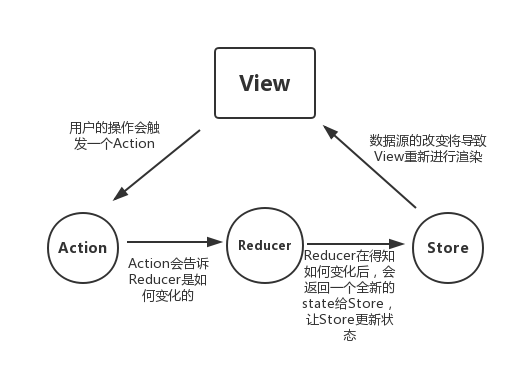
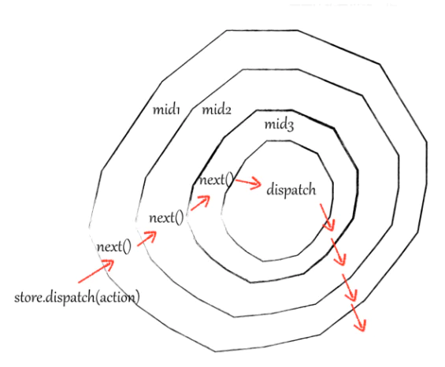

# React 基本原理

</br>

### Redux

**单向数据流**



</br>

**react-redux**

基于 context 和高阶组件完成 redux 与组件的关联

</br>

**中间件**

-   洋葱模型

-   通过 applyMiddleware 绑定中间件

-   然后顺序初始化 dispatch 函数

    1. 将上一个中间件改造的 dispatch 函数赋值给 next
    2. 改造当前中间件的 store.dispatch 函数
    3. 通过 next(actiion)，执行上一个中间件的 dispatch 函数



</br>

**伪代码**

```javascript
const next = store.dispatch;
store.dispatch = function middleware(action) {
    // to do list ...
    // 中间件的逻辑
    next(action);
};
```

</br>
</br>

### 函数式编程

-   纯函数：不会产生任何的副作用，唯一输入决定唯一输出

-   不可变值

</br>
</br>

### vdom 和 diff 算法

</br>
</br>

### jsx 本质

-   类似于 Vue 的模板语法

-   通过 babel 编译

-   编译成一个函数（React.createElement），函数执行后返回一个虚拟 dom，react V16 之前就是通过 React.createElement 来创建组件

</br>
</br>

### 合成事件

-   所有事件挂载到 document 上

-   event 不是原生的，是合成事件对象，通过 event.native 事件访问原生事件

-   和 Vue 事件不同，和 Dom 事件也不同

**优势：**

-   更好的兼容性

-   所有事件挂载到 document 上，通过事件委托，避免组件事件频繁解绑，减少内存消耗

-   方便事件的统一管理

</br>
</br>

### setState 和 batchUpdate

**setState 流程**

1. 调用 setState

2. 将需要更新的 state 存入一个 pending 队列

3. 判断是否处于 batchUpdate

-   Yes：保存于 dirtyComponents（异步更新）

-   No：遍历所有的 dirtyComponents，更新 pending 队列中的 state（同步更新）

</br>

**batchUpdate 机制**

1. 每一个函数执行的时候，React 会定义一个变量 isbatchUpdates 为 true

2. 函数执行完之后，isbatchUpdates 会设置为 false

3. 由 react 管理的函数入口，可以命中 batchUpdate 机制（例如：生命周期、React 中注册的事件）；但 setTimeOut、dom 事件...非 react 管理的函数就无法命中 batchUpdate 机制

```javascript
// 异步更新
todo = () => {
    // 开始：处于 batchUpdate，isbatchingUpdate = true
    this.setState({ count: 2 });
    // 结束：isbatchingUpdate = false
};

// 同步更新
todo = () => {
    // 开始：处于 batchUpdate，isbatchingUpdate = true
    setTimeOut(() => {
        // setTimeOut函数不是由react管理注册的，因此无法命中batchUpdate机制
        this.setState({ count: 2 });
    });
    dom.addeventListener("click", () => {
        // 与setTimeOut同理
        this.setState({ count: 3 });
    });

    // 结束：isbatchingUpdate = false
};
```

</br>
</br>
