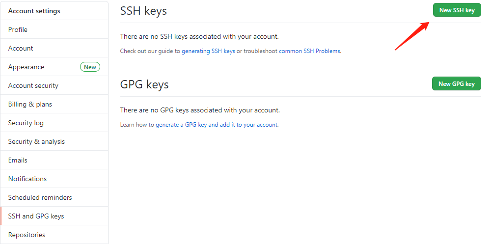

# git 与 github

</br>

### 远程仓库

同一个 git 仓库，想在不同电脑上协同维护，这就需要找一台电脑充当服务器，每台电脑都从这个 “服务器” 仓库克隆一份到自己的电脑上，并且各自把各自的提交推送到服务器仓库里。这个 “服务器” 上的仓库就叫远程仓库。

</br>
</br>

### 什么是 github？

gitHub 就是上述中的 “服务器” ，它是一个通过 git 进行版本控制的软件源代码托管服务平台。github 上有 public 和 private 两种类型仓库：

- **public**：对 github 上所有用户可见，所有用户都可以克隆这个仓库到本地，但只有自己才能修改

- **private**：仅对自己可见

本地 Git 仓库和 GitHub 仓库之间的传输是通过 SSH 加密的。提交代码时，github 会通过 ssh key 这个密钥来识别你是否有权限进行修改。

</br>
</br>

### SSH 和 SSH Key

1. SSH 是一种网络协议，用于加密客户端和服务器之间的连接

2. 客户端会创建一对密钥（公钥和私钥），并把公有密钥放在需要访问的服务器上

3. 客户端会向服务器发出请求，请求用你的密钥进行安全验证

4. 服务器收到请求之后，先在你在该服务器中寻找你的公有密钥，然后把它和你发送过来的公有密钥进行比较，如果两个密钥一致，服务器就用公有密钥加密传输内容并把它发送给客户端

5. 客户端收到加密内容再利用私钥解密获取内容。

</br>
</br>

### 如何生成 SSH Key？

- 打开 cmd 终端，输入以下命令，一路回车键确认即可：

```
ssh-keygen -t rsa -C "email@qq.com"
```

- 操作成功后，根据命令提示，会告诉你在你电脑某个位置会生成 id_rsa 和 id_rsa.pub 两个文件，前者是你的私钥，后者是你的公钥。

- 以文本方式打开 id_rsa.pub 文件，复制里面的内容，在 github 的 setting 中添加密钥即可。



- 测试

```
ssh git@gitub.com

// Hi HeJueting! You've successfully authenticated, but GitHub does not provide shell access.
Connection to github.com closed.
```

</br>
</br>
