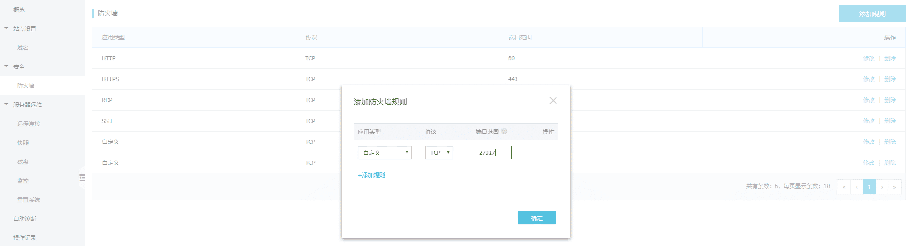
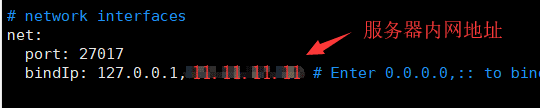
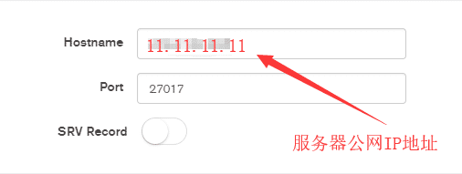
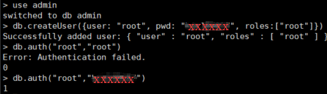
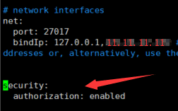
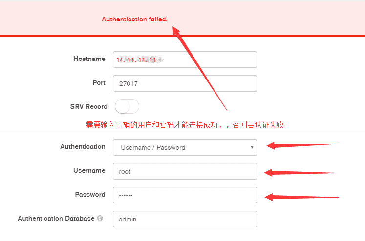
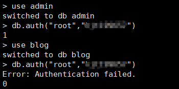

# 阿里云远程连接 mongodb 数据库

> 我的阿里云安装的系统为 centos 8.2

</br>
</br>

### 阿里云配置开放端口号

mongodb 默认的端口号是 27017，需要服务器将其开放出来。登录进入[阿里云](https://cn.aliyun.com/) -> 进入控制台 -> 选择服务器 -> 防火墙 -> 添加规则



</br>
</br>

### 修改 mongod.conf 配置文件

阿里云服务器的**公网地址**和**内网地址**可以在服务器概览中查看

```
vim /etc/mongod.conf    // 编辑配置文件
```



保存后，记得重启 mongodb

```
service mongod restart
```

</br>

---

</br>

### 远程连接 mongdb

</br>

- **cmd 连接**

如果你使用的是 windows，需要进入到 mongodb/bin 目录下执行以下命令：

```
mongo 11.11.11.11 //mongo后面接你的公网IP地址
```

</br>

- **可视化工具**

我使用的是 mongodb 官方可视化工具 —— MongoDB Compass Community，输入**公网 IP**和**端口号**即可进行连接



</br>

---

</br>

### 添加用户认证

如果按照以上步骤操作，意味着**任何人**都可以连接你的数据库，因此，我们还需要针对不同数据库创建用户信息，避免任何人都可以对你的数据库进行读写。

</br>

- **角色权限**

在 moogodb 中，每一个数据库都可以创建多个角色，不同的角色有着不同的操作权限

**1、** Superuser Roles（超级管理员角色）

```
    ✦ root：readWriteAnyDatabase、dbAdminAnyDatabase、userAdminAnyDatabase、clusterAdmin、restore、backup 权限
```

**2、** Database User Roles（数据库用户角色）

```
    ✦ read：读取指定数据库中任何数据
    ✦ readWrite：读写指定数据库中任何数据
```

更多角色详情，请查看： [https://docs.mongodb.com/manual/reference/built-in-roles/#database-user-roles](https://docs.mongodb.com/manual/reference/built-in-roles/#database-user-roles)

</br>

- **创建超级管理员用户**

```
// 连接数据库(你也通过cmd远程连接，这里我在服务器直接使用mongo命令进行的连接)
mongo

// 切换到admin数据库
use admin

// 创建管理员用户
db.createUser(
  {
    user: "root",      // 账号（自行设置）
    pwd: "xxxxxx",     // 密码（自行设置）
    roles: ["root"]    // 角色：超级管理员
  }
)

// 验证你的账号信息：0代表验证失败，1代表验证通过
db.auth("root","xxxxxx")
```



**注意：db.auth 进行用户校验时，必须先使用 use admin 命令切换到 admin 数据库**

</br>

- **开启认证**

```
//编辑配置文件
vim /etc/mongod.conf

//修改配置文件内容
security:                       // 去掉security前面#
    authorization: enabled      // 添加这句开启认证
```



保存后，记得重启 mongodb

```
service mongod restart
```

</br>

- **再次连接 mongodb**

**1、** cmd 方式

```
mongo 阿里云公网地址 -u "root" -p "xxxxxx" --authenticationDatabase admin
```

**2、** MongoDB Compass Community 工具



</br>

---

</br>

### 使用 moogose 连接数据库

</br>

在个人博客开发过程中，使用到了 **moogose** 这个库对数据库进行连接，由于我开启了 mongodb 用户权限，使用 moogose 进行数据库连接时，也需要添加用户信息，否则 mongodb 会连接失败。

</br>

- **创建拥有读写权限的角色**

虽然我们一开始在 admin 数据库下创建了一个超级管理用户，他拥有所有数据库的读写权限，但是我的个人博客使用的是 blog 数据库，在 blog 数据库下用户认证是不会通过的。



</br>

因此，我们还需要在 blog 数据库下新建一个拥有读写权限的用户角色：

```javascript
//切换到blog数据库
use blog

//创建拥有读写权限的用户角色
db.createUser(
  {
    user: "blog",          // 账号（自行设置）
    pwd: "xxxxxx",         // 密码（自行设置）
    roles: [{
      role:"readWrite",  // 拥有读写权限即可
      db:"blog"          // 指定数据库
    }]
  }
)
```

</br>

- **修改代码**

```javascrit
mongoose.connect("mongodb://localhost:27017/blog", {
    user: "blog",          //用户名
    pass: "xxxxxx",        //密码
    useNewUrlParser: true
})
```
