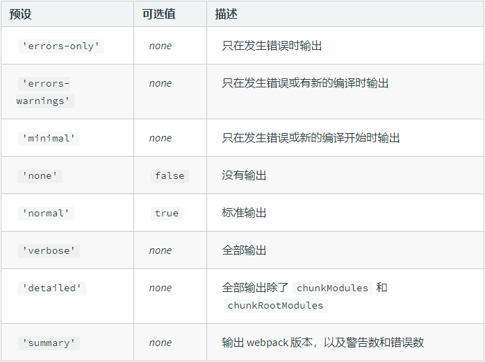

# webpack 优化构建日志

</br>

### stats 对象

webpack 打包构建时，会展示一大堆日志，但是很多并不需要开发者关注



**开发环境**

如果使用了热更新，需要在 devServer 中配置

```javascript
module.exports = {
    devServer: {
        stats: "errors-only",
    },
};
```

**生产环境**

```javascript
module.exports = {
    stats: "errors-only",
};
```

</br>
</br>

### friendly-errors-webpack-plugin

使用该插件，更便捷地帮我们优化了输出的日志

**安装依赖**

```
npm install friendly-errors-webpack-plugin -D
```

**webpack 配置**

```javascript
const FriendlyErrorsWebpackPlugin = require("friendly-errors-webpack-plugin");
module.exports = {
    plugins: [new FriendlyErrorsWebpackPlugin()],
};
```

</br>
</br>
