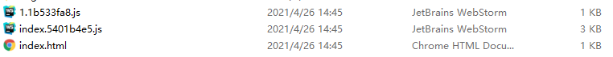

# webpack 4.x 按需加载和代码分割

</br>

### @babel/plugin-syntax-dynamic-import

参考地址：[https://babeljs.io/docs/en/babel-plugin-syntax-dynamic-import](https://babeljs.io/docs/en/babel-plugin-syntax-dynamic-import)

**1、安装依赖**

```
npm i @babel/plugin-syntax-dynamic-import -D
```

**2、配置 .babelrc 文件**

```json
{
    "plugins": ["@babel/plugin-syntax-dynamic-import"]
}
```

</br>
</br>

### import 语法

```javascript
const AsyncComponent = React.lazy(() => import("./async.js"));

function App() {
    return (
        <React.Suspense fallback={<div>Loading...</div>}>
            <AsyncComponent />
        </React.Suspense>
    );
}
```

</br>
</br>

### 打包结果

1.1b533fa8.js 就是 async 组件打包分离出来的结果



</br>
</br>
