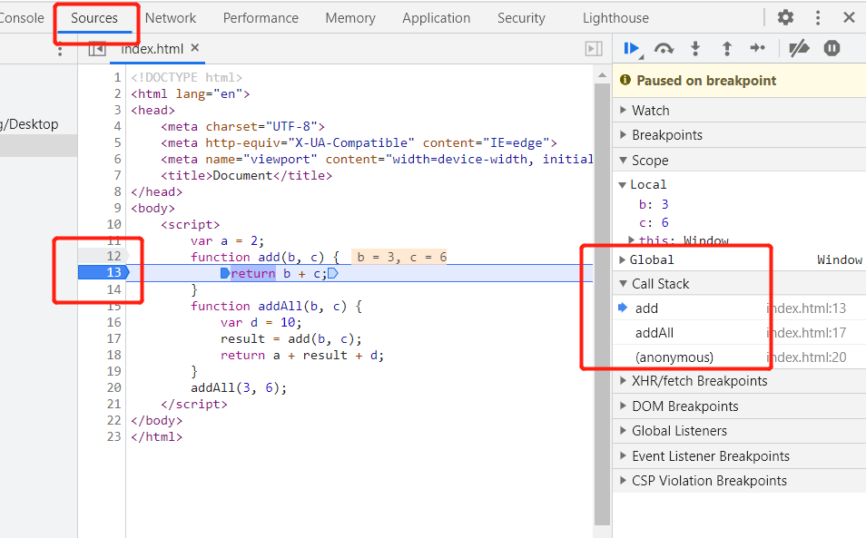
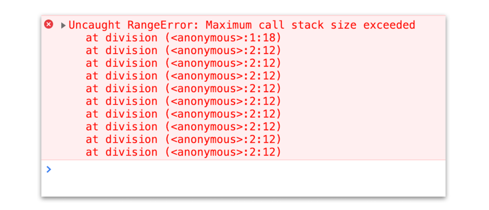

# 调用栈：为什么 JavaScript 代码会出现栈溢出？

</br>

### 概念

javaScript 中有很多函数，经常会出现在一个函数中调用另外一个函数的情况，**调用栈就是用来管理函数调用关系的一种数据结构**

</br>
</br>

### JavaScript 的调用栈

利用栈的数据结构进行管理（先进后出）

```javascript
var a = 2;
function add(b, c) {
	return b + c;
}
function addAll(b, c) {
	var d = 10;
	result = add(b, c);
	return a + result + d;
}
addAll(3, 6);
```

1. 创建全局上下文，并推入栈中

2. 调用 addAll 函数，创建一个 addAll 函数的执行上下文，并推入栈中

3. 调用 add 函数，创建一个 add 函数的执行上下文，并推入栈中

4. add 函数调用完成之后，将 add 函数的执行上下文从调用栈中弹出

5. 同理 addAll 函数调用完成之后，addAll 函数的执行上下文也将从调用栈弹出

6. 最后调用栈中就只剩下全局上下文了

</br>
</br>

### 利用浏览器查看调用栈的信息

1. 通过 chrome 控制台的 source，对代码打断点，并查看 Call Statck



2. 也可以通过 console.trace() 打印调用栈

</br>
</br>

### 栈溢出

调用栈是有大小的，当入栈的执行上下文超过一定数目，JavaScript 引擎就会报错，我们把这种错误叫做栈溢出。例如下代码就会栈溢出：

```javascript
function division(a, b) {
	return division(a, b);
}
console.log(division(1, 2));
```



</br>
</br>
