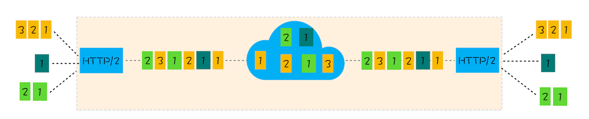

# HTTP/3：甩掉 TCP、TLS 的包袱，构建高效网络

 

### TCP 的队头阻塞

TCP 传输过程中，如果有一个数据因为网络故障或者其他原因而丢包了，那么整个 TCP 的连接就会处于暂停状态，需要等待丢失的数据包被重新传输过来。**在 TCP 传输过程中，由于单个数据包的丢失而造成的阻塞称为 TCP 上的队头阻塞**

在 HTTP/1.1，浏览器为每个域名开启了 6 个 TCP 连接，如果其中的 1 个 TCP 连接发生了队头阻塞，那么其他的 5 个连接依然可以继续传输数据

在 HTTP/2 中，多个请求是跑在一个 TCP 管道中的，如果其中任意一路数据流中出现了丢包的情况，那么就会阻塞该 TCP 连接中的所有请求

 
 

### TCP 建立连接的延时

TCP 建立连接需要三次握手，如果是 HTTPS 的话，甚至还需要建立 TSL 连接

 
 

### QUIC 协议

1. 构建网络时，会在各处搭建各种设备，而它们通常依赖一些很少升级的软件，这些软件使用了大量的 TCP 特性，这些功能被设置之后就很少更新了，因此改造 TCP 协议是不现实的，发明新的协议也是不现实的

2. 于是 HTTP/3 选择**基于 UDP 实现了类似于 TCP 的多路数据流、传输可靠性等功能，我们把这套功能称为 QUIC 协议**

1. 虽然 UDP 不提供可靠性的传输，但在 QUIC 层实现了**类似 TCP 的流量控制、传输可靠性的功能**

2. 集成了 TLS 加密功能，减少 TSL 握手的时间

3. 实现了快速握手功能，由于 QUIC 是基于 UDP 的，可以用最快的速度来发送和接收数据

4. 实现了 HTTP/2 中的多路复用功能

 
 
