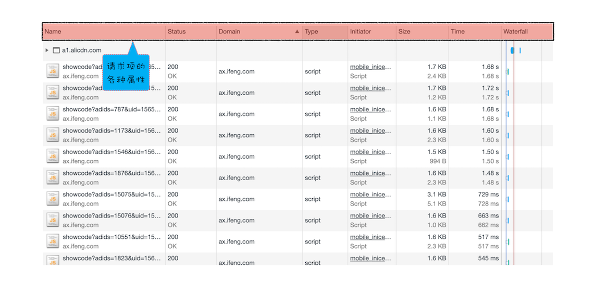

# Chrome 开发者工具：利用网络面板做性能分析

 

### 网络面板

1. 控制器

2. 过滤器：通过过滤器模块来筛选你想要的文件类型

3. 抓图信息：分析用户等待页面加载时间内所看到的内容

4. 时间线：主要用来展示 HTTP、HTTPS、WebSocket 加载的状态和时间的一个关系，用于直观感受页面的加载过程。如果是多条竖线堆叠在一起，那说明这些资源被同时被加载

5. 详细列表：通过该列表去诊断一些网络问题

6. 下载信息概要

    - DOMContentLoaded：页面已经构建好 DOM 了，这意味着构建 DOM 所需要的 HTML 文件、JavaScript 文件、CSS 文件都已经下载完成了
    - Load：说明浏览器已经加载了所有的资源（图像、样式表等）

 
 

### 网络面板 - 控制器

1. 红色圆点的按钮：表示“开始 / 暂停抓包”，这个功能很常见，很容易理解

2. "全局搜索"按钮：可以在所有下载资源中搜索相关内容，还可以快速定位到某几个你想要的文件上

3. Disable cache：即"禁止从 Cache 中加载资源"的功能，它在调试 Web 应用的时候非常有用，因为开启了 Cache 会影响到网络性能测试的结果

4. Online 按钮，是"模拟 2G/3G"功能，它可以限制带宽，模拟弱网情况下页面的展现情况，然后你就可以根据实际展示情况来动态调整策略，以便让 Web 应用更加适用于这些弱网

 
 

### 网络面板 - 详细列表

#### 列表的属性

 

#### 单个资源的详细信息

 

#### 单个资源的时间线

1. Queuing：该资源需要排队等待的时间

    - 资源加载是有优先级的，例如 CSS、HTML、JavaScript 等都是页面中的核心文件的优先级最高，当后者遇到前者时，就需要进入待排队状态

    - 每个域名最多维护 6 个 TCP 连接，如果发起一个 HTTP 请求过多时，就会进入到 TCP 队列中等待

2. Stalled：在发起连接之前，其他原因可能导致连接过程被推迟的时间

3. Initial connection：和服务器建立 TCP 连接的时间

4. SSL：如果是 HTTPS 的话，建立 SSL 连接的时间

5. Request sent：发送数据包的时间

6. Waiting (TTFB)：等待接收服务器第一个字节的数据的时间

7. Content Download：第一字节时间到接收到全部响应数据所用的时间

 
 

### 优化时间线上耗时

1. 排队（Queuing）时间过久：可能是同一个域名下 TCP 连接建立过多，可以升级到 HTTP2

2. 第一字节时间（TTFB）时间过久：服务器原因；网络原因；请求头数据过多

3. Content Download：数据量过大，减少不必要的数据

 
 
