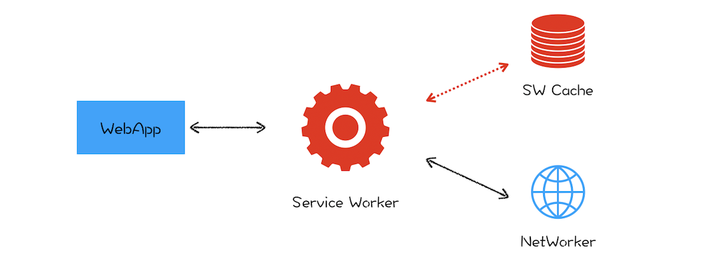

# 渐进式网页应用 PWA

 

### 什么是 PWA

它是一套理念，渐进式增强 Web 的优势，并通过技术手段渐进式缩短和本地应用或者小程序的距离

 
 

### Web 应用 VS 本地应用

1. 首先，Web 应用缺少离线使用能力，在离线或者在弱网环境下基本上是无法使用的。而用户需要的是沉浸式的体验，在离线或者弱网环境下能够流畅地使用是用户对一个应用的基本要求

2. 其次，Web 应用还缺少了消息推送的能力，因为作为一个 App 厂商，需要有将消息送达到应用的能力

3. 最后，Web 应用缺少一级入口，也就是将 Web 应用安装到桌面，在需要的时候直接从桌面打开 Web 应用，而不是每次都需要通过浏览器来打开

 
 

### 什么是 Service Worker

使用 Service Worker 来试着解决离线存储和消息推送的问题，它的主要思想是在页面和网络之间增加一个拦截器，**用来缓存和拦截请求**

1. ServiceWorker 运行在浏览器进程中，为所有页面提供服务

2. 必须使用 HTTPS

 
 
