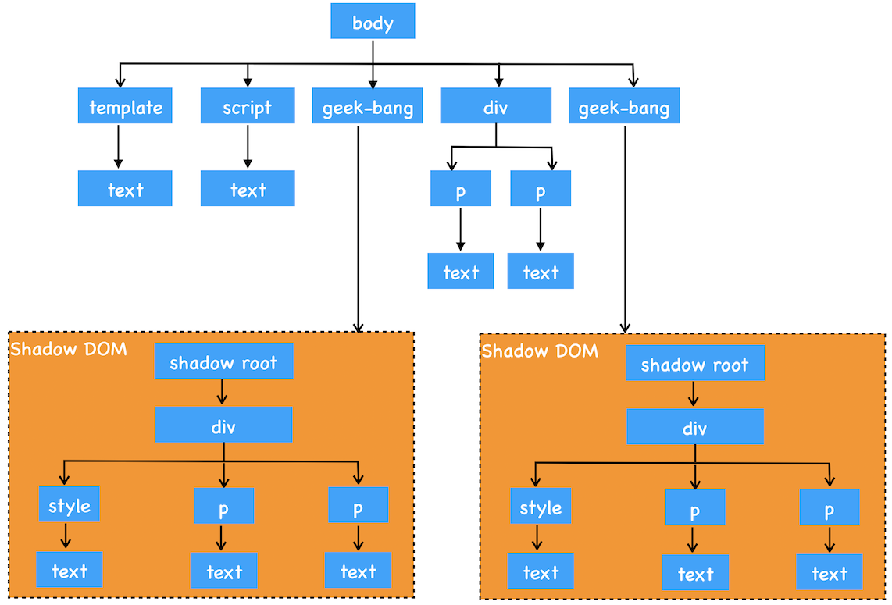

# WebComponent：像搭建积木一样构建 Web 应用

 

### 前端组件化的阻碍因素

1. CSS 的全局影响

2. 页面中只有一个 DOM，任何地方都可以直接读取和修改 DOM

 
 

### 解决思路

让 DOM、CSSOM 和 JavaScript 运行在局部环境中，这样就使得局部的 CSS 和 DOM 不会影响到全局

1. 当通过 DOM 接口去查找元素时，渲染引擎会去判断 geek-bang 属性下面的 shadow-root 元素是否是影子 DOM，如果是影子 DOM，那么就直接跳过 shadow-root 元素的查询操作

2. 当生成布局树的时候，渲染引擎也会判断 geek-bang 属性下面的 shadow-root 元素是否是影子 DOM，如果是，那么在影子 DOM 内部元素的节点选择 CSS 样式的时候，会直接使用影子 DOM 内部的 CSS 属性。所以这样最终渲染出来的效果就是影子 DOM 内部定义的样式

 
 
