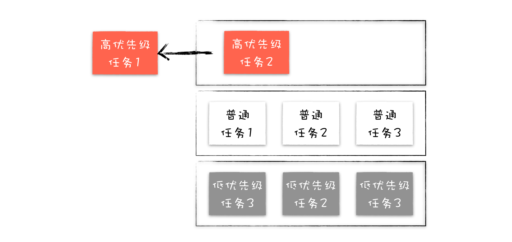

# 任务调度：有了 setTimeOut，为什么还要使用 requestAnimationFrame

 

### requestAnimationFrame

window.requestAnimationFrame() 告诉浏览器——你希望执行一个动画，并且要求浏览器在下次重绘之前调用指定的回调函数更新动画。该方法需要传入一个回调函数作为参数，该回调函数会在浏览器下一次重绘之前执行

 
 

### 消息队列

chrome 中有两种消息队列，一种是普通消息队列，一种是延迟消息队列，每执行完一个普通任务，根据发起时间和延迟时间计算出到期的任务，然后依次执行这些到期的任务

 
 

### 单消息队列的队头阻塞问题

如果只有一个消息队列，存在着低优先级任务会阻塞高优先级任务的情况

 
 

### 第一次迭代：引入高优先级队列

引入了三个不同优先级的消息队列，然后使用任务调度器来统一调度这三个不同消息队列中的任务。按照顺序从高优先级队列中取出任务，如果高优先级的队列为空，那么再按照顺序从低优级队列中取出任务

**问题**

对大多数任务而言，需要保持其相对执行顺序，如果将用户输入的消息或者合成消息添加进多个不同优先级的队列中，那么这种任务的相对执行顺序就会被打乱，甚至有可能出现还未处理输入事件，就合成了该事件要显示的图片。因此我们需要让一些相同类型的任务保持其相对执行顺序

 
 

### 第二次迭代：根据消息类型来实现消息队列

虽然在交互阶段，采用上述这种静态优先级的策略没有什么太大问题的，但是在页面加载阶段，如果依然要优先执行用户输入事件和合成事件，那么页面的解析速度将会被拖慢

 
 

### 第三次迭代：动态调度策略

 
 

### 如何造成动画卡顿

1. 如果渲染进程生成的帧速比屏幕的刷新率慢，那么屏幕会在两帧中显示同一个画面，当这种断断续续的情况持续发生时，用户将会很明显地察觉到动画卡住了

2. 如果渲染进程生成的帧速率实际上比屏幕刷新率快，那么也会出现一些视觉上的问题，比如当帧速率在 100fps 而刷新率只有 60Hz 的时候，GPU 所渲染的图像并非全都被显示出来，这就会造成丢帧现象

 
 

### Chrome 如何优化任务调度策略

1. 当在执行用户交互的任务时，将合成任务的优先级调整到最高

2. 把下个合成任务的优先级调整为最低，并将页面解析、定时器等任务优先级提升

3. 基于以上方案依然存在一个问题，那就是在某个状态下，一直有新的高优先级的任务加入到队列中，这样就会导致其他低优先级的任务得不到执行，这称为任务饿死。Chromium 为了解决任务饿死的问题，给每个队列设置了执行权重，也就是如果连续执行了一定个数的高优先级的任务，那么中间会执行一次低优先级的任务，这样就缓解了任务饿死的情况。

 
 
