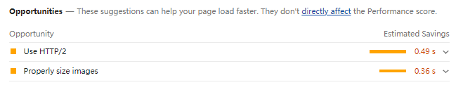

# 使用 Audits 来优化 Web 性能

 

### 注意

1. chrome v83.0.4103.61 的 Audits 升级成 Lighthouse 了

2. 使用该工具需要翻墙

 
 

### Performance vs Audits

1. 首先 Performance 非常强大，因为它为我们提供了非常多的运行时数据，利用这些数据我们就可以分析出来 Web 应用的瓶颈。但是要完全学会其使用方式却是非常有难度的，其难点在于这些数据涉及到了特别多的概念，而这些概念又和浏览器的系统架构、消息循环机制、渲染流水线等知识紧密联系在了一起。

2. 相反，Audtis 就简单了许多，它将检测到的细节数据隐藏在背后，只提供给我们一些直观的性能数据，同时，还会给我们提供一些优化建议。

3. Perfomance 能让我们看到更多细节数据，但是更加复杂，Audits 就比较智能，但是隐藏了更多细节

 
 

### 利用 Audits 生成 Web 性能报告

1. 打开新的无痕浏览器

2. 打开控制台

3. 选择 lighthouse 选项

4. 点击 generate report 生成报告

 
 

### 报告分析

报告分析出来后，大致有 5 个模块：

1. Performance：监测并分析 Web 性能

2. Accessibility：监测并分析是否实施了无障碍功能

3. Best practices：监测并分析 Web 应用是否采用了最佳实践策略

4. SEO：监测并分析 Web 应用是否采实施了 SEO 搜素引擎优化

5. Progressive Web App：监测并分析 PWA 程序的性能

 
 

### Performance

该模块主要是性能分析的结果统计，共分为四个板块：

**Metrics**

第一部分：性能指标的评分

1. First Contentful Paint：当页面中绘制了第一个像素时，我们把这个时间点称为 First Content Paint，简称 FCP

2. Speed Index：首屏渲染时间

3. Largest Contentful Paint：当首屏内容完全绘制完成时，我们把这个时间点称为 Largest Content Paint，简称 LCP

4. Time to Interactive：表示页面中所有元素都达到了可交互的时长，简称 TTI

5. Total Blocking Time：FCP 到 TTI 之间主线程被阻塞时长的总和，简称 TBT

6. Cumulative Layout Shift：累计布局偏移得分，简单理解：当用户浏览一个页面的时候，若是想要点击一个按钮或者其他交互时，页面的布局突然出然抖动，可能会造成用户的交互行为造成期望之外的结果，简称 CLS

 

**opportunities**

第二部分：可优化项，如下图所示：建议我使用 HTTP/2 协议；图片尺寸过大，建议我使用适当大小的图片

 

**Diagnostics**

第三部分：手动诊断，采集了一些可能存在性能问题的指标，这些指标可能会影响到页面的加载性能

 

**Passed audits**

第四部分：通过审核（百度翻译），应该是用来统计了该网站使用了哪些优化策略，数量越多代表网站优化策略越好

 
