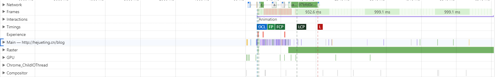

# 如何使用 Performance

 

### 使用 performance

1. Performance 可以记录站点在运行过程中的性能数据，有了这些性能数据，我们就可以回放整个页面的执行过程，这样就方便我们来定位和诊断每个时间段内页面的运行情况，从而有效帮助我们找出页面的性能瓶颈

2. 不同于 Audits，Perofrmance 不会给出性能得分，也不会给出优化建议，它只是单纯地采集性能数据，并将采集到的数据按照时间线的方式来展现，我们要做的就是依据原始数据来分析 Web 应用的性能问题

3. 使用 Performance 需要分三步走：

   - 第一步是配置 Performance

   - 第二步是生成报告页

   - 第三步就是人工分析报告页，并找出页面的性能瓶颈。

 
 

### 如何使用 Performance

1. 左侧黑色按钮：**用来记录交互阶段性能数据**，需要手动开启/停止录制过程

2. 左侧带箭头的圆圈形按钮：**用来记录加载阶段的性能数据**，点击后 Performance 会重新刷新页面，并等到页面完全渲染出来后，Performance 就会自动停止录制

3. 右侧 Network：限制网络加载速度

4. 右侧 CPU：限制 CPU 的运算速度

 
 

### 报告页构成

Performance 最后生成的报告主要由三部分组成：

1. **概览面板（红色框）**：宏观上检测几个**关键指标**的变化

2. **性能分析面板（蓝色框）**：主要用来**展现特定时间段内的多种性能指标数据**

3. **详情面板（绿色框）**：统计特定时间段内的多种性能指标数据详情

 
 

### 概览面板

概览面板中引入了几个关键指标：

**1、页面帧速 (FPS)**

如果出现了红色块，那么就表示红色块附近渲染出一帧所需时间过久，帧的渲染时间过久，就有可能导致页面卡顿。一般来说，绿色的长条越高，说明 FPS 越高，用户体验越好

 

**2、CPU 资源消耗（CPU）**

如果图形占用面积太大，表示 CPU 使用率就越高，那么就有可能因为某个任务占用太多的主线程时间，从而影响其他任务的执行。在 CPU 图表中的各种颜色与详情面板中的 Summary 模块的颜色是相互对应的

 

**3. 网络请求流量（NET）**

宏观展示某个时段正在处理网络资源

 

**4. 每一帧绘制的图像**

 

**5. V8 内存使用量（HEAP）**

如果记录的过程中，内存使用量一直在增加，就可能是某种原因导致了内存泄漏

 
 

### 性能分析面板

 

**回顾浏览器渲染流程**

1. 网络进程请求 HTML/CSS/JavaScript 资源，并提交给渲染进程处理

2. 渲染主线程解析 HTML 资源，生成 DOM 树

3. 渲染主线程解析 CSS 资源，生成 CSSOM 对象（注意：JavaScript 会影响 DOM 树和 CSSOM 对象的构建）

4. 渲染主线程根据 DOM 树和 CSSOM 对象生成一棵布局树

5. 渲染主线程将布局树划分图层，并为每个图层生成绘制命令，并将绘制命令提交给合成线程去处理

6. 合成线程会将图层拆分为图块，并借助 GPU 进程将图块生成位图，该过程称为栅格化操作

7. 位图绘制完成后，浏览器主进程会从 GPU 进程内存中读取位图展示页面

 

**性能分析构成**

我们一般通过概览面板来定位到可能存在问题的时间节点，接着查看性能分析面板中性能指标的具体数据进行问题分析

1. Network：记录展示了页面中的每个网络请求所消耗的时长

2. Frames：浏览器生成每帧的记录

3. Interactions：记录用户交互操作

4. Timings：记录一些关键的时间节点在何时产生的数据信息，例如：FCP（绘制了第一个像素时间点）、LCP（页面完全绘制的时间点）

5. Main：记录**渲染主线程的任务执行过程**

6. Raster：合成线程又维护了一个光栅化线程池，主要目的是让 GPU 执行光栅化的任务（图块生成位图的任务）

7. GPU：记录了 GPU 进程主线程的任务执行过程

8. Chrome_ChildIOThread：IO 线程的任务记录

9. Compositor：浏览器主线程生成布局树后，会生成记录了合成线程的任务执行过程

 
 

### 详情面板

通过在性能分析面板中选中性能指标中的任何历史数据，然后选中记录的细节信息就会展现在详情面板中

 
 
