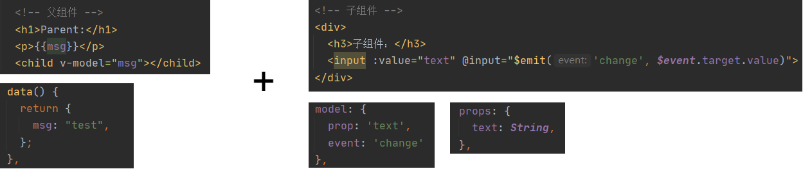
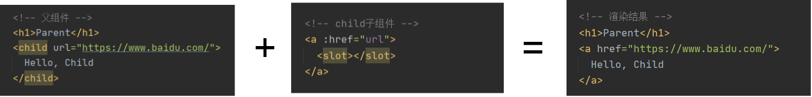
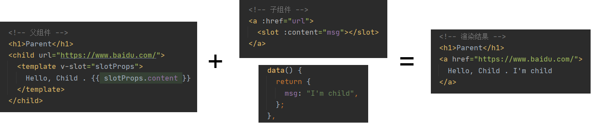
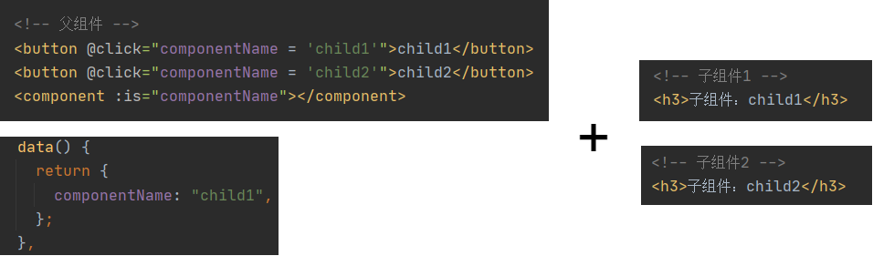
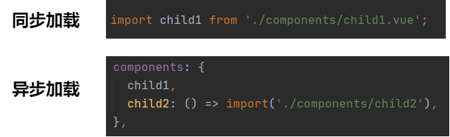

### 基础用法

-   v-html：会有 XSS 风险，会覆盖子组件

-   computed 有缓存，data 不变则不会重新计算

-   watch 如何深度监听？（利用 handler 方法和 deep 属性）；watch 监听引用类型，拿不到 oldValue

-   v-if 和 v-show 的区别？（v-if 直接不渲染；v-show 是利用 display:none 来隐藏）

-   v-for 和 v-if 不允许一起使用

-   v-for 的 key 不能乱赋值（index 或者 random）

-   v-for 也可以便利对象 (val, key, index) in obj

-   Vue 的事件传递：event 是原生的，且事件被挂载到了当前元素

-   Vue 提供了更便捷的：事件修饰符、按键修饰符、系统修饰符...

-   $emit 用于父组件监听子组件事件

-   props 用于父组件向子组件传递数据

-   自定义事件，用于不相关的组件事件通信，其实就是具部注册全局事件（注意组件销毁时，及时清理掉这个事件）

-   ref 获取 dom 元素

 
 
 

### Vue 生命周期

> 先初始化(更新)父组件实例 -> 然后再初始化(更新)子组件实例 -> 然后渲染子组件 -> 最后渲染父组件

**挂载阶段：**

-   beforeCreate

-   create: 页面还没开始渲染，只是初始化了 vue 实例

-   beforeMount

-   mounted: 页面渲染完成

**更新阶段：**

-   beforeUpdate

-   update

**销毁阶段：**

-   beforeDestroy: 解除事件绑定

-   destroy

 
 
 

### 自定义 v-modal

跟传入 props，子组件通过 props 改变父组件的 data 功能类似

 
 
 

### $nextTick

-   Vue 是异步渲染，data 改变之后，DOM 不会立刻渲染

-   $nextTick 会在 DOM 渲染之后被触发，以获取最新的 DOM 节点（类似于 React 中的 setState 的回调函数）

 
 
 

### slot 是什么？

**基本使用：** 将子元素插入到 slot 中（类似于 React 中的 props.children）

**作用域插槽：** 让插槽内容能够访问子组件中的数据

**具名插槽：** 多个 slot 插槽一一对应

 
 
 

### 动态组件

> 在不确定渲染哪种类型组件时使用，用法：is="component-name"

 
 
 

### 异步组件

> import 函数，按需加载，异步加载

 
 
 

### keep-alive

> 用于缓存频繁切换，不需要重新渲染的组件

 
 
 

### mixin

> 抽离多个组件有相同逻辑

问题：

-   来源不明确，不方便代码阅读
-   多个 mixin 可能会冲突
-   mixin 和组件可能出现多对多的关系，复杂度较高

 
 
 

### vuex

 
 
 

### vue-router

-   hash 模式（默认），如：http://abc.com/#/user

-   H5 history 模式，如http://abc.com/suer

-   后者需要 server 端的支持（访问路由时，重定向到 index.html），因此无特殊需求可选择前者

-   动态路由，{ path: 'user/:id', component: User }

-   懒加载，{ path: 'user/:id', component: () => import('./user.vue') } }

 
 
 
