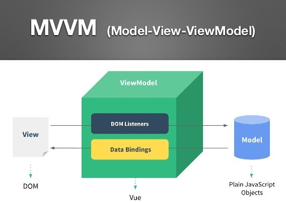

### 组件化和 MVVM

-   传统组件，更新依赖于 DOM 操作

-   数据驱动视图 -> Vue MVVM -> M(Modal) V(View) VM(ViewModal)



</br>
</br>
</br>

### 监听 data 变化的核心 API 是什么？响应式原理？

**基本使用**

-   利用 Object.defineProperty 这个 API，通过它的 set 和 get 方法去监听对象属性的改变

```javascript
const data = {};

Object.defineProperty(data, "name", {
    get: function () {
        console.log("你在获取data的name属性");
        return name;
    },
    set: function (val) {
        console.log("你在对data的name属性赋值");
        name = val;
    },
});

data.name = "hejueting"; // 你在对data的name属性赋值
console.log(data.name); // 你在获取data的name属性  hejueting
```

**复杂对象，深度监听？如何监听数组？**

```javascript
// 更新视图
function updateView() {
    console.log("更新视图");
}

// 定义一个新的数据类型，在这个新数组类型上封装一层push、pop等方法
// Object.create()方法创建一个新对象，使用现有的对象来提供新创建的对象的__proto__
const newArray = Object.create(Array.prototype);
["push", "pop", "shift", "unshift"].forEach((methodName) => {
    newArray[methodName] = function (params) {
        // 该function中this指向了target这个数组
        // 让该target调用数组原生的方法
        newArray.__proto__[methodName].call(this, params);
        // 更新视图
        updateView();
    };
});

// 监听的方法
function observe(target) {
    if (typeof target !== "object" || target === null) {
        // 不是对象或者数组
        return target;
    }

    // 如果这个变量是一个数组，则改变这个数组的原型
    if (Array.isArray(target)) {
        target.__proto__ = newArray;
    }

    // 重新定义各个属性
    for (let key in target) {
        defineAttribute(target, key, target[key]);
    }
}

// 重新定义属性进行监听
function defineAttribute(target, key, value) {
    // 对进行value深度监听
    observe(value);
    // 重新定义这个对象属性
    Object.defineProperty(target, key, {
        get: function () {
            return value;
        },
        set: function (newValue) {
            if (newValue !== value) {
                // 如果更新的这个newValue是一个对象，也需要深度监听
                observe(value);
                // 更新值
                value = newValue;
                // 更新新视图
                updateView();
            }
        },
    });
}

const data = {
    name: "hejueting",
    age: 18,
    other: {
        location: "CQ",
    },
    arr: [1, 2, 3],
};

observe(data);

data.name = "xxx"; // 视图更新
data.age = 25; // 视图更新
data.other.location = "BJ"; // 视图更新
data.arr.push(4); // 视图更新
```

**Object.defineProperty 的缺点**

-   深度监听，需要递归到底，一次性计算量大

-   无法监听新增属性/删除属性（需要调用 Vue.set 和 Vue.delete）

-   无法监听数组，需要特殊处理

</br>
</br>
</br>

### v-dom 和 diff 算法

**用 JS 模拟 dom 结构**

-   JS 计算速度是很快的，但是 dom 的计算速度很耗时，因此 vue、react 等主流框架便使用虚拟 dom（JS 模拟的 dom 结构）来计算并渲染 dom

```html
<div id="divId">
    <h1 class="title">hello world</h1>
</div>
```

```javascript
var jsDom = {
    tag: "div",
    props: {
        id: "divId",
    },
    children: [
        {
            tag: "h1",
            props: {
                className: "title",
            },
            children: "hello world",
        },
    ],
};
```

**diff 算法**

-   diff 算法，即一种对比算法。例如 git 版本管理工具，也使用了 diff 算法，将不同分支进行比较

**dom diff 算法**

-   dom diff 算法就是将 js 模拟的两个 dom 树进行比较，但树的 diff 算法，时间复杂度是 O(n^3)，tree1 遍历一次，tree2 遍历一次，相互比较再遍历一次，但如果有 1000 个节点，就要遍历 1 亿次

-   dom diff 算法优化后，将时间复杂度变成了 O(n)

    -   只比较一层级，不跨级比较

    -   tag 不相同，直接删掉重建，不再深度比较

    -   tag 和 key，两者都相同，则认为是相同节点，不再深度比较

</br>
</br>
</br>

### 模板编译

> 模板不是 html，有指令、插值、JS 表达式、能实现判断、循环。但 html 只是标签语言，只有 JS 才能实现判断、循环，因此模板一定是转化为某种 JS 代码，即编译模板

**vue template complier**

通过 vue-cli 创建项目，package.json 中有一个 vue-template-compiler 的包，vue 就是通过这个包实现的模板编译

```javascript
const compiler = require("vue-template-compiler");
const tempalte = `<h1>fuck</h1>`;
const res = compiler.compile(tempalte);

console.log(res);
// {
//   ast: { type: 1, tag: 'h1', .... },
//   render: `with(this){return _c('h1',[_v("fuck")])}`,
//   ......
// }
```

**JS 的 with 语法**

res.render 是一个 with 语法的 JS 语句

```javascript
const obj = {
    a: "a",
    b: "b",
};
console.log(obj.a); // a
console.log(obj.b); // b
console.log(obj.c); // undefined

// 改变{}内自由变量的查找规则，当作obj属性来查找
// 如果找不到匹配的obj属性，就会报错
with (obj) {
    console.log(a); // a
    console.log(b); // b
    console.log(c); // 报错
}
```

**执行 render 函数生成 vnode**

this 表示 vue 实例，\_c 代表 creatElement，也就是说 render 最后会返回一个 vnode

</br>
</br>
</br>

### 组件渲染过程

</br>
</br>
</br>

### 前端路由

</br>
</br>
</br>
