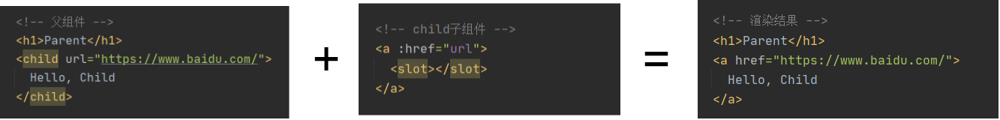
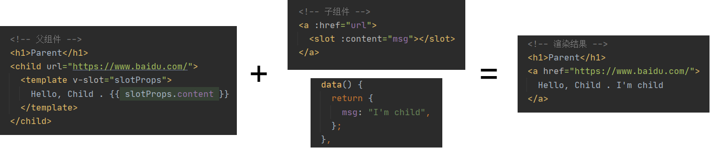
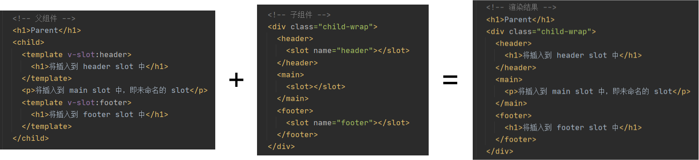

### 基本使用

- v-html：会有XSS风险，会覆盖子组件

- computed有缓存，data不变则不会重新计算

- watch如何深度监听？（利用handler方法和deep属性）；watch监听引用类型，拿不到oldValue

- v-if和v-show的区别？（v-if直接不渲染；v-show是利用display:none来隐藏）

- v-for和v-if不允许一起使用

- v-for的key不能乱赋值（index或者random）

- v-for也可以便利对象 (val, key, index) in obj

- Vue的事件传递：event是原生的，且事件被挂载到了当前元素

- Vue提供了更便捷的：事件修饰符、按键修饰符、系统修饰符...

  
  

### slot是什么？

**基本使用：** 将子元素插入到slot中（类似于React中的props.children）

  

**作用域插槽：** 让插槽内容能够访问子组件中中的数据

  

**具名插槽：** 多个slot插槽一一对应

  
  
  
