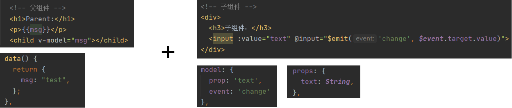
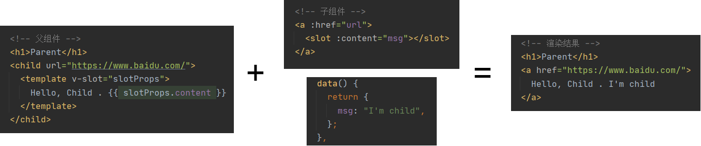
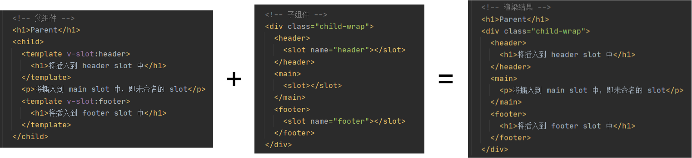
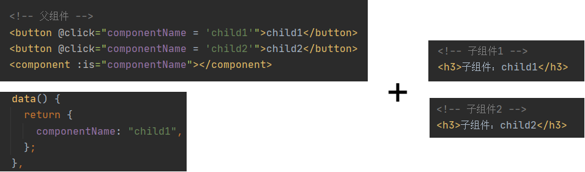
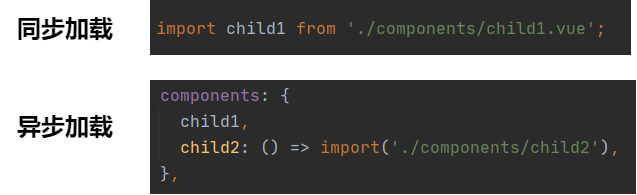

### 基础用法

- v-html：会有XSS风险，会覆盖子组件

- computed有缓存，data不变则不会重新计算

- watch如何深度监听？（利用handler方法和deep属性）；watch监听引用类型，拿不到oldValue

- v-if和v-show的区别？（v-if直接不渲染；v-show是利用display:none来隐藏）

- v-for和v-if不允许一起使用

- v-for的key不能乱赋值（index或者random）

- v-for也可以便利对象 (val, key, index) in obj

- Vue的事件传递：event是原生的，且事件被挂载到了当前元素

- Vue提供了更便捷的：事件修饰符、按键修饰符、系统修饰符...

- $emit用于父组件监听子组件事件

- props用于父组件向子组件传递数据

- 自定义事件，用于不相关的组件事件通信，其实就是具部注册全局事件（注意组件销毁时，及时清理掉这个事件）

- ref获取dom元素

  
  
  

### Vue生命周期

> 先初始化(更新)父组件实例 -> 然后再初始化(更新)子组件实例 -> 然后渲染子组件 -> 最后渲染父组件

**挂载阶段：**

- beforeCreate

- create: 页面还没开始渲染，只是初始化了vue实例

- beforeMount

- mounted: 页面渲染完成

**更新阶段：**

- beforeUpdate

- update

**销毁阶段：**

- beforeDestroy: 解除事件绑定

- destroy

  
  
  

### 自定义v-modal

跟传入props，子组件通过props改变父组件的data功能类似

  
  
  

### $nextTick

- Vue是异步渲染，data改变之后，DOM不会立刻渲染

- $nextTick会在DOM渲染之后被触发，以获取最新的DOM节点（类似于React中的setState的回调函数）

  
  
  

### slot是什么？

**基本使用：** 将子元素插入到slot中（类似于React中的props.children）

**作用域插槽：** 让插槽内容能够访问子组件中的数据

**具名插槽：** 多个slot插槽一一对应

  
  
  

### 动态组件

> 在不确定渲染哪种类型组件时使用，用法：is="component-name"

  
  
  

### 异步组件

> import函数，按需加载，异步加载

  
  
  

### keep-alive

> 用于缓存频繁切换，不需要重新渲染的组件

  
  
  

### mixin

> 抽离多个组件有相同逻辑

问题：
- 来源不明确，不方便代码阅读
- 多个mixin可能会冲突
- mixin和组件可能出现多对多的关系，复杂度较高

  
  
  

### vuex

  
  
  

### vue-router

- hash模式（默认），如：http://abc.com/#/user

- H5 history模式，如http://abc.com/suer

- 后者需要server端的支持（访问路由时，重定向到index.html），因此无特殊需求可选择前者

- 动态路由，{ path: 'user/:id', component: User }

- 懒加载，{ path: 'user/:id', component: () => import('./user.vue') } }

  
  
  
