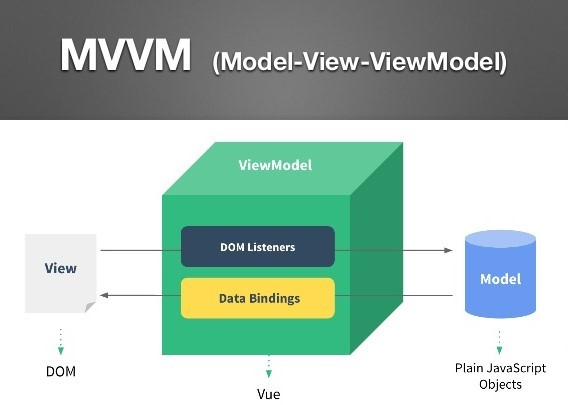

### 组件化和MVVM

- 传统组件，更新依赖于DOM操作

- 数据驱动视图 -> Vue MVVM -> M(Modal) V(View) VM(ViewModal)



<br></br>
<br></br>
<br></br>


### 监听data变化的核心API是什么？响应式原理？

**基本使用**

- 利用Object.defineProperty这个API，通过它的set和get方法去监听对象属性的改变

```javascript
const data = {};

Object.defineProperty(data, 'name', {
    get: function () {
        console.log('你在获取data的name属性');
        return name;
    },
    set: function (val) {
        console.log('你在对data的name属性赋值');
        name = val;
    }
})

data.name = 'hejueting'; // 你在对data的name属性赋值
console.log(data.name);  // 你在获取data的name属性  hejueting
```


**复杂对象，深度监听？如何监听数组？**

```javascript
// 更新视图
function updateView() {
    console.log('更新视图');
}

// 定义一个新的数据类型，在这个新数组类型上封装一层push、pop等方法
// Object.create()方法创建一个新对象，使用现有的对象来提供新创建的对象的__proto__
const newArray = Object.create(Array.prototype);
['push', 'pop', 'shift', 'unshift'].forEach(methodName => {
    newArray[methodName] = function (params) {
        // 该function中this指向了target这个数组
        // 让该target调用数组原生的方法
        newArray.__proto__[methodName].call(this, params);
        // 更新视图
        updateView();
    }
});

// 监听的方法
function observe(target) {
    if(typeof target !== 'object' || target === null) {
        // 不是对象或者数组
        return target;
    }

    // 如果这个变量是一个数组，则改变这个数组的原型
    if(Array.isArray(target)) {
        target.__proto__ = newArray;
    }

    // 重新定义各个属性
    for(let key in target) {
        defineAttribute(target, key, target[key]);
    }
}

// 重新定义属性进行监听
function defineAttribute(target, key, value) {
    // 对进行value深度监听
    observe(value);
    // 重新定义这个对象属性
    Object.defineProperty(target, key, {
        get: function () {
            return value;
        },
        set: function (newValue) {
            if (newValue !== value) {
                // 如果更新的这个newValue是一个对象，也需要深度监听
                observe(value);
                // 更新值
                value = newValue;
                // 更新新视图
                updateView();
            }
        }
    })
}


const data = {
    name: 'hejueting',
    age: 18,
    other: {
        location: 'CQ',
    },
    arr: [1, 2, 3],
}

observe(data);

data.name = 'xxx';          // 视图更新
data.age = 25;              // 视图更新
data.other.location = 'BJ'; // 视图更新
data.arr.push(4);           // 视图更新
```


**Object.defineProperty的缺点**

- 深度监听，需要递归到底，一次性计算量大

- 无法监听新增属性/删除属性（需要调用 Vue.set 和 Vue.delete）

- 无法监听数组，需要特殊处理

<br></br>
<br></br>
<br></br>


### v-dom和diff算法

**用JS模拟dom结构**

- JS计算速度是很快的，但是dom的计算速度很耗时，因此vue、react等主流框架便使用虚拟dom（JS模拟的dom结构）来计算并渲染dom
```html
<div id="divId">
    <h1 class="title">hello world</h1>
</div>
```
```javascript
var jsDom = {
    tag: 'div',
    props: {
        id: 'divId',
    },
    children: [
        {
            tag: 'h1',  
            props: {
                className: 'title',
            },
            children: 'hello world'
        }
    ]
}
```

**diff算法**

- diff算法，即一种对比算法。例如git版本管理工具，也使用了diff算法，将不同分支进行比较


**dom diff算法**

- dom diff算法就是将js模拟的两个dom树进行比较，但树的diff算法，时间复杂度是O(n^3)，tree1遍历一次，tree2遍历一次，相互比较再遍历一次，但如果有1000个节点，就要遍历1亿次

- dom diff算法优化后，将时间复杂度变成了O(n)

    - 只比较一层级，不跨级比较
    
    - tag不相同，直接删掉重建，不再深度比较
    
    - tag和key，两者都相同，则认为是相同节点，不再深度比较

的时间复杂度只有O(n)。如果应用在前端框架中，1000个节点就要遍历1亿次，显然不科学

<br></br>
<br></br>
<br></br>


### 模板编译

<br></br>
<br></br>
<br></br>


### 组件渲染过程

<br></br>
<br></br>
<br></br>


### 前端路由

<br></br>
<br></br>
<br></br>
